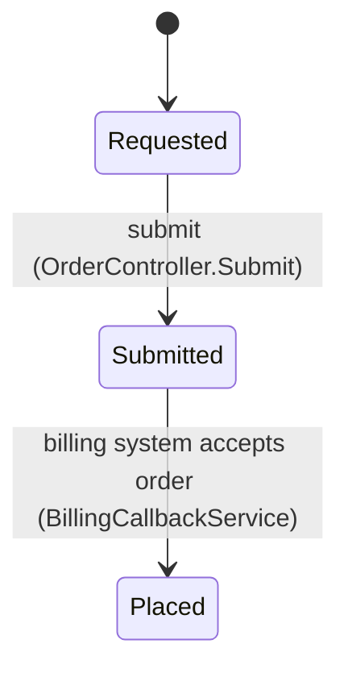

# Page patterns

## Contents

- Module page (`modules/<module>.md`)
- Screens and actions
- <Engine / process name> (step by step)
- Statuses
- Data
- Integrations
- Permissions
- Integration page (`integrations/<system>.md`)
- Outbound: <operation>
- Inbound: <operation>
- Known issues
- State machine (`workflows/state-machines.md` section)
- <Object> status
- End-to-end journey (`workflows/end-to-end.md`)
- Security findings register (`security/findings.md`)
- SEC-01 · <title> — Critical
- Defects register (`appendices/defects.md`)
- Glossary (`appendices/glossary.md`)
- Codes & statuses (`data/codes-and-statuses.md`)
- Diagrams


Proven layouts. Replace `<…>`; delete rows that do not apply; keep the order.

## Module page (`modules/<module>.md`)

```markdown
# <Module name>

<One paragraph: what the module is for, who uses it, where it sits in the journey.>

## Screens and actions
| Screen / action | What it does | Rules / side effects | Code |
| --- | --- | --- | --- |
| <Create order> | <business behaviour> | <emails, statuses, documents> | [[act:Order.Create]] |

## <Engine / process name> (step by step)
1. <step, with exact condition> ([[proc:Order_Calculate]])
2. …

## Statuses
<table or link to [[page:workflows/state-machines.md#orders|state machine]]>

## Data
| Object | Table | Notes |
| --- | --- | --- |

## Integrations
<links to integration pages, with trigger>

## Permissions
<roles / claims; anonymous entry points>

!!! warning "Known issues"
    <DEF-nn / SEC-nn with links>
```

## Integration page (`integrations/<system>.md`)

```markdown
# <System> (<what it is, one phrase>)

| Item | Value |
| --- | --- |
| Direction | Outbound / inbound / both |
| Trigger | <user action, job, event> |
| Configuration | `<GROUP/KEY_NAME>` (names only) |
| Payload builder | [[proc:X]] / [[cls:X]] |
| Authentication | <OAuth client credentials, basic, token env name> |
| Response handling | <success / failure handlers> |
| Logging | [[table:Json_Log]] |

## Outbound: <operation>
## Inbound: <operation>
## Known issues
```

## State machine (`workflows/state-machines.md` section)

````markdown
## <Object> status

| From | To | Trigger | Code | Who |
| --- | --- | --- | --- | --- |
````

## End-to-end journey (`workflows/end-to-end.md`)

Sequence diagram (actors + systems), a stage table (`# · Stage · Actors · Module page · Status after`) and a hand-off table (`From → to · What travels · Built by`).

## Security findings register (`security/findings.md`)

Summary table (`Id · Severity · Finding · Area`) with links to sections; each section:

```markdown
<a id="sec-01"></a>
## SEC-01 · <title> — Critical
- **Where**: `<file>`, `<method>`.
- **What**: <condition>.
- **Impact**: <who can do what>.
- **Recommendation**: <fix>.
```

## Defects register (`appendices/defects.md`)

`Id · Priority · Area · Defect · Effect · Where` for DEF-nn; `Id · Item · Recommendation` for TD-nn.

## Glossary (`appendices/glossary.md`)

`Term · Meaning` alphabetically; link to the page that explains it; mark unknown expansions.

## Codes & statuses (`data/codes-and-statuses.md`)

One table per code set from enums **and** seed data (`Id · Name · Active · Meaning`), with a link to the enum and seed entries (`[[enum:X]]`, `[[seed:X]]`).

## Diagrams

- Mermaid only (renders in MkDocs and GitHub); real names; ≤ ~15 nodes per diagram; split otherwise.
- Context: `flowchart LR` users / system / externals. Containers: `flowchart TB`. Sequences: `sequenceDiagram` with `autonumber`. Data: `erDiagram` with the 10–20 core entities.
- `graphify export callflow-html` output is a starting point; verify every arrow before reusing it.
