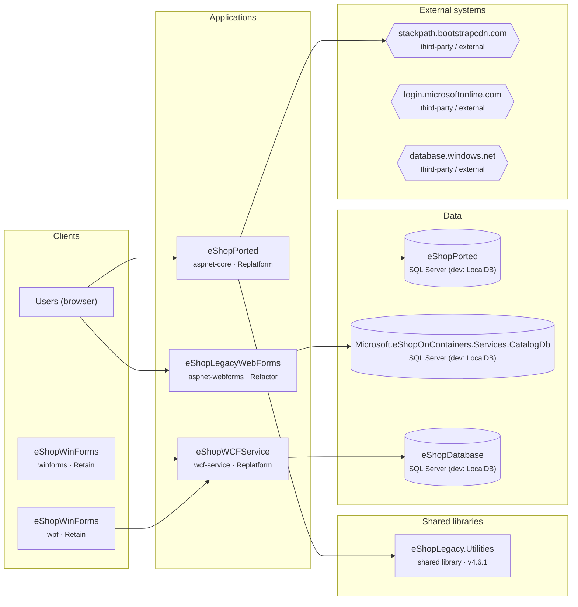
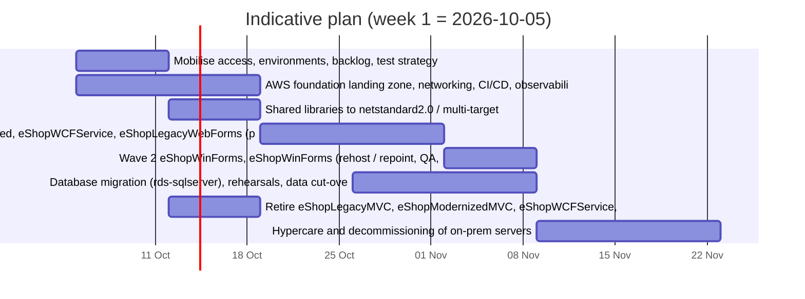

<!--
## Contents
Executive summary, scope and method, application inventory, architecture, findings by category, database, per-application plans, effort and timeline, risks and questions, testing and merge, appendices.
This sample predates the v4 coding-only estimate and the dual / PostgreSQL scenarios; use it for structure and tone, not for scenario names or hour figures.
-->
# eShop (public sample) — AWS Migration & Modernization Assessment

| | |
|---|---|
| Prepared by | Example Consultancy |
| Prepared for | eShop (public sample) |
| Date / version | 2026-10-02 / 1.0 |
| Target platform | .NET 10 on Linux, Amazon Web Services |
| Current hosting (as stated) | not stated |
| Compliance context (as stated) | not stated |
| Classification | Confidential — contains architecture and security findings |

## 1. Executive summary

The estate is a single repository (`eShopModernizing`, 7 solutions, 11 projects, about 16,000 lines of C# and markup) that contains a product-catalog system in several variants. There are three lineages:
- a catalog web application, as ASP.NET MVC 5 and as ASP.NET Web Forms;
- a WCF catalog service with a Windows desktop client (WinForms/WPF);
- "Modernized" copies of the same applications, adapted to Windows containers and Azure services.

Everything server-side runs on .NET Framework 4.6.1–4.7.2 on Windows/IIS with SQL Server. Two of those target frameworks are already out of support (F-016 to F-019). One earlier port attempt (`eShopPorted`, ASP.NET Core 2.2) still targets .NET Framework 4.6.1.

**Recommended path.** Move the catalog to **.NET 10 (LTS, supported to November 2028) on Linux containers on Amazon ECS with AWS Fargate**, backed by **Amazon RDS for SQL Server**:
- **Replatform** `eShopPorted` (finish the existing port) and the WCF service (CoreWCF keeps the SOAP contract for the desktop clients).
- **Refactor** the small Web Forms catalog to Blazor (F-004).
- **Retain** the desktop clients on user machines, with a repointed service endpoint.
- **Retire** five duplicate or superseded applications, after the client confirms which lineage is in production.

**Effort and duration.** 118–432 hours (15–54 person-days), likely **244 hours (about 30 person-days)**, roughly 7 weeks with a team of three. This assumes AI-assisted delivery: AWS Transform for .NET or coding agents do the mechanical port, with generated tests and infrastructure templates. The manual equivalent is about 434 hours likely, so AI assistance saves about 44%. The figure includes QA, the AWS foundation, cut-over, project management and contingency (Effort & timeline). The largest single item is the Web Forms rewrite (about 62 hours likely). Alternatives are compared side by side in the scenario table:
- rehost as-is on EC2 Windows: about 186 hours;
- lift-and-shift to EC2 Linux: about 203 hours;
- full PostgreSQL port: about 327 hours.

**Licensing.** All server workloads leave Windows Server; only the desktop clients stay on Windows (user machines, no server licence). The database moves to RDS for SQL Server (licence included). No code-level blocker to Babelfish was found in the repository, but there is no production schema in it, so a Babelfish Compass run on a schema export decides whether the SQL Server licence can go too (section 6).

**Top risks.**
1. A brands download API returns **BinaryFormatter** output, which always throws on .NET 9 and later (F-006). The endpoint and its consumers must switch to JSON.
2. There are **no automated tests** (F-034). Regression relies on client QA, so we start with characterisation tests for the catalog flows.
3. **Production configuration is not in the repository.** Connection strings point at LocalDB, so server, authentication and identity-provider details are open questions (section 9.2).

**Next steps.**
- The client confirms the production lineage (Retire list) and answers the open questions.
- We run Babelfish Compass on a schema export and spike the BinaryFormatter replacement.
- The AWS account team can check funding eligibility (for example MAP) for the wave plan.

### 1.1 At a glance

| Measure | Value |
| --- | --- |
| Repositories / solutions / projects | 1 / 7 / 11 |
| Applications assessed | 10 |
| Lines of code (C#, VB.NET, markup) | 11,798 |
| Recommended path (7R) | Retire 5, Replatform 2, Retain 2, Refactor 1 |
| Findings | Blocker 5, High 43, Medium 77, Low 72, Info 7 |
| Effort (AI-assisted delivery) | 118–432 h (14.8–54 d), likely 244 h / 30.5 d |
| Manual-equivalent effort (for comparison) | 258–697 h (32.2–87.1 d) |
| Indicative duration | ~7 weeks with 3 engineers |
| Target platform | .NET 10 (LTS, supported to 2028-11-14) on Linux, AWS |

### 1.2 Key risks

| Ref | Severity | Finding | Where |
| --- | --- | --- | --- |
| F-001 | Blocker | Windows Forms | eShopWinForms |
| F-002 | Blocker | Windows Forms | eShopWinForms |
| F-003 | Blocker | WPF | eShopWinForms |
| F-004 | Blocker | ASP.NET Web Forms (System.Web.UI) | eShopLegacyWebForms |
| F-005 | Blocker | ASP.NET Web Forms (System.Web.UI) | eShopModernizedWebForms |
| F-006 | High | BinaryFormatter and legacy formatters | eShopPorted, eShopLegacyMVC |
| F-007 | High | Visual Studio web application build targets | eShopLegacyMVC |
| F-008 | High | Visual Studio web application build targets | eShopWCFService |

## 2. Scope and method

### 2.1 What was assessed

| Repository | Path | Files | Files scanned | Lines scanned | Branch / last commit | Code graph |
| --- | --- | --- | --- | --- | --- | --- |
| eshopmodernizing | C:/Users/mayan/Desktop/Prod_Analysis/testbeds/eShopModernizing | 1,279 | 372 | 16,216 | main @ 2023-10-25 (shallow clone) | yes |

### 2.2 How

| Step | What was done |
| --- | --- |
| Inventory | Solution/project parsing (SDK-style and legacy), target frameworks, project types, packages, lines of code, git history |
| Code graph | graphify AST graph per repository: communities, hub classes, observed project dependencies, per-file blast radius |
| Static checks | 131 evidence rules across 21 categories (C#, VB.NET, Razor/Web Forms markup, config, T-SQL, project files, scripts, CI) |
| Configuration | web.config / app.config / appsettings parsing: connection strings (servers, databases, auth mode), secret-like settings (names only) |
| Packages | NuGet package map (Windows-only, replace, licence, vulnerable) + api.nuget.org metadata (frameworks, deprecation, advisories) |
| Endpoints | URLs, host names, IPs and UNC paths classified internal (on-prem) vs external |
| Linux file-system | Path-literal case check against files on disk; drive letters; separators |
| Review | Findings marked Needs verification were read in context by the assessor; verdicts are recorded with the evidence |
| Estimation | Parametric model 2026-10-v3-scenarios: conversion baseline by project type and size + remediation per finding + QA, drift, DevOps, PM and contingency |

Every finding in this report cites evidence (file and line, package and version, or configuration key). Severity: **Blocker** prevents running on Linux / modern .NET without replacing a technology; **High** needs code or design change before go-live; **Medium** needs change but is contained; **Low** is clean-up or hardening; **Info** is a fact recorded for planning. Confidence: **Confirmed** (seen in code), **Likely** (pattern seen, context not fully traced), **Needs verification** (depends on runtime or infrastructure we could not see).

### 2.3 What could not be assessed

| Area | Why it could not be assessed from code |
| --- | --- |
| Running infrastructure | Servers, OS versions, IIS settings, app-pool identities, scheduled tasks, certificates and firewall rules are not in the repositories; listed as open questions. |
| Production configuration | Connection strings and secrets in production are configured outside the code; only repository config was read (values never copied). |
| Runtime behaviour | No application was executed against production data; performance and load characteristics are not assessed. |
| Data volumes | Database sizes and growth are needed for migration timing (DMS / native backup-restore) and are not in the code. |
| eshopmodernizing: git history | Shallow clone: commit activity is partial. |

## 3. Application inventory

| Application | Repository | Type | Framework | LOC | Project deps | 7R | Target | Effort | Risk |
| --- | --- | --- | --- | --- | --- | --- | --- | --- | --- |
| eShopPorted | eshopmodernizing | aspnet-core | net461 | 1,429 | 1 | Replatform | .NET 10 on Linux containers | 13–48 h (1.7–6 d) [S] | Medium |
| eShopLegacyMVC | eshopmodernizing | aspnet-mvc | v4.7.2 | 1,741 | 1 | Retire | Decommission after eShopPorted reaches functional parity | 2–11 h (0.3–1.3 d) [S] | Medium |
| eShopWCFService | eshopmodernizing | wcf-service | v4.6.1 | 611 | 0 | Replatform | .NET 10 with CoreWCF (BasicHttpBinding) on Linux containers | 15–48 h (1.8–6 d) [S] | Medium |
| eShopWinForms | eshopmodernizing | winforms | v4.7 | 672 | 0 | Retain | Windows desktop on user machines; repoint the service endpoint to AWS; optional upgrade to .NET 10 Windows Desktop | 7–26 h (0.8–3.2 d) [S] | High |
| eShopLegacyWebForms | eshopmodernizing | aspnet-webforms | v4.7.2 | 1,757 | 0 | Refactor | .NET 10 Blazor Web App on Linux containers | 30–109 h (3.8–13.6 d) [M] | High |
| eShopModernizedMVC | eshopmodernizing | aspnet-mvc | v4.7.2 | 2,164 | 0 | Retire | Decommission (duplicate variant of the catalog web app) | 2–11 h (0.3–1.3 d) [S] | Medium |
| eShopWCFService | eshopmodernizing | wcf-service | v4.6.1 | 643 | 0 | Retire | Decommission (duplicate of eShopLegacyNTier/eShopWCFService) | 2–11 h (0.3–1.3 d) [S] | Medium |
| eShopWinForms | eshopmodernizing | wpf | net6.0-windows | 438 | 0 | Retain | Windows desktop (.NET 6 WPF/WinForms client; upgrade to .NET 10 Windows Desktop because .NET 6 is out of support) | 6–22 h (0.7–2.7 d) [S] | High |
| eShopWinForms.fx | eshopmodernizing | winforms | v4.7.1 | 0 | 0 | Retire | Remove (alternative .NET Framework project file for the same desktop client) | 2–11 h (0.3–1.3 d) [S] | Low |
| eShopModernizedWebForms | eshopmodernizing | aspnet-webforms | v4.7.2 | 2,365 | 0 | Retire | Decommission (duplicate variant of the Web Forms catalog) | 2–11 h (0.3–1.4 d) [S] | High |

Project-level detail (frameworks, project format, support status) is in Appendix A2.

### 3.1 Linux readiness by application

| Application | Framework | Linux readiness | Windows APIs | Framework blockers | Incompatible packages | Path issues | Time/culture | Windows auth | Linux build | What stops it |
| --- | --- | --- | --- | --- | --- | --- | --- | --- | --- | --- |
| eShopPorted | net461 | Ready after porting to .NET 10 | 0 | 4 | 0 | 0 | 0 | 0 | .NET Framework target: cannot run on Linux | port from net461 to .NET 10 |
| eShopLegacyMVC | v4.7.2 | Retiring — not assessed for Linux | 0 | 4 | 1 | 5 | 2 | 0 | legacy project: convert to SDK-style first | 1 incompatible package(s); 5 path/file-system issue(s); time zone / culture |
| eShopWCFService | v4.6.1 | Ready after porting to .NET 10 | 0 | 3 | 0 | 0 | 0 | 0 | legacy project: convert to SDK-style first | port from v4.6.1 to .NET 10 |
| eShopWinForms | v4.7 | Windows-only (desktop client) | 1 | 1 | 0 | 0 | 1 | 0 | legacy project: convert to SDK-style first | replace/redesign: Windows Forms; 1 Windows-only API finding(s); time zone / culture |
| eShopLegacyWebForms | v4.7.2 | Ready after porting + replacing Windows-only parts | 0 | 3 | 4 | 5 | 2 | 0 | legacy project: convert to SDK-style first | port from v4.7.2 to .NET 10; replace/redesign: ASP.NET Web Forms (System.Web.UI); 4 incompatible package(s); 5 path/file-system issue(s); time zone / culture |
| eShopModernizedMVC | v4.7.2 | Retiring — not assessed for Linux | 1 | 2 | 1 | 6 | 2 | 0 | legacy project: convert to SDK-style first | 1 Windows-only API finding(s); 1 incompatible package(s); 6 path/file-system issue(s); time zone / culture |
| eShopWCFService | v4.6.1 | Retiring — not assessed for Linux | 0 | 3 | 0 | 0 | 0 | 0 | legacy project: convert to SDK-style first | no Linux blockers found |
| eShopWinForms | net6.0-windows | Windows-only (desktop client) | 1 | 3 | 0 | 0 | 1 | 0 | Windows-only target | replace/redesign: WPF, Windows Forms; 1 Windows-only API finding(s); time zone / culture |
| eShopWinForms.fx | v4.7.1 | Retiring — not assessed for Linux | 0 | 0 | 0 | 0 | 0 | 0 | legacy project: convert to SDK-style first | no Linux blockers found |
| eShopModernizedWebForms | v4.7.2 | Retiring — not assessed for Linux | 1 | 4 | 4 | 8 | 2 | 0 | legacy project: convert to SDK-style first | replace/redesign: ASP.NET Web Forms (System.Web.UI); 1 Windows-only API finding(s); 4 incompatible package(s); 8 path/file-system issue(s); time zone / culture |

**Linux-ready**: already cross-platform, no blockers. **Ready after porting**: moves to .NET 10 on Linux with code changes listed in the findings. **Blocked**: Windows-bound and kept on Windows by decision until redesigned (apps being ported replace their Windows-only parts and show as Ready after porting). **Windows-only (desktop)**: client app, runs on user machines.

### 3.2 What breaks on Linux

| Severity | What breaks on Linux | Applications | Occurrences | Findings | Fix |
| --- | --- | --- | --- | --- | --- |
| Blocker | ASP.NET Web Forms (System.Web.UI) | eShopLegacyWebForms, eShopModernizedWebForms | 274 | F-004, F-005 | Choose per app: rewrite UI (AWS Transform can port Web Forms UI to Blazor), or retain on .NET Framework on Windows and move shared libraries to .NET Standard 2.0 (hybrid). |
| Blocker | Windows Forms | eShopWinForms | 6 | F-001, F-002 | Retain on Windows (upgrade to .NET 10 Windows Desktop, or AppStream 2.0/WorkSpaces), or rewrite as a web front end. |
| Blocker | WPF | eShopWinForms | 1 | F-003 | Retain on Windows (.NET 10 WPF) or rewrite (web / Avalonia). |
| High | System.Drawing / GDI+ imaging | eShopModernizedMVC, eShopModernizedWebForms, eShopWinForms | 6 | F-020, F-021, F-022, F-023 | Port imaging code to SkiaSharp or ImageSharp; check fonts are installed in the Linux image. |
| Medium | Path literal differs in case from the file on disk | eShopLegacyMVC, eShopLegacyWebForms, eShopModernizedMVC, eShopModernizedWebForms | 18 | F-069, F-070, F-071, F-072 | Fix the literal (or the file name) to match exactly; add a CI check. |
| Medium | Server-local time (DateTime.Now / Today) | eShopLegacyMVC, eShopLegacyWebForms, eShopModernizedMVC, eShopModernizedWebForms, eShopWinForms | 8 | F-118, F-119, F-187, F-188, F-189, F-190 | Decide the business time zone explicitly; use DateTime.UtcNow / TimeProvider and convert at the edges, or set TZ deliberately. |
| Medium | Server.MapPath / HostingEnvironment.MapPath | eShopLegacyMVC, eShopModernizedMVC, eShopModernizedWebForms | 6 | F-073, F-074, F-075 | Use IWebHostEnvironment.ContentRootPath/WebRootPath for read-only assets; S3/EFS for writable data. |
| Low | Culture handling | eShopLegacyMVC, eShopLegacyWebForms, eShopModernizedMVC, eShopModernizedWebForms | 4 | F-193, F-194, F-195, F-196 | Set RequestLocalization explicitly; test formatting/sorting; keep ICU in images. |
| Low | .NET Remoting | eShopLegacyMVC | 1 | F-191 | Replace with HTTP/gRPC APIs or StreamJsonRpc for IPC. |

## 4. Architecture and dependencies

The repository holds one business capability, a **product catalog** (items, brands, types, pictures, discounts), implemented several times:
- **Catalog web app.** ASP.NET MVC 5 `eShopLegacyMVC`, its ASP.NET Core 2.2 port `eShopPorted`, and the Web Forms version `eShopLegacyWebForms` (Create, Edit, Delete and Details pages under `Catalog/`). All use Entity Framework (EF6 in the .NET Framework apps, EF Core 2.2 in `eShopPorted`) against one SQL Server database, `Microsoft.eShopOnContainers.Services.CatalogDb`. Both MVC apps expose small Web API controllers, including a brands download that uses the shared `eShopLegacy.Utilities` library (BinaryFormatter, F-006). Picture upload uses System.Drawing (F-020 to F-023).
- **N-tier catalog.** `eShopWCFService` exposes `ICatalogService` over `basicHttpBinding` (`Web.config:39`). The desktop client `eShopWinForms` calls it through a generated proxy (`App.config:26`); the integration direction is desktop to service. Discounts are evaluated by date on the service, using the user's local date sent by the client.
- **Modernized variants.** `eShopModernizedMVC`, `eShopModernizedWebForms` and `eShopModernizedNTier` repeat the same code adapted for Windows containers and Azure: Key Vault, Application Insights, Azure AD sign-in through OWIN OpenID Connect (F-049), and Azure SQL token authentication.

The code graph (section 4.2) confirms the shape: the most connected classes are the `CatalogItem` models of each variant, and the only cross-project code dependency is on `eShopLegacy.Utilities`.

**Systems outside the code after migration:**
- the SQL Server database (RDS);
- the identity provider, if the Azure AD variant is the live one (redirect URIs to register);
- the desktop clients on user machines, which need the new HTTPS service endpoint.

No on-premises host names or private IPs were found in code or configuration. Production connection details are configured outside the repository.

### 4.1 Application and dependency map

Not shown (to be retired): eShopLegacyMVC, eShopModernizedMVC, eShopModernizedWebForms, eShopWCFService, eShopWinForms.fx.

### 4.2 Code structure (from the code graph)

**eshopmodernizing** — 8,945 code elements, 17,621 relationships, 638 clusters (graphify).

| Hub (most connected) | Connections | Defined in |
| --- | --- | --- |
| CatalogItem | 60 | eShopLegacyNTier/src/eShopWCFService/Models/CatalogItem.cs:10 |
| CatalogItem | 57 | eShopLegacyNTier/src/eShopWinForms/Connected Services/eShopServiceReference/Reference.cs:16 |
| CatalogItem | 50 | eShopModernizedWebFormsSolution/src/eShopModernizedWebForms/Models/CatalogItem.cs:5 |
| CatalogItem | 48 | eShopModernizedMVCSolution/src/eShopModernizedMVC/Models/CatalogItem.cs:5 |

Code-level dependencies observed between projects (calls/references found in the graph; name-based, verify before relying on them):

| From | To | References |
| --- | --- | --- |
| eShopLegacyMVC | eShopLegacy.Utilities | 5 |
| eShopPorted | eShopLegacy.Utilities | 4 |
| eShopLegacyMVC | eShopWinForms | 1 |
| eShopModernizedMVC | eShopWinForms | 1 |

Largest code clusters:

| Cluster | Elements | Main folders | Projects |
| --- | --- | --- | --- |
| Community 11 | 71 | eShopLegacyNTier/src/eShopWCFService/Models/Infrastructure, eShopLegacyNTier/src/eShopWCFService, eShopLegacyNTier/src/eShopWCFService/Models | eShopWCFService, eShopPorted, eShopLegacyWebForms |
| Community 30 | 54 | eShopLegacyNTier/src/eShopWinForms/Connected Services/eShopServiceReference, eShopModernizedNTier/src/eShopWinForms/Connected Services/eShopServiceReference | eShopWinForms |
| Community 40 | 49 | eShopLegacyMVCSolution/src/eShopLegacyMVC | eShopLegacyMVC |
| Community 49 | 45 | eShopModernizedNTier/src/eShopWinForms/Views, eShopModernizedNTier/src/eShopWinForms/Controllers, eShopLegacyNTier/src/eShopWinForms/Controllers | eShopWinForms |

### 4.3 Third-party services, on-premises systems and SDKs

**Third-party / external services called from the code**

| System | Protocol | Used by | References | Evidence | Needed on AWS |
| --- | --- | --- | --- | --- | --- |
| stackpath.bootstrapcdn.com | https | eShopPorted | 2 | eShopLegacyMVCSolution/eShopPorted/Views/Shared/_Layout.cshtml:7; eShopLegacyMVCSolution/eShopPorted/Views/Shared/_Layout.cshtml:46 | Outbound HTTPS from AWS; check IP allow-listing (new egress IPs), credentials and TLS |
| login.microsoftonline.com | https | eShopModernizedMVC, eShopModernizedWebForms | 2 | eShopModernizedMVCSolution/src/eShopModernizedMVC/Web.config:44; eShopModernizedWebFormsSolution/src/eShopModernizedWebForms/Web.config:32 | Outbound HTTPS from AWS; check IP allow-listing (new egress IPs), credentials and TLS |
| database.windows.net | https | eShopModernizedMVC, eShopModernizedWebForms | 2 | eShopModernizedMVCSolution/src/eShopModernizedMVC/App_Start/SqlAccessTokenProvider.cs:31; eShopModernizedWebFormsSolution/src/eShopModernizedWebForms/App_Start/SqlAccessTokenProvider.cs:31 | Outbound HTTPS from AWS; check IP allow-listing (new egress IPs), credentials and TLS |

**On-premises / internal systems** (need a network path from AWS or must move too)

| System | Protocol | Used by | References | Evidence | Needed on AWS |
| --- | --- | --- | --- | --- | --- |
| 127.0.0.1 / Microsoft.eShopOnContainers.Services.CatalogDb | sql | eShopModernizedWebForms | 1 | eShopModernizedWebFormsSolution/src/eShopModernizedWebForms/Web.config:20 | Database server: migrate (RDS/Babelfish) or keep reachable |

**Service SDKs in use**

| Service | Package | Version(s) | Package status | Projects | On AWS |
| --- | --- | --- | --- | --- | --- |
| Azure Application Insights | Microsoft.ApplicationInsights | 2.11.0, 2.9.1 | Upgrade needed | 4 | Amazon CloudWatch / X-Ray (ADOT) |
| Azure Application Insights | Microsoft.ApplicationInsights.Agent.Intercept | 2.4.0 | Framework-specific | 4 | Amazon CloudWatch / X-Ray (ADOT) |
| Azure Application Insights | Microsoft.ApplicationInsights.DependencyCollector | 2.11.2, 2.9.1 | Framework-specific | 4 | Amazon CloudWatch / X-Ray (ADOT) |
| Azure Application Insights | Microsoft.ApplicationInsights.Log4NetAppender | 2.11.0 | Upgrade needed | 1 | Amazon CloudWatch / X-Ray (ADOT) |
| Azure Application Insights | Microsoft.ApplicationInsights.PerfCounterCollector | 2.11.2, 2.9.1 | Framework-specific | 4 | Amazon CloudWatch / X-Ray (ADOT) |
| Azure Application Insights | Microsoft.ApplicationInsights.ServiceFabric | 2.3.1 | Compatible | 2 | Amazon CloudWatch / X-Ray (ADOT) |
| Azure Application Insights | Microsoft.ApplicationInsights.TraceListener | 2.11.0 | Upgrade needed | 2 | Amazon CloudWatch / X-Ray (ADOT) |
| Azure Application Insights | Microsoft.ApplicationInsights.Web | 2.11.2, 2.9.1 | Framework-specific | 4 | Amazon CloudWatch / X-Ray (ADOT) |
| Azure Application Insights | Microsoft.ApplicationInsights.WindowsServer | 2.11.2, 2.9.1 | Framework-specific | 4 | Amazon CloudWatch / X-Ray (ADOT) |
| Azure Application Insights | Microsoft.ApplicationInsights.WindowsServer.TelemetryChannel | 2.11.0, 2.9.1 | Framework-specific | 4 | Amazon CloudWatch / X-Ray (ADOT) |
| Azure Key Vault | Microsoft.Azure.KeyVault | 3.0.4 | Deprecated / end of life | 2 | AWS Secrets Manager / KMS |
| Azure Key Vault | Microsoft.Azure.KeyVault.Core | 3.0.4 | Deprecated / end of life | 2 | AWS Secrets Manager / KMS |
| Azure Key Vault | Microsoft.Azure.KeyVault.WebKey | 3.0.4 | Deprecated / end of life | 2 | AWS Secrets Manager / KMS |
| Azure Service Bus | WindowsAzure.ServiceBus | 6.0.0 | Deprecated / end of life | 2 | Amazon SQS / SNS / Amazon MQ |
| Azure Storage | WindowsAzure.Storage | 9.3.3 | Deprecated / end of life | 2 | Amazon S3 (or keep Azure with cross-cloud credentials) |
| Microsoft Entra ID (Azure AD) | Microsoft.Azure.Services.AppAuthentication | 1.3.1 | Deprecated / end of life | 2 | Keep Entra ID (register AWS redirect URIs) or federate to Cognito / IAM Identity Center |
| Microsoft Entra ID (Azure AD) | Microsoft.IdentityModel.Clients.ActiveDirectory | 5.2.4 | Deprecated / end of life | 2 | Keep Entra ID (register AWS redirect URIs) or federate to Cognito / IAM Identity Center |
| Redis | Microsoft.Web.RedisSessionStateProvider | 4.0.1 | Framework-specific | 2 | Amazon ElastiCache (Valkey/Redis) |
| Redis | StackExchange.Redis | 2.0.601 | Compatible | 2 | Amazon ElastiCache (Valkey/Redis) |

### 4.4 All upstream and downstream systems

| Kind | System | Protocol / details | References | First evidence | Repository |
| --- | --- | --- | --- | --- | --- |
| Database | (localdb) / Microsoft.eShopOnContainers.Services.CatalogDb | System.Data.SqlClient; auth integrated; LocalDB (dev) | 1 | eShopLegacyMVCSolution/src/eShopLegacyMVC/Web.config:12 | eshopmodernizing |
| Database | (localdb) / Microsoft.eShopOnContainers.Services.CatalogDb | System.Data.SqlClient; auth integrated; LocalDB (dev) | 1 | eShopLegacyWebFormsSolution/src/eShopLegacyWebForms/Web.config:12 | eshopmodernizing |
| Database | (localdb) / Microsoft.eShopOnContainers.Services.CatalogDb | System.Data.SqlClient; auth integrated; LocalDB (dev) | 1 | eShopModernizedMVCSolution/src/eShopModernizedMVC/Web.config:26 | eshopmodernizing |
| Database | (localdb) / eShopDatabase | System.Data.SqlClient; auth unspecified; LocalDB (dev) | 1 | eShopLegacyNTier/src/eShopWCFService/Web.config:63 | eshopmodernizing |
| Database | (localdb) / eShopDatabase | System.Data.SqlClient; auth unspecified; LocalDB (dev) | 1 | eShopModernizedNTier/src/eShopWCFService/Web.config:63 | eshopmodernizing |
| Database | (localdb) / eShopPorted | SqlClient; auth integrated; LocalDB (dev) | 1 | eShopLegacyMVCSolution/eShopPorted/appsettings.json:3 | eshopmodernizing |
| Database | 127.0.0.1 / Microsoft.eShopOnContainers.Services.CatalogDb | System.Data.SqlClient; auth sql-login | 1 | eShopModernizedWebFormsSolution/src/eShopModernizedWebForms/Web.config:20 | eshopmodernizing |
| External service | database.windows.net | https | 2 | eShopModernizedMVCSolution/src/eShopModernizedMVC/App_Start/SqlAccessTokenProvider.cs:31 | eshopmodernizing |
| External service | login.microsoftonline.com | https | 2 | eShopModernizedMVCSolution/src/eShopModernizedMVC/Web.config:44 | eshopmodernizing |
| External service | stackpath.bootstrapcdn.com | https | 2 | eShopLegacyMVCSolution/eShopPorted/Views/Shared/_Layout.cshtml:7 | eshopmodernizing |

## 5. Findings by category

| Category | Blocker | High | Medium | Low | Info | Status |
| --- | --- | --- | --- | --- | --- | --- |
| Windows-only APIs (Linux readiness) |  | 4 |  |  |  | 4 finding(s) |
| File system and path handling |  |  | 7 |  |  | 7 finding(s) |
| Time zones and culture |  |  | 2 | 8 |  | 10 finding(s) |
| Inventory and project structure |  | 4 | 1 |  |  | 5 finding(s) |
| .NET Framework technologies unavailable on modern .NET |  | 1 |  | 1 |  | 2 finding(s) |
| ASP.NET (System.Web) dependencies | 2 | 11 | 6 |  |  | 19 finding(s) |
| WCF, WPF, WinForms and other rewrite candidates | 3 | 3 |  |  |  | 6 finding(s) |
| Modern .NET still hosted on Windows |  | 1 |  |  |  | 1 finding(s) |
| NuGet packages and third-party libraries |  | 3 | 23 | 18 |  | 44 finding(s) |
| Connectivity and network dependencies |  |  | 4 |  |  | 4 finding(s) |
| Email, reporting, printing and other on-prem integrations |  |  |  |  |  | checked, none found |
| Upstream and downstream systems |  |  | 1 |  | 3 | 4 finding(s) |
| Data access layer |  |  |  | 9 |  | 9 finding(s) |
| SQL Server features vs Amazon RDS for SQL Server and Babelfish |  |  |  |  |  | checked, none found |
| Authentication and identity |  |  | 2 |  |  | 2 finding(s) |
| Configuration and secrets |  | 1 | 4 | 10 |  | 15 finding(s) |
| Security and compliance |  | 4 |  | 6 |  | 10 finding(s) |
| Hosting and IIS dependencies |  |  | 7 |  | 3 | 10 finding(s) |
| State and horizontal scaling |  | 2 | 4 | 1 |  | 7 finding(s) |
| Background processing and scheduling |  |  |  |  |  | checked, none found |
| Logging, monitoring and health |  |  |  | 3 |  | 3 finding(s) |
| Hypervisor and machine-coupling (Proxmox, VMware, Hyper-V) |  |  |  | 4 |  | 4 finding(s) |
| Build and delivery |  | 6 | 9 | 8 |  | 23 finding(s) |
| Automated tests |  | 1 |  |  |  | 1 finding(s) |
| Front end |  | 2 | 7 | 4 |  | 13 finding(s) |
| Parallel development and merge risk |  |  |  |  | 1 | 1 finding(s) |
| Tooling coverage (what tools find vs manual review) |  |  |  |  |  | checked, none found |

**Linux readiness** — Everything that stops the code running on Linux: Windows-only APIs, file system and paths, time zones and culture.

### 5.1 Windows-only APIs (Linux readiness)

_Checked:_ C#/VB/markup for registry, Event Log, WMI, performance counters, System.Drawing, COM, P/Invoke, DirectoryServices, MSMQ, Windows services, DPAPI, CNG/CSP, certificate store, ACLs, shelling out to Windows executables.

| Ref | Severity | Confidence | Finding | Where | Count | Evidence | Impact | Recommendation |
| --- | --- | --- | --- | --- | --- | --- | --- | --- |
| F-020 | High | Confirmed | System.Drawing / GDI+ imaging | eShopWinForms | 1 | `eShopLegacyNTier/src/eShopWinForms/Views/CatalogView.cs:58` | System.Drawing.Common is Windows-only since .NET 6 (TypeInitializationException / PlatformNotSupportedException on Linux). | Port imaging code to SkiaSharp or ImageSharp; check fonts are installed in the Linux image. _Alternative:_ SkiaSharp (MIT) / ImageSharp (Six Labors licence) / Aspose.Drawing (commercial) |
| F-021 | High | Confirmed | System.Drawing / GDI+ imaging | eShopModernizedMVC | 2 | `eShopModernizedMVCSolution/src/eShopModernizedMVC/Controllers/PicController.cs:17` `eShopModernizedMVCSolution/src/eShopModernizedMVC/Controllers/PicController.cs:54` | System.Drawing.Common is Windows-only since .NET 6 (TypeInitializationException / PlatformNotSupportedException on Linux). | Port imaging code to SkiaSharp or ImageSharp; check fonts are installed in the Linux image. _Alternative:_ SkiaSharp (MIT) / ImageSharp (Six Labors licence) / Aspose.Drawing (commercial) |
| F-022 | High | Confirmed | System.Drawing / GDI+ imaging | eShopWinForms | 1 | `eShopModernizedNTier/src/eShopWinForms/Views/CatalogView.cs:58` | System.Drawing.Common is Windows-only since .NET 6 (TypeInitializationException / PlatformNotSupportedException on Linux). | Port imaging code to SkiaSharp or ImageSharp; check fonts are installed in the Linux image. _Alternative:_ SkiaSharp (MIT) / ImageSharp (Six Labors licence) / Aspose.Drawing (commercial) |
| F-023 | High | Confirmed | System.Drawing / GDI+ imaging | eShopModernizedWebForms | 2 | `eShopModernizedWebFormsSolution/src/eShopModernizedWebForms/Catalog/PicUploader.asmx.cs:28` `eShopModernizedWebFormsSolution/src/eShopModernizedWebForms/Catalog/PicUploader.asmx.cs:69` | System.Drawing.Common is Windows-only since .NET 6 (TypeInitializationException / PlatformNotSupportedException on Linux). | Port imaging code to SkiaSharp or ImageSharp; check fonts are installed in the Linux image. _Alternative:_ SkiaSharp (MIT) / ImageSharp (Six Labors licence) / Aspose.Drawing (commercial) |

### 5.2 File system and path handling

_Checked:_ drive letters, backslash path literals, MapPath, case mismatches between path literals and files on disk, Windows special folders and %VARS%, local file writes, code pages / Encoding.Default, hard-coded CRLF.

| Ref | Severity | Confidence | Finding | Where | Count | Evidence | Impact | Recommendation |
| --- | --- | --- | --- | --- | --- | --- | --- | --- |
| F-069 | Medium | Confirmed | Path literal differs in case from the file on disk | eShopLegacyMVC | 4 | `eShopLegacyMVCSolution/src/eShopLegacyMVC/App_Start/BundleConfig.cs:29` `eShopLegacyMVCSolution/src/eShopLegacyMVC/Views/Shared/_Layout.cshtml:14` +2 more | Linux file systems are case-sensitive: this reference works on Windows and returns 404/FileNotFound on Linux. | Fix the literal (or the file name) to match exactly; add a CI check. |
| F-070 | Medium | Confirmed | Path literal differs in case from the file on disk | eShopLegacyWebForms | 5 | `eShopLegacyWebFormsSolution/src/eShopLegacyWebForms/Bundle.config:5` `eShopLegacyWebFormsSolution/src/eShopLegacyWebForms/App_Start/BundleConfig.cs:23` +3 more | Linux file systems are case-sensitive: this reference works on Windows and returns 404/FileNotFound on Linux. | Fix the literal (or the file name) to match exactly; add a CI check. |
| F-071 | Medium | Confirmed | Path literal differs in case from the file on disk | eShopModernizedMVC | 4 | `eShopModernizedMVCSolution/src/eShopModernizedMVC/App_Start/BundleConfig.cs:31` `eShopModernizedMVCSolution/src/eShopModernizedMVC/Views/Shared/_Layout.cshtml:14` +2 more | Linux file systems are case-sensitive: this reference works on Windows and returns 404/FileNotFound on Linux. | Fix the literal (or the file name) to match exactly; add a CI check. |
| F-072 | Medium | Confirmed | Path literal differs in case from the file on disk | eShopModernizedWebForms | 5 | `eShopModernizedWebFormsSolution/src/eShopModernizedWebForms/Bundle.config:5` `eShopModernizedWebFormsSolution/src/eShopModernizedWebForms/App_Start/BundleConfig.cs:24` +3 more | Linux file systems are case-sensitive: this reference works on Windows and returns 404/FileNotFound on Linux. | Fix the literal (or the file name) to match exactly; add a CI check. |
| F-073 | Medium | Confirmed | Server.MapPath / HostingEnvironment.MapPath | eShopLegacyMVC | 1 | `eShopLegacyMVCSolution/src/eShopLegacyMVC/Controllers/PicController.cs:38` | MapPath does not exist in ASP.NET Core; files under the site folder are lost when containers restart. | Use IWebHostEnvironment.ContentRootPath/WebRootPath for read-only assets; S3/EFS for writable data. _Alternative:_ IWebHostEnvironment + S3 |
| F-074 | Medium | Confirmed | Server.MapPath / HostingEnvironment.MapPath | eShopModernizedMVC | 2 | `eShopModernizedMVCSolution/src/eShopModernizedMVC/Services/ImageAzureStorage.cs:52` `eShopModernizedMVCSolution/src/eShopModernizedMVC/Services/ImageMockStorage.cs:40` | MapPath does not exist in ASP.NET Core; files under the site folder are lost when containers restart. | Use IWebHostEnvironment.ContentRootPath/WebRootPath for read-only assets; S3/EFS for writable data. _Alternative:_ IWebHostEnvironment + S3 |
| F-075 | Medium | Confirmed | Server.MapPath / HostingEnvironment.MapPath | eShopModernizedWebForms | 3 | `eShopModernizedWebFormsSolution/src/eShopModernizedWebForms/App_Start/RouteConfig.cs:62` `eShopModernizedWebFormsSolution/src/eShopModernizedWebForms/Services/ImageAzureStorage.cs:52` +1 more | MapPath does not exist in ASP.NET Core; files under the site folder are lost when containers restart. | Use IWebHostEnvironment.ContentRootPath/WebRootPath for read-only assets; S3/EFS for writable data. _Alternative:_ IWebHostEnvironment + S3 |

### 5.3 Time zones and culture

_Checked:_ Windows time-zone IDs, DateTime.Now usage, hard-coded cultures, web.config globalization, culture-sensitive string comparison.

| Ref | Severity | Confidence | Finding | Where | Count | Evidence | Impact | Recommendation |
| --- | --- | --- | --- | --- | --- | --- | --- | --- |
| F-118 | Medium | Confirmed | Server-local time (DateTime.Now / Today) | eShopWinForms | 2 | `eShopLegacyNTier/src/eShopWinForms/Controllers/CatalogController.cs:63` `eShopLegacyNTier/src/eShopWinForms/Controllers/CatalogController.cs:80` | AWS hosts and containers run in UTC; logic that relied on the on-prem server's local time zone shifts (cut-offs, reports, schedules). | Decide the business time zone explicitly; use DateTime.UtcNow / TimeProvider and convert at the edges, or set TZ deliberately. _Alternative:_ TimeProvider + explicit business time zone _Review:_ Business rule: the desktop client sends the user's local date to CatalogService.GetDiscount (CatalogController.cs:63, Catalo… |
| F-119 | Medium | Confirmed | Server-local time (DateTime.Now / Today) | eShopWinForms | 2 | `eShopModernizedNTier/src/eShopWinForms/Controllers/CatalogController.cs:63` `eShopModernizedNTier/src/eShopWinForms/Controllers/CatalogController.cs:80` | AWS hosts and containers run in UTC; logic that relied on the on-prem server's local time zone shifts (cut-offs, reports, schedules). | Decide the business time zone explicitly; use DateTime.UtcNow / TimeProvider and convert at the edges, or set TZ deliberately. _Alternative:_ TimeProvider + explicit business time zone _Review:_ Same discount-date rule as the legacy client (CatalogController.cs:63). |
| F-187 | Low | Confirmed | Server-local time (DateTime.Now / Today) | eShopLegacyMVC | 1 | `eShopLegacyMVCSolution/src/eShopLegacyMVC/Global.asax.cs:44` | AWS hosts and containers run in UTC; logic that relied on the on-prem server's local time zone shifts (cut-offs, reports, schedules). | Decide the business time zone explicitly; use DateTime.UtcNow / TimeProvider and convert at the edges, or set TZ deliberately. _Alternative:_ TimeProvider + explicit business time zone _Review:_ Session start time for display only (Global.asax.cs:44); no business rule depends on it. |
| F-188 | Low | Confirmed | Server-local time (DateTime.Now / Today) | eShopLegacyWebForms | 1 | `eShopLegacyWebFormsSolution/src/eShopLegacyWebForms/Global.asax.cs:44` | AWS hosts and containers run in UTC; logic that relied on the on-prem server's local time zone shifts (cut-offs, reports, schedules). | Decide the business time zone explicitly; use DateTime.UtcNow / TimeProvider and convert at the edges, or set TZ deliberately. _Alternative:_ TimeProvider + explicit business time zone _Review:_ Session start time for display only (Global.asax.cs:44). |
| F-189 | Low | Confirmed | Server-local time (DateTime.Now / Today) | eShopModernizedMVC | 1 | `eShopModernizedMVCSolution/src/eShopModernizedMVC/Global.asax.cs:43` | AWS hosts and containers run in UTC; logic that relied on the on-prem server's local time zone shifts (cut-offs, reports, schedules). | Decide the business time zone explicitly; use DateTime.UtcNow / TimeProvider and convert at the edges, or set TZ deliberately. _Alternative:_ TimeProvider + explicit business time zone _Review:_ Session start time for display only (Global.asax.cs:43). |
| F-190 | Low | Confirmed | Server-local time (DateTime.Now / Today) | eShopModernizedWebForms | 1 | `eShopModernizedWebFormsSolution/src/eShopModernizedWebForms/Global.asax.cs:48` | AWS hosts and containers run in UTC; logic that relied on the on-prem server's local time zone shifts (cut-offs, reports, schedules). | Decide the business time zone explicitly; use DateTime.UtcNow / TimeProvider and convert at the edges, or set TZ deliberately. _Alternative:_ TimeProvider + explicit business time zone _Review:_ Session start time for display only (Global.asax.cs:48). |
| F-193 | Low | Likely | Culture handling | eShopLegacyMVC | 1 | `eShopLegacyMVCSolution/src/eShopLegacyMVC/Web.config:38` | Culture data comes from ICU on Linux (formats, sorting and comparisons can differ from Windows NLS); web.config globalization settings are not applied in ASP.NET Core. | Set RequestLocalization explicitly; test formatting/sorting; keep ICU in images. _Alternative:_ RequestLocalizationOptions |
| F-194 | Low | Likely | Culture handling | eShopLegacyWebForms | 1 | `eShopLegacyWebFormsSolution/src/eShopLegacyWebForms/Web.config:44` | Culture data comes from ICU on Linux (formats, sorting and comparisons can differ from Windows NLS); web.config globalization settings are not applied in ASP.NET Core. | Set RequestLocalization explicitly; test formatting/sorting; keep ICU in images. _Alternative:_ RequestLocalizationOptions |
| F-195 | Low | Likely | Culture handling | eShopModernizedMVC | 1 | `eShopModernizedMVCSolution/src/eShopModernizedMVC/Web.config:63` | Culture data comes from ICU on Linux (formats, sorting and comparisons can differ from Windows NLS); web.config globalization settings are not applied in ASP.NET Core. | Set RequestLocalization explicitly; test formatting/sorting; keep ICU in images. _Alternative:_ RequestLocalizationOptions |
| F-196 | Low | Likely | Culture handling | eShopModernizedWebForms | 1 | `eShopModernizedWebFormsSolution/src/eShopModernizedWebForms/Web.config:68` | Culture data comes from ICU on Linux (formats, sorting and comparisons can differ from Windows NLS); web.config globalization settings are not applied in ASP.NET Core. | Set RequestLocalization explicitly; test formatting/sorting; keep ICU in images. _Alternative:_ RequestLocalizationOptions |

**.NET modernization** — Technologies that do not exist on modern .NET: System.Web / Web Forms, WCF, desktop UI, AppDomains, Remoting, project formats, out-of-support frameworks.

### 5.4 Inventory and project structure

_Checked:_ solutions, project files, target frameworks, project types, package formats, languages, lines of code.

Project types: aspnet-mvc 2, wcf-service 2, winforms 2, aspnet-webforms 2, class-library 1, aspnet-core 1, wpf 1. Full list: Appendix A2.

| Ref | Severity | Confidence | Finding | Where | Count | Evidence | Impact | Recommendation |
| --- | --- | --- | --- | --- | --- | --- | --- | --- |
| F-016 | High | Confirmed | Target framework .NET Framework 4.0-4.6.1 (out of support) | eShopPorted, eShopLegacyMVC | 1 | `eShopLegacyMVCSolution/eShopLegacy.Utilities/eShopLegacy.Utilities.csproj:12` | v4.6.1: end of support ended (2016 / 2022-04-26). Unsupported runtimes get no security fixes. | Upgrade to net10.0 (LTS, supported to 2028-11-14). _Alternative:_ .NET 10 LTS |
| F-017 | High | Confirmed | Target framework .NET Framework 4.0-4.6.1 (out of support) | eShopPorted | 1 | `eShopLegacyMVCSolution/eShopPorted/eShopPorted.csproj:3` | net461: end of support ended (2016 / 2022-04-26). Unsupported runtimes get no security fixes. | Upgrade to net10.0 (LTS, supported to 2028-11-14). _Alternative:_ .NET 10 LTS |
| F-018 | High | Confirmed | Target framework .NET Framework 4.0-4.6.1 (out of support) | eShopWCFService | 1 | `eShopLegacyNTier/src/eShopWCFService/eShopWCFService.csproj:15` | v4.6.1: end of support ended (2016 / 2022-04-26). Unsupported runtimes get no security fixes. | Upgrade to net10.0 (LTS, supported to 2028-11-14). _Alternative:_ .NET 10 LTS |
| F-019 | High | Confirmed | Target framework .NET Framework 4.0-4.6.1 (out of support) | eShopWCFService | 1 | `eShopModernizedNTier/src/eShopWCFService/eShopWCFService.csproj:15` | v4.6.1: end of support ended (2016 / 2022-04-26). Unsupported runtimes get no security fixes. | Upgrade to net10.0 (LTS, supported to 2028-11-14). _Alternative:_ .NET 10 LTS |
| F-090 | Medium | Confirmed | ASP.NET Core / SDK-style project still targeting .NET Framework | eShopPorted | 1 | `eShopLegacyMVCSolution/eShopPorted/eShopPorted.csproj:3` | ASP.NET Core 2.x on .NET Framework is a half-way port: it is out of support and still Windows-only. | Retarget to net10.0 and update ASP.NET Core packages. _Alternative:_ .NET 10 |

### 5.5 .NET Framework technologies unavailable on modern .NET

_Checked:_ AppDomains, Remoting, CAS, EnterpriseServices/COM+, Workflow Foundation, BinaryFormatter, Thread.Abort, CodeDom compilation, reflection-only loading, XSLT script, obsolete WebRequest.

| Ref | Severity | Confidence | Finding | Where | Count | Evidence | Impact | Recommendation |
| --- | --- | --- | --- | --- | --- | --- | --- | --- |
| F-006 | High | Confirmed | BinaryFormatter and legacy formatters | eShopPorted, eShopLegacyMVC | 2 | `eShopLegacyMVCSolution/eShopLegacy.Utilities/Serializing.cs:11` `eShopLegacyMVCSolution/eShopLegacy.Utilities/Serializing.cs:19` | BinaryFormatter always throws from .NET 9 and is a deserialization security risk; persisted binary blobs need a migration path. | Switch to System.Text.Json / DataContractSerializer / MessagePack; convert any persisted data. _Alternative:_ System.Text.Json / MessagePack / protobuf-net _Review:_ Serializing.SerializeBinary is called by the brands download endpoints (eShopPorted FilesController.cs:28, eShopLegacyMVC Controllers/WebApi/FilesControl… |
| F-191 | Low | Likely | .NET Remoting | eShopLegacyMVC | 1 | `eShopLegacyMVCSolution/src/eShopLegacyMVC/Controllers/WebApi/BrandsController.cs:7` | .NET Remoting is not supported on .NET 6+. | Replace with HTTP/gRPC APIs or StreamJsonRpc for IPC. _Alternative:_ gRPC / REST / StreamJsonRpc _Note:_ Only import directives were found (the namespace is probably unused): remove the import and confirm the build. |

### 5.6 ASP.NET (System.Web) dependencies

_Checked:_ System.Web, HttpContext.Current, Web Forms pages and controls, Global.asax, HTTP modules/handlers, OWIN, MVC child actions, ASMX, Web Site projects, ReportViewer.

| Ref | Severity | Confidence | Finding | Where | Count | Evidence | Impact | Recommendation |
| --- | --- | --- | --- | --- | --- | --- | --- | --- |
| F-004 | Blocker | Confirmed | ASP.NET Web Forms (System.Web.UI) | eShopLegacyWebForms | 134 | `eShopLegacyWebFormsSolution/src/eShopLegacyWebForms/About.aspx:1` `eShopLegacyWebFormsSolution/src/eShopLegacyWebForms/About.aspx:3` +132 more | Web Forms does not exist on ASP.NET Core and has no direct equivalent; the UI layer must be rewritten (Blazor / Razor Pages / MVC / SPA) or the app retained on .NET Framework. | Choose per app: rewrite UI (AWS Transform can port Web Forms UI to Blazor), or retain on .NET Framework on Windows and move shared libraries to .NET Standard 2.0 (hybrid). _Alternative:_ Blazor / Razor Pages; retain + .NET Standard 2.0 shared libraries |
| F-005 | Blocker | Confirmed | ASP.NET Web Forms (System.Web.UI) | eShopModernizedWebForms | 140 | `eShopModernizedWebFormsSolution/src/eShopModernizedWebForms/Default.aspx:1` `eShopModernizedWebFormsSolution/src/eShopModernizedWebForms/Default.aspx:3` +138 more | Web Forms does not exist on ASP.NET Core and has no direct equivalent; the UI layer must be rewritten (Blazor / Razor Pages / MVC / SPA) or the app retained on .NET Framework. | Choose per app: rewrite UI (AWS Transform can port Web Forms UI to Blazor), or retain on .NET Framework on Windows and move shared libraries to .NET Standard 2.0 (hybrid). _Alternative:_ Blazor / Razor Pages; retain + .NET Standard 2.0 shared libraries |
| F-038 | High | Confirmed | HttpContext.Current (ambient request context) | eShopLegacyMVC | 4 | `eShopLegacyMVCSolution/src/eShopLegacyMVC/Global.asax.cs:43` `eShopLegacyMVCSolution/src/eShopLegacyMVC/Global.asax.cs:44` +2 more | There is no static HttpContext.Current in ASP.NET Core; code deep in libraries that reaches for it must be re-plumbed. | Inject IHttpContextAccessor or pass values explicitly; System.Web adapters can bridge during migration. _Alternative:_ IHttpContextAccessor / SystemWebAdapters |
| F-039 | High | Confirmed | HttpContext.Current (ambient request context) | eShopLegacyWebForms | 4 | `eShopLegacyWebFormsSolution/src/eShopLegacyWebForms/Global.asax.cs:43` `eShopLegacyWebFormsSolution/src/eShopLegacyWebForms/Global.asax.cs:44` +2 more | There is no static HttpContext.Current in ASP.NET Core; code deep in libraries that reaches for it must be re-plumbed. | Inject IHttpContextAccessor or pass values explicitly; System.Web adapters can bridge during migration. _Alternative:_ IHttpContextAccessor / SystemWebAdapters |
| F-040 | High | Confirmed | HttpContext.Current (ambient request context) | eShopModernizedMVC | 8 | `eShopModernizedMVCSolution/src/eShopModernizedMVC/Global.asax.cs:42` `eShopModernizedMVCSolution/src/eShopModernizedMVC/Global.asax.cs:43` +6 more | There is no static HttpContext.Current in ASP.NET Core; code deep in libraries that reaches for it must be re-plumbed. | Inject IHttpContextAccessor or pass values explicitly; System.Web adapters can bridge during migration. _Alternative:_ IHttpContextAccessor / SystemWebAdapters |
| F-041 | High | Confirmed | HttpContext.Current (ambient request context) | eShopModernizedWebForms | 10 | `eShopModernizedWebFormsSolution/src/eShopModernizedWebForms/Global.asax.cs:47` `eShopModernizedWebFormsSolution/src/eShopModernizedWebForms/Global.asax.cs:48` +8 more | There is no static HttpContext.Current in ASP.NET Core; code deep in libraries that reaches for it must be re-plumbed. | Inject IHttpContextAccessor or pass values explicitly; System.Web adapters can bridge during migration. _Alternative:_ IHttpContextAccessor / SystemWebAdapters |
| F-042 | High | Confirmed | System.Web dependency | eShopPorted | 3 | `eShopLegacyMVCSolution/eShopPorted/Controllers/PicController.cs:5` `eShopLegacyMVCSolution/eShopPorted/Models/CatalogBrand.cs:4` +1 more | System.Web does not exist on modern .NET; every file using it changes in an ASP.NET Core port. | Port to ASP.NET Core; use Microsoft.AspNetCore.SystemWebAdapters to keep shared libraries compiling during an incremental (strangler fig) migration. _Alternative:_ ASP.NET Core + System.Web adapters |
| F-043 | High | Confirmed | System.Web dependency | eShopLegacyMVC | 22 | `eShopLegacyMVCSolution/src/eShopLegacyMVC/Global.asax.cs:13` `eShopLegacyMVCSolution/src/eShopLegacyMVC/Global.asax.cs:14` +20 more | System.Web does not exist on modern .NET; every file using it changes in an ASP.NET Core port. | Port to ASP.NET Core; use Microsoft.AspNetCore.SystemWebAdapters to keep shared libraries compiling during an incremental (strangler fig) migration. _Alternative:_ ASP.NET Core + System.Web adapters |
| F-044 | High | Confirmed | System.Web dependency | eShopWCFService | 5 | `eShopLegacyNTier/src/eShopWCFService/CatalogServiceClient.cs:4` `eShopLegacyNTier/src/eShopWCFService/Models/DiscountItem.cs:7` +3 more | System.Web does not exist on modern .NET; every file using it changes in an ASP.NET Core port. | Port to ASP.NET Core; use Microsoft.AspNetCore.SystemWebAdapters to keep shared libraries compiling during an incremental (strangler fig) migration. _Alternative:_ ASP.NET Core + System.Web adapters |
| F-045 | High | Confirmed | System.Web dependency | eShopLegacyWebForms | 28 | `eShopLegacyWebFormsSolution/src/eShopLegacyWebForms/About.aspx.cs:3` `eShopLegacyWebFormsSolution/src/eShopLegacyWebForms/Contact.aspx.cs:3` +26 more | System.Web does not exist on modern .NET; every file using it changes in an ASP.NET Core port. | Port to ASP.NET Core; use Microsoft.AspNetCore.SystemWebAdapters to keep shared libraries compiling during an incremental (strangler fig) migration. _Alternative:_ ASP.NET Core + System.Web adapters |
| F-046 | High | Confirmed | System.Web dependency | eShopModernizedMVC | 19 | `eShopModernizedMVCSolution/src/eShopModernizedMVC/Global.asax.cs:12` `eShopModernizedMVCSolution/src/eShopModernizedMVC/Global.asax.cs:13` +17 more | System.Web does not exist on modern .NET; every file using it changes in an ASP.NET Core port. | Port to ASP.NET Core; use Microsoft.AspNetCore.SystemWebAdapters to keep shared libraries compiling during an incremental (strangler fig) migration. _Alternative:_ ASP.NET Core + System.Web adapters |
| F-047 | High | Confirmed | System.Web dependency | eShopWCFService | 6 | `eShopModernizedNTier/src/eShopWCFService/CatalogServiceClient.cs:4` `eShopModernizedNTier/src/eShopWCFService/Models/CatalogItemHiLoGenerator.cs:4` +4 more | System.Web does not exist on modern .NET; every file using it changes in an ASP.NET Core port. | Port to ASP.NET Core; use Microsoft.AspNetCore.SystemWebAdapters to keep shared libraries compiling during an incremental (strangler fig) migration. _Alternative:_ ASP.NET Core + System.Web adapters |
| F-048 | High | Confirmed | System.Web dependency | eShopModernizedWebForms | 33 | `eShopModernizedWebFormsSolution/src/eShopModernizedWebForms/Default.aspx.cs:7` `eShopModernizedWebFormsSolution/src/eShopModernizedWebForms/Global.asax.cs:12` +31 more | System.Web does not exist on modern .NET; every file using it changes in an ASP.NET Core port. | Port to ASP.NET Core; use Microsoft.AspNetCore.SystemWebAdapters to keep shared libraries compiling during an incremental (strangler fig) migration. _Alternative:_ ASP.NET Core + System.Web adapters |
| F-120 | Medium | Confirmed | Global.asax application events | eShopLegacyMVC | 3 | `eShopLegacyMVCSolution/src/eShopLegacyMVC/Global.asax.cs:27` `eShopLegacyMVCSolution/src/eShopLegacyMVC/Global.asax.cs:41` +1 more | Application/session events become Program.cs startup and middleware in ASP.NET Core. | Move logic to Program.cs, middleware and IHostApplicationLifetime. _Alternative:_ Middleware / hosted services |
| F-121 | Medium | Confirmed | Global.asax application events | eShopLegacyWebForms | 4 | `eShopLegacyWebFormsSolution/src/eShopLegacyWebForms/Global.asax.cs:29` `eShopLegacyWebFormsSolution/src/eShopLegacyWebForms/Global.asax.cs:41` +2 more | Application/session events become Program.cs startup and middleware in ASP.NET Core. | Move logic to Program.cs, middleware and IHostApplicationLifetime. _Alternative:_ Middleware / hosted services |
| F-122 | Medium | Confirmed | Global.asax application events | eShopModernizedMVC | 4 | `eShopModernizedMVCSolution/src/eShopModernizedMVC/Global.asax.cs:25` `eShopModernizedMVCSolution/src/eShopModernizedMVC/Global.asax.cs:40` +2 more | Application/session events become Program.cs startup and middleware in ASP.NET Core. | Move logic to Program.cs, middleware and IHostApplicationLifetime. _Alternative:_ Middleware / hosted services |
| F-123 | Medium | Confirmed | Global.asax application events | eShopModernizedWebForms | 6 | `eShopModernizedWebFormsSolution/src/eShopModernizedWebForms/Global.asax.cs:30` `eShopModernizedWebFormsSolution/src/eShopModernizedWebForms/Global.asax.cs:39` +4 more | Application/session events become Program.cs startup and middleware in ASP.NET Core. | Move logic to Program.cs, middleware and IHostApplicationLifetime. _Alternative:_ Middleware / hosted services |
| F-124 | Medium | Confirmed | OWIN / Katana pipeline | eShopModernizedMVC | 16 | `eShopModernizedMVCSolution/src/eShopModernizedMVC/packages.config:60` `eShopModernizedMVCSolution/src/eShopModernizedMVC/packages.config:61` +14 more | OWIN middleware (often authentication) must be rebuilt on the ASP.NET Core pipeline. | Replace Katana middleware with ASP.NET Core equivalents (authentication handlers, CORS, static files). _Alternative:_ ASP.NET Core authentication/middleware |
| F-125 | Medium | Confirmed | OWIN / Katana pipeline | eShopModernizedWebForms | 22 | `eShopModernizedWebFormsSolution/src/eShopModernizedWebForms/packages.config:61` `eShopModernizedWebFormsSolution/src/eShopModernizedWebForms/packages.config:62` +20 more | OWIN middleware (often authentication) must be rebuilt on the ASP.NET Core pipeline. | Replace Katana middleware with ASP.NET Core equivalents (authentication handlers, CORS, static files). _Alternative:_ ASP.NET Core authentication/middleware |

### 5.7 WCF, WPF, WinForms and other rewrite candidates

_Checked:_ WCF service contracts and bindings, WCF clients and web references, WinForms, WPF, ClickOnce.

| Ref | Severity | Confidence | Finding | Where | Count | Evidence | Impact | Recommendation |
| --- | --- | --- | --- | --- | --- | --- | --- | --- |
| F-001 | Blocker | Confirmed | Windows Forms | eShopWinForms | 3 | `eShopLegacyNTier/src/eShopWinForms/Program.cs:7` `eShopLegacyNTier/src/eShopWinForms/Views/CatalogView.cs:9` +1 more | WinForms runs on .NET 10 but only on Windows; it cannot run on Linux. | Retain on Windows (upgrade to .NET 10 Windows Desktop, or AppStream 2.0/WorkSpaces), or rewrite as a web front end. _Alternative:_ .NET 10 WinForms on Windows; web UI rewrite; Avalonia |
| F-002 | Blocker | Confirmed | Windows Forms | eShopWinForms | 3 | `eShopModernizedNTier/src/eShopWinForms/Program.cs:7` `eShopModernizedNTier/src/eShopWinForms/Views/CatalogView.cs:9` +1 more | WinForms runs on .NET 10 but only on Windows; it cannot run on Linux. | Retain on Windows (upgrade to .NET 10 Windows Desktop, or AppStream 2.0/WorkSpaces), or rewrite as a web front end. _Alternative:_ .NET 10 WinForms on Windows; web UI rewrite; Avalonia |
| F-003 | Blocker | Confirmed | WPF | eShopWinForms | 1 | `eShopModernizedNTier/src/eShopWinForms/eShopWinForms.csproj:7` | WPF runs on .NET 10 but only on Windows. | Retain on Windows (.NET 10 WPF) or rewrite (web / Avalonia). _Alternative:_ .NET 10 WPF on Windows; Avalonia |
| F-035 | High | Confirmed | WCF service (server side) | eShopWCFService | 2 | `eShopLegacyNTier/src/eShopWCFService/CatalogService.svc:1` `eShopLegacyNTier/src/eShopWCFService/ICatalogService.cs:12` | WCF server is not part of .NET; CoreWCF supports a subset (BasicHttp, NetTcp, WSHttp and some WS-* features). | Port to CoreWCF when callers need the SOAP/NetTcp contract; otherwise re-expose as REST/gRPC. _Alternative:_ CoreWCF / gRPC / ASP.NET Core Web API |
| F-036 | High | Confirmed | WCF service (server side) | eShopWCFService | 2 | `eShopModernizedNTier/src/eShopWCFService/CatalogService.svc:1` `eShopModernizedNTier/src/eShopWCFService/ICatalogService.cs:12` | WCF server is not part of .NET; CoreWCF supports a subset (BasicHttp, NetTcp, WSHttp and some WS-* features). | Port to CoreWCF when callers need the SOAP/NetTcp contract; otherwise re-expose as REST/gRPC. _Alternative:_ CoreWCF / gRPC / ASP.NET Core Web API |
| F-037 | High | Confirmed | ASMX web services | eShopModernizedWebForms | 2 | `eShopModernizedWebFormsSolution/src/eShopModernizedWebForms/Catalog/PicUploader.asmx:1` `eShopModernizedWebFormsSolution/src/eShopModernizedWebForms/Catalog/PicUploader.asmx.cs:30` | ASMX services are not supported on ASP.NET Core; callers depend on the SOAP contract. | Expose the same contract with CoreWCF (BasicHttpBinding) or move callers to REST. _Alternative:_ CoreWCF / Web API |

### 5.8 Modern .NET still hosted on Windows

_Checked:_ SDK-style projects on .NET Core/5+ with no Windows-only findings but IIS/Windows hosting artefacts; out-of-support .NET versions.

| Ref | Severity | Confidence | Finding | Where | Count | Evidence | Impact | Recommendation |
| --- | --- | --- | --- | --- | --- | --- | --- | --- |
| F-024 | High | Confirmed | Target framework .NET Core / .NET 5-7 (out of support) | eShopWinForms | 1 | `eShopModernizedNTier/src/eShopWinForms/eShopWinForms.csproj:5` | net6.0-windows: end of support ended. Unsupported runtimes get no security fixes. | Upgrade to net10.0 (LTS, supported to 2028-11-14). _Alternative:_ .NET 10 LTS |

**Packages and libraries** — NuGet packages: incompatible, deprecated, vulnerable, licence review, private.

### 5.9 NuGet packages and third-party libraries

_Checked:_ packages.config and PackageReference against the package map (Windows-only, deprecated, vulnerable, licence) and, when enabled, api.nuget.org.

| Ref | Severity | Confidence | Finding | Where | Count | Evidence | Impact | Recommendation |
| --- | --- | --- | --- | --- | --- | --- | --- | --- |
| F-025 | High | Confirmed | Package Microsoft.AspNet.FriendlyUrls (blocker) | eShopLegacyWebForms, eShopModernizedWebForms | 2 | `eShopLegacyWebFormsSolution/src/eShopLegacyWebForms/packages.config:19` +1 more | Web Forms infrastructure. | Replace with: Part of the Web Forms UI rewrite _Alternative:_ Part of the Web Forms UI rewrite |
| F-026 | High | Confirmed | Package Microsoft.AspNet.ScriptManager.MSAjax (blocker) | eShopLegacyWebForms, eShopModernizedWebForms | 2 | `eShopLegacyWebFormsSolution/src/eShopLegacyWebForms/packages.config:21` +1 more | Web Forms infrastructure. | Replace with: Part of the Web Forms UI rewrite _Alternative:_ Part of the Web Forms UI rewrite |
| F-027 | High | Confirmed | Package Microsoft.AspNet.ScriptManager.WebForms (blocker) | eShopLegacyWebForms, eShopModernizedWebForms | 2 | `eShopLegacyWebFormsSolution/src/eShopLegacyWebForms/packages.config:22` +1 more | Web Forms infrastructure. | Replace with: Part of the Web Forms UI rewrite _Alternative:_ Part of the Web Forms UI rewrite |
| F-091 | Medium | Confirmed | Package Autofac.Web (replace) | eShopLegacyWebForms, eShopModernizedWebForms | 2 | `eShopLegacyWebFormsSolution/src/eShopLegacyWebForms/packages.config:7` +1 more | No .NET Standard/.NET target in latest 8.0.0 (targets .netframework4.8.1) | Find a supported version or replacement. |
| F-092 | Medium | Confirmed | Package log4net.Appender.Azure (replace) | eShopModernizedMVC, eShopModernizedWebForms | 2 | `eShopModernizedMVCSolution/src/eShopModernizedMVC/packages.config:11` +1 more | No .NET Standard/.NET target in latest 1.4.3 (targets .netframework4.5) | Find a supported version or replacement. |
| F-093 | Medium | Confirmed | Package Microsoft.AspNet.FriendlyUrls.Core (replace) | eShopLegacyWebForms, eShopModernizedWebForms | 2 | `eShopLegacyWebFormsSolution/src/eShopLegacyWebForms/packages.config:20` +1 more | No .NET Standard/.NET target in latest 1.0.2 (targets .netframework4.0, .netframework4.5) | Find a supported version or replacement. |
| F-094 | Medium | Confirmed | Package Microsoft.Azure.KeyVault (replace) | eShopModernizedMVC, eShopModernizedWebForms | 2 | `eShopModernizedMVCSolution/src/eShopModernizedMVC/packages.config:28` +1 more | Azure services: decide the AWS equivalent. | Replace with: AWSSDK.S3 / AWSSDK.SecretsManager _Alternative:_ AWSSDK.S3 / AWSSDK.SecretsManager |
| F-095 | Medium | Confirmed | Package Microsoft.Azure.KeyVault.Core (replace) | eShopModernizedMVC, eShopModernizedWebForms | 2 | `eShopModernizedMVCSolution/src/eShopModernizedMVC/packages.config:29` +1 more | Deprecated on nuget.org: Legacy; use Azure.Security.KeyVault.Keys | Find a supported version or replacement. |
| F-096 | Medium | Confirmed | Package Microsoft.Azure.KeyVault.WebKey (replace) | eShopModernizedMVC, eShopModernizedWebForms | 2 | `eShopModernizedMVCSolution/src/eShopModernizedMVC/packages.config:30` +1 more | Deprecated on nuget.org: Legacy; use Azure.Security.KeyVault.Keys | Find a supported version or replacement. |
| F-097 | Medium | Confirmed | Package Microsoft.Azure.Services.AppAuthentication (replace) | eShopModernizedMVC, eShopModernizedWebForms | 2 | `eShopModernizedMVCSolution/src/eShopModernizedMVC/packages.config:31` +1 more | Deprecated on nuget.org: Legacy; use Azure.Identity | Find a supported version or replacement. |
| F-098 | Medium | Confirmed | Package Microsoft.Data.OData (replace) | eShopModernizedMVC, eShopModernizedWebForms | 2 | `eShopModernizedMVCSolution/src/eShopModernizedMVC/packages.config:39` +1 more | Deprecated on nuget.org: CriticalBugs | Find a supported version or replacement. |
| F-099 | Medium | Confirmed | Package Microsoft.IdentityModel.Clients.ActiveDirectory (replace) | eShopModernizedMVC, eShopModernizedWebForms | 2 | `eShopModernizedMVCSolution/src/eShopModernizedMVC/packages.config:50` +1 more | Retired identity libraries. | Replace with: Microsoft.AspNetCore.Authentication.OpenIdConnect / Duende IdentityServer (licence) / Cognito _Alternative:_ Microsoft.AspNetCore.Authentication.OpenIdConnect / Duende IdentityServer (licence) / Cognito |
| F-100 | Medium | Confirmed | Package Microsoft.IdentityModel.Protocol.Extensions (replace) | eShopModernizedMVC, eShopModernizedWebForms | 2 | `eShopModernizedMVCSolution/src/eShopModernizedMVC/packages.config:53` +1 more | Retired identity libraries. | Replace with: Microsoft.AspNetCore.Authentication.OpenIdConnect / Duende IdentityServer (licence) / Cognito _Alternative:_ Microsoft.AspNetCore.Authentication.OpenIdConnect / Duende IdentityServer (licence) / Cognito |
| F-101 | Medium | Confirmed | Package Microsoft.Owin (replace) | eShopModernizedMVC, eShopModernizedWebForms | 2 | `eShopModernizedMVCSolution/src/eShopModernizedMVC/packages.config:60` +1 more | Katana/OWIN pipeline. | Replace with: ASP.NET Core middleware and authentication handlers _Alternative:_ ASP.NET Core middleware and authentication handlers |
| F-102 | Medium | Confirmed | Package Microsoft.Owin.Host.SystemWeb (replace) | eShopModernizedMVC, eShopModernizedWebForms | 2 | `eShopModernizedMVCSolution/src/eShopModernizedMVC/packages.config:61` +1 more | Katana/OWIN pipeline. | Replace with: ASP.NET Core middleware and authentication handlers _Alternative:_ ASP.NET Core middleware and authentication handlers |
| F-103 | Medium | Confirmed | Package Microsoft.Owin.Security (replace) | eShopModernizedMVC, eShopModernizedWebForms | 2 | `eShopModernizedMVCSolution/src/eShopModernizedMVC/packages.config:62` +1 more | Katana/OWIN pipeline. | Replace with: ASP.NET Core middleware and authentication handlers _Alternative:_ ASP.NET Core middleware and authentication handlers |
| F-104 | Medium | Confirmed | Package Microsoft.Owin.Security.Cookies (replace) | eShopModernizedMVC, eShopModernizedWebForms | 2 | `eShopModernizedMVCSolution/src/eShopModernizedMVC/packages.config:63` +1 more | Katana/OWIN pipeline. | Replace with: ASP.NET Core middleware and authentication handlers _Alternative:_ ASP.NET Core middleware and authentication handlers |
| F-105 | Medium | Confirmed | Package Microsoft.Owin.Security.OpenIdConnect (replace) | eShopModernizedMVC, eShopModernizedWebForms | 2 | `eShopModernizedMVCSolution/src/eShopModernizedMVC/packages.config:64` +1 more | Katana/OWIN pipeline. | Replace with: ASP.NET Core middleware and authentication handlers _Alternative:_ ASP.NET Core middleware and authentication handlers |
| F-106 | Medium | Confirmed | Package Microsoft.Rest.ClientRuntime (replace) | eShopModernizedMVC, eShopModernizedWebForms | 2 | `eShopModernizedMVCSolution/src/eShopModernizedMVC/packages.config:65` +1 more | Deprecated on nuget.org: Legacy; use Azure.Core | Find a supported version or replacement. |
| F-107 | Medium | Confirmed | Package Microsoft.Rest.ClientRuntime.Azure (replace) | eShopModernizedMVC, eShopModernizedWebForms | 2 | `eShopModernizedMVCSolution/src/eShopModernizedMVC/packages.config:66` +1 more | Deprecated on nuget.org: Legacy; use Azure.Core | Find a supported version or replacement. |
| F-108 | Medium | Confirmed | Package Microsoft.Web.RedisSessionStateProvider (replace) | eShopModernizedMVC, eShopModernizedWebForms | 2 | `eShopModernizedMVCSolution/src/eShopModernizedMVC/packages.config:68` +1 more | No .NET Standard/.NET target in latest 5.0.4 (targets .netframework4.6.2, .netframework4.7.2) | Find a supported version or replacement. |
| F-109 | Medium | Confirmed | Package Microsoft.WindowsAzure.ConfigurationManager (replace) | eShopModernizedMVC, eShopModernizedWebForms | 2 | `eShopModernizedMVCSolution/src/eShopModernizedMVC/packages.config:70` +1 more | Azure services: decide the AWS equivalent. | Replace with: AWSSDK.S3 / AWSSDK.SecretsManager _Alternative:_ AWSSDK.S3 / AWSSDK.SecretsManager |
| F-110 | Medium | Confirmed | Package Owin (replace) | eShopModernizedMVC, eShopModernizedWebForms | 2 | `eShopModernizedMVCSolution/src/eShopModernizedMVC/packages.config:60` +1 more | Katana/OWIN pipeline. | Replace with: ASP.NET Core middleware and authentication handlers _Alternative:_ ASP.NET Core middleware and authentication handlers |
| F-111 | Medium | Confirmed | Package System.Diagnostics.PerformanceCounter (windows-only) | eShopLegacyMVC, eShopLegacyWebForms, eShopModernizedMVC, eShopModernizedWebForms | 4 | `eShopLegacyMVCSolution/src/eShopLegacyMVC/eShopLegacyMVC.csproj:129` +3 more | Windows Compatibility Pack APIs (work on Windows only). | Replace with: Cross-platform equivalents _Alternative:_ Cross-platform equivalents |
| F-112 | Medium | Confirmed | Package WindowsAzure.ServiceBus (replace) | eShopModernizedMVC, eShopModernizedWebForms | 2 | `eShopModernizedMVCSolution/src/eShopModernizedMVC/packages.config:147` +1 more | Deprecated on nuget.org: Other; use Azure.Messaging.ServiceBus | Find a supported version or replacement. |
| F-113 | Medium | Confirmed | Package WindowsAzure.Storage (replace) | eShopModernizedMVC, eShopModernizedWebForms | 2 | `eShopModernizedMVCSolution/src/eShopModernizedMVC/packages.config:148` +1 more | Azure services: decide the AWS equivalent. | Replace with: AWSSDK.S3 / AWSSDK.SecretsManager _Alternative:_ AWSSDK.S3 / AWSSDK.SecretsManager |
| F-163 | Low | Confirmed | Package Autofac.Mvc5 (replace) | eShopPorted, eShopLegacyMVC, eShopModernizedMVC | 3 | `eShopLegacyMVCSolution/eShopPorted/eShopPorted.csproj:10` +2 more | DI integrations for System.Web. | Replace with: Microsoft.Extensions.DependencyInjection (or the container's ASP.NET Core integration; StructureMap -> Lamar) _Alternative:_ Microsoft.Extensions.DependencyInjection (or the container's ASP.NET Core integration; StructureMap -> Lamar) |
| F-164 | Low | Confirmed | Package autofac.webapi2 (replace) | eShopLegacyMVC | 1 | `eShopLegacyMVCSolution/src/eShopLegacyMVC/eShopLegacyMVC.csproj:62` | DI integrations for System.Web. | Replace with: Microsoft.Extensions.DependencyInjection (or the container's ASP.NET Core integration; StructureMap -> Lamar) _Alternative:_ Microsoft.Extensions.DependencyInjection (or the container's ASP.NET Core integration; StructureMap -> Lamar) |
| F-165 | Low | Confirmed | Package bootstrap (replace) | eShopLegacyMVC, eShopLegacyWebForms, eShopModernizedMVC, eShopModernizedWebForms | 4 | `eShopLegacyMVCSolution/src/eShopLegacyMVC/eShopLegacyMVC.csproj:290` +3 more | Client libraries delivered via NuGet (content packages). | Replace with: npm / LibMan / CDN _Alternative:_ npm / LibMan / CDN |
| F-166 | Low | Confirmed | Package jQuery (replace) | eShopLegacyMVC, eShopLegacyWebForms, eShopModernizedMVC, eShopModernizedWebForms | 4 | `eShopLegacyMVCSolution/src/eShopLegacyMVC/eShopLegacyMVC.csproj:483` +3 more | Client libraries delivered via NuGet (content packages). | Replace with: npm / LibMan / CDN _Alternative:_ npm / LibMan / CDN |
| F-167 | Low | Confirmed | Package jQuery.Validation (replace) | eShopLegacyMVC, eShopModernizedMVC | 2 | `eShopLegacyMVCSolution/src/eShopLegacyMVC/eShopLegacyMVC.csproj:488` +1 more | Client libraries delivered via NuGet (content packages). | Replace with: npm / LibMan / CDN _Alternative:_ npm / LibMan / CDN |
| F-168 | Low | Confirmed | Package Microsoft.ApplicationInsights.Agent.Intercept (replace) | eShopLegacyMVC, eShopLegacyWebForms, eShopModernizedMVC, eShopModernizedWebForms | 4 | `eShopLegacyMVCSolution/src/eShopLegacyMVC/eShopLegacyMVC.csproj:72` +3 more | Azure monitoring for System.Web/Windows. | Replace with: OpenTelemetry + CloudWatch / X-Ray (ADOT) _Alternative:_ OpenTelemetry + CloudWatch / X-Ray (ADOT) |
| F-169 | Low | Confirmed | Package Microsoft.ApplicationInsights.DependencyCollector (replace) | eShopLegacyMVC, eShopLegacyWebForms, eShopModernizedMVC, eShopModernizedWebForms | 4 | `eShopLegacyMVCSolution/src/eShopLegacyMVC/eShopLegacyMVC.csproj:75` +3 more | Azure monitoring for System.Web/Windows. | Replace with: OpenTelemetry + CloudWatch / X-Ray (ADOT) _Alternative:_ OpenTelemetry + CloudWatch / X-Ray (ADOT) |
| F-170 | Low | Confirmed | Package Microsoft.ApplicationInsights.PerfCounterCollector (replace) | eShopLegacyMVC, eShopLegacyWebForms, eShopModernizedMVC, eShopModernizedWebForms | 4 | `eShopLegacyMVCSolution/src/eShopLegacyMVC/eShopLegacyMVC.csproj:78` +3 more | Azure monitoring for System.Web/Windows. | Replace with: OpenTelemetry + CloudWatch / X-Ray (ADOT) _Alternative:_ OpenTelemetry + CloudWatch / X-Ray (ADOT) |
| F-171 | Low | Confirmed | Package Microsoft.ApplicationInsights.Web (replace) | eShopLegacyMVC, eShopLegacyWebForms, eShopModernizedMVC, eShopModernizedWebForms | 4 | `eShopLegacyMVCSolution/src/eShopLegacyMVC/eShopLegacyMVC.csproj:84` +3 more | Azure monitoring for System.Web/Windows. | Replace with: OpenTelemetry + CloudWatch / X-Ray (ADOT) _Alternative:_ OpenTelemetry + CloudWatch / X-Ray (ADOT) |
| F-172 | Low | Confirmed | Package Microsoft.ApplicationInsights.WindowsServer (replace) | eShopLegacyMVC, eShopLegacyWebForms, eShopModernizedMVC, eShopModernizedWebForms | 4 | `eShopLegacyMVCSolution/src/eShopLegacyMVC/eShopLegacyMVC.csproj:81` +3 more | Azure monitoring for System.Web/Windows. | Replace with: OpenTelemetry + CloudWatch / X-Ray (ADOT) _Alternative:_ OpenTelemetry + CloudWatch / X-Ray (ADOT) |
| F-173 | Low | Confirmed | Package Microsoft.ApplicationInsights.WindowsServer.TelemetryChannel (replace) | eShopLegacyMVC, eShopLegacyWebForms, eShopModernizedMVC, eShopModernizedWebForms | 4 | `eShopLegacyMVCSolution/src/eShopLegacyMVC/eShopLegacyMVC.csproj:81` +3 more | Azure monitoring for System.Web/Windows. | Replace with: OpenTelemetry + CloudWatch / X-Ray (ADOT) _Alternative:_ OpenTelemetry + CloudWatch / X-Ray (ADOT) |
| F-174 | Low | Confirmed | Package Microsoft.AspNet.SessionState.SessionStateModule (replace) | eShopLegacyMVC, eShopLegacyWebForms, eShopModernizedMVC, eShopModernizedWebForms | 4 | `eShopLegacyMVCSolution/src/eShopLegacyMVC/eShopLegacyMVC.csproj:248` +3 more | System.Web-specific helpers. | Replace with: ASP.NET Core built-ins / Microsoft.AspNetCore.OData _Alternative:_ ASP.NET Core built-ins / Microsoft.AspNetCore.OData |
| F-175 | Low | Confirmed | Package Microsoft.AspNet.TelemetryCorrelation (replace) | eShopLegacyMVC, eShopLegacyWebForms, eShopModernizedMVC, eShopModernizedWebForms | 4 | `eShopLegacyMVCSolution/src/eShopLegacyMVC/eShopLegacyMVC.csproj:251` +3 more | System.Web-specific helpers. | Replace with: ASP.NET Core built-ins / Microsoft.AspNetCore.OData _Alternative:_ ASP.NET Core built-ins / Microsoft.AspNetCore.OData |
| F-176 | Low | Confirmed | Package Microsoft.AspNet.Web.Optimization (replace) | eShopLegacyMVC, eShopLegacyWebForms, eShopModernizedMVC, eShopModernizedWebForms | 4 | `eShopLegacyMVCSolution/src/eShopLegacyMVC/eShopLegacyMVC.csproj:209` +3 more | System.Web bundling. | Replace with: Build-time bundling (Vite/esbuild) or LigerShark.WebOptimizer.Core _Alternative:_ Build-time bundling (Vite/esbuild) or LigerShark.WebOptimizer.Core |
| F-177 | Low | Confirmed | Package Microsoft.AspNet.Web.Optimization.WebForms (replace) | eShopLegacyWebForms, eShopModernizedWebForms | 2 | `eShopLegacyWebFormsSolution/src/eShopLegacyWebForms/packages.config:26` +1 more | System.Web bundling. | Replace with: Build-time bundling (Vite/esbuild) or LigerShark.WebOptimizer.Core _Alternative:_ Build-time bundling (Vite/esbuild) or LigerShark.WebOptimizer.Core |
| F-178 | Low | Confirmed | Package Microsoft.jQuery.Unobtrusive.Validation (replace) | eShopLegacyMVC, eShopModernizedMVC | 2 | `eShopLegacyMVCSolution/src/eShopLegacyMVC/eShopLegacyMVC.csproj:543` +1 more | Client libraries delivered via NuGet (content packages). | Replace with: npm / LibMan / CDN _Alternative:_ npm / LibMan / CDN |
| F-179 | Low | Confirmed | Package Modernizr (replace) | eShopLegacyMVC, eShopLegacyWebForms, eShopModernizedMVC, eShopModernizedWebForms | 4 | `eShopLegacyMVCSolution/src/eShopLegacyMVC/eShopLegacyMVC.csproj:553` +3 more | Client libraries delivered via NuGet (content packages). | Replace with: npm / LibMan / CDN _Alternative:_ npm / LibMan / CDN |
| F-180 | Low | Confirmed | Package Respond (replace) | eShopLegacyMVC, eShopLegacyWebForms, eShopModernizedMVC, eShopModernizedWebForms | 4 | `eShopLegacyMVCSolution/src/eShopLegacyMVC/eShopLegacyMVC.csproj:563` +3 more | Client libraries delivered via NuGet (content packages). | Replace with: npm / LibMan / CDN _Alternative:_ npm / LibMan / CDN |

**Third-party APIs and integrations** — External services, on-premises systems, email, file transfer, reporting and other integrations the app depends on.

### 5.10 Connectivity and network dependencies

_Checked:_ hard-coded IPs and hosts, internal host names, UNC shares, SMTP, FTP, proxies, WCF client endpoints, outbound URLs.

| Ref | Severity | Confidence | Finding | Where | Count | Evidence | Impact | Recommendation |
| --- | --- | --- | --- | --- | --- | --- | --- | --- |
| F-064 | Medium | Confirmed | WCF / SOAP client proxies | eShopWCFService | 1 | `eShopLegacyNTier/src/eShopWCFService/CatalogServiceClient.cs:9` | WCF clients work on .NET via System.ServiceModel.* packages, but generated proxies and client config must be regenerated and the endpoint must be reachable from AWS. | Regenerate proxies with dotnet-svcutil; move endpoint config to appsettings; confirm network path. _Alternative:_ System.ServiceModel.Http/NetTcp + dotnet-svcutil |
| F-065 | Medium | Confirmed | WCF / SOAP client proxies | eShopWinForms | 2 | `eShopLegacyNTier/src/eShopWinForms/App.config:25` `eShopLegacyNTier/src/eShopWinForms/Connected Services/eShopServiceReference/Reference.cs:568` | WCF clients work on .NET via System.ServiceModel.* packages, but generated proxies and client config must be regenerated and the endpoint must be reachable from AWS. | Regenerate proxies with dotnet-svcutil; move endpoint config to appsettings; confirm network path. _Alternative:_ System.ServiceModel.Http/NetTcp + dotnet-svcutil |
| F-066 | Medium | Confirmed | WCF / SOAP client proxies | eShopWCFService | 1 | `eShopModernizedNTier/src/eShopWCFService/CatalogServiceClient.cs:9` | WCF clients work on .NET via System.ServiceModel.* packages, but generated proxies and client config must be regenerated and the endpoint must be reachable from AWS. | Regenerate proxies with dotnet-svcutil; move endpoint config to appsettings; confirm network path. _Alternative:_ System.ServiceModel.Http/NetTcp + dotnet-svcutil |
| F-067 | Medium | Confirmed | WCF / SOAP client proxies | eShopWinForms | 2 | `eShopModernizedNTier/src/eShopWinForms/App.config:19` `eShopModernizedNTier/src/eShopWinForms/Connected Services/eShopServiceReference/Reference.cs:438` | WCF clients work on .NET via System.ServiceModel.* packages, but generated proxies and client config must be regenerated and the endpoint must be reachable from AWS. | Regenerate proxies with dotnet-svcutil; move endpoint config to appsettings; confirm network path. _Alternative:_ System.ServiceModel.Http/NetTcp + dotnet-svcutil |

### 5.11 Email, reporting, printing and other on-prem integrations

_Checked:_ SMTP clients, printing APIs, fax, Office interop, Crystal Reports, SSRS clients, PDF/Excel libraries, SharePoint, Exchange EWS.

**Checked, none found.**

### 5.12 Upstream and downstream systems

_Checked:_ aggregated from connection strings, URLs, WCF endpoints, SMTP, file shares, queues.

| Ref | Severity | Confidence | Finding | Where | Count | Evidence | Impact | Recommendation |
| --- | --- | --- | --- | --- | --- | --- | --- | --- |
| F-068 | Medium | Confirmed | Desktop client calls the WCF catalog service over basicHttpBinding (endpoint in App.config) | eShopWinForms | 2 | `eShopLegacyNTier/src/eShopWinForms/App.config:26` `eShopLegacyNTier/src/eShopWCFService/Web.config:39` | Integration direction: WinForms (user machines) -> WCF service (server). When the service moves to AWS, every installed desktop client needs the new HTTPS endpoint, and the SOAP contract must stay identical (CoreWCF Bas… | Port the service with CoreWCF (basicHttpBinding is supported), publish it behind an ALB with HTTPS, and ship a desktop configuration update (or a DNS name that is repointed at cut-over). _Alternative:_ Keep a stable DNS name so clients do not need reconfiguration |
| F-198 | Info | Confirmed | External service: database.windows.net | eShopModernizedMVC, eShopModernizedWebForms | 2 | `eShopModernizedMVCSolution/src/eShopModernizedMVC/App_Start/SqlAccessTokenProvider.cs:31` `eShopModernizedWebFormsSolution/src/eShopModernizedWebForms/App_Start/SqlAccessTokenProvider.cs:31` | Third-party/external endpoint the application depends on; check IP allow-listing, credentials and TLS requirements before cut-over. | Record in the dependency map; confirm allow-listing and credentials for the AWS environment. |
| F-199 | Info | Confirmed | External service: login.microsoftonline.com | eShopModernizedMVC, eShopModernizedWebForms | 2 | `eShopModernizedMVCSolution/src/eShopModernizedMVC/Web.config:44` `eShopModernizedWebFormsSolution/src/eShopModernizedWebForms/Web.config:32` | Third-party/external endpoint the application depends on; check IP allow-listing, credentials and TLS requirements before cut-over. | Record in the dependency map; confirm allow-listing and credentials for the AWS environment. |
| F-200 | Info | Confirmed | External service: stackpath.bootstrapcdn.com | eShopPorted | 2 | `eShopLegacyMVCSolution/eShopPorted/Views/Shared/_Layout.cshtml:7` `eShopLegacyMVCSolution/eShopPorted/Views/Shared/_Layout.cshtml:46` | Third-party/external endpoint the application depends on; check IP allow-listing, credentials and TLS requirements before cut-over. | Record in the dependency map; confirm allow-listing and credentials for the AWS environment. |

**Data and database** — Data-access code and SQL Server features versus Amazon RDS / Babelfish.

### 5.13 Data access layer

_Checked:_ EF6/EDMX, System.Data.SqlClient, OLE DB/ODBC, Oracle unmanaged driver, TransactionScope / distributed transactions, SqlDependency, integrated-security connection strings.

| Ref | Severity | Confidence | Finding | Where | Count | Evidence | Impact | Recommendation |
| --- | --- | --- | --- | --- | --- | --- | --- | --- |
| F-144 | Low | Confirmed | Entity Framework 6 | eShopLegacyMVC | 4 | `eShopLegacyMVCSolution/src/eShopLegacyMVC/Global.asax.cs:10` `eShopLegacyMVCSolution/src/eShopLegacyMVC/Models/CatalogDBContext.cs:3` +2 more | EF6 works on .NET 10 but is in maintenance; EF Core is the strategic ORM (and AWS Transform can port EF code). | Keep EF 6.5 for the first move; plan EF Core as a follow-up. _Alternative:_ EF Core 10 |
| F-145 | Low | Confirmed | Entity Framework 6 | eShopWCFService | 3 | `eShopLegacyNTier/src/eShopWCFService/CatalogService.svc.cs:4` `eShopLegacyNTier/src/eShopWCFService/EntityModel.cs:2` +1 more | EF6 works on .NET 10 but is in maintenance; EF Core is the strategic ORM (and AWS Transform can port EF code). | Keep EF 6.5 for the first move; plan EF Core as a follow-up. _Alternative:_ EF Core 10 |
| F-146 | Low | Confirmed | Entity Framework 6 | eShopLegacyWebForms | 4 | `eShopLegacyWebFormsSolution/src/eShopLegacyWebForms/Global.asax.cs:9` `eShopLegacyWebFormsSolution/src/eShopLegacyWebForms/Models/CatalogDBContext.cs:3` +2 more | EF6 works on .NET 10 but is in maintenance; EF Core is the strategic ORM (and AWS Transform can port EF code). | Keep EF 6.5 for the first move; plan EF Core as a follow-up. _Alternative:_ EF Core 10 |
| F-147 | Low | Confirmed | Entity Framework 6 | eShopModernizedMVC | 4 | `eShopModernizedMVCSolution/src/eShopModernizedMVC/Global.asax.cs:10` `eShopModernizedMVCSolution/src/eShopModernizedMVC/Models/CatalogDBContext.cs:2` +2 more | EF6 works on .NET 10 but is in maintenance; EF Core is the strategic ORM (and AWS Transform can port EF code). | Keep EF 6.5 for the first move; plan EF Core as a follow-up. _Alternative:_ EF Core 10 |
| F-148 | Low | Confirmed | Entity Framework 6 | eShopWCFService | 3 | `eShopModernizedNTier/src/eShopWCFService/CatalogService.svc.cs:4` `eShopModernizedNTier/src/eShopWCFService/EntityModel.cs:2` +1 more | EF6 works on .NET 10 but is in maintenance; EF Core is the strategic ORM (and AWS Transform can port EF code). | Keep EF 6.5 for the first move; plan EF Core as a follow-up. _Alternative:_ EF Core 10 |
| F-149 | Low | Confirmed | Entity Framework 6 | eShopModernizedWebForms | 4 | `eShopModernizedWebFormsSolution/src/eShopModernizedWebForms/Global.asax.cs:10` `eShopModernizedWebFormsSolution/src/eShopModernizedWebForms/Models/CatalogDBContext.cs:2` +2 more | EF6 works on .NET 10 but is in maintenance; EF Core is the strategic ORM (and AWS Transform can port EF code). | Keep EF 6.5 for the first move; plan EF Core as a follow-up. _Alternative:_ EF Core 10 |
| F-150 | Low | Confirmed | System.Data.SqlClient | eShopLegacyWebForms | 1 | `eShopLegacyWebFormsSolution/src/eShopLegacyWebForms/Services/CatalogService.cs:5` | System.Data.SqlClient is deprecated; Microsoft.Data.SqlClient is the supported provider (different TLS/Encrypt defaults). | Switch to Microsoft.Data.SqlClient; set Encrypt/TrustServerCertificate deliberately for RDS. _Alternative:_ Microsoft.Data.SqlClient |
| F-151 | Low | Confirmed | System.Data.SqlClient | eShopModernizedMVC | 1 | `eShopModernizedMVCSolution/src/eShopModernizedMVC/App_Start/SqlAccessTokenProvider.cs:3` | System.Data.SqlClient is deprecated; Microsoft.Data.SqlClient is the supported provider (different TLS/Encrypt defaults). | Switch to Microsoft.Data.SqlClient; set Encrypt/TrustServerCertificate deliberately for RDS. _Alternative:_ Microsoft.Data.SqlClient |
| F-152 | Low | Confirmed | System.Data.SqlClient | eShopModernizedWebForms | 1 | `eShopModernizedWebFormsSolution/src/eShopModernizedWebForms/App_Start/SqlAccessTokenProvider.cs:3` | System.Data.SqlClient is deprecated; Microsoft.Data.SqlClient is the supported provider (different TLS/Encrypt defaults). | Switch to Microsoft.Data.SqlClient; set Encrypt/TrustServerCertificate deliberately for RDS. _Alternative:_ Microsoft.Data.SqlClient |

### 5.14 SQL Server features vs Amazon RDS for SQL Server and Babelfish

_Checked:_ T-SQL in .sql files / SSDT projects: CLR, linked servers, xp_cmdshell, FILESTREAM, Service Broker, MSDTC, SQL Agent jobs, cross-database references, BULK INSERT, full-text, MERGE, hierarchyid, temporal tables, XML methods, EXECUTE AS, Database Mail, replication; SSIS/SSRS/SSAS artefacts.

**Checked, none found.**

**Identity, configuration and security** — Authentication, secrets, configuration and security posture.

### 5.15 Authentication and identity

_Checked:_ web.config authentication mode, Windows auth / impersonation, Forms auth, Membership/role manager, machineKey, WS-Federation/ADFS, ASP.NET Identity 2, OWIN security, default network credentials.

| Ref | Severity | Confidence | Finding | Where | Count | Evidence | Impact | Recommendation |
| --- | --- | --- | --- | --- | --- | --- | --- | --- |
| F-049 | Medium | Confirmed | External identity provider (OpenID Connect / Azure AD / Entra ID) | eShopModernizedMVC | 2 | `eShopModernizedMVCSolution/src/eShopModernizedMVC/App_Start/Startup.Auth.cs:48` `eShopModernizedMVCSolution/src/eShopModernizedMVC/App_Start/Startup.Auth.cs:49` | Sign-in is delegated to an external IdP: the OWIN middleware must be replaced, and redirect URIs, client secrets and allowed origins must be registered for the new AWS host names. | Port to ASP.NET Core OpenID Connect (or Microsoft.Identity.Web); register AWS redirect URIs; move client secrets to Secrets Manager. _Alternative:_ Microsoft.AspNetCore.Authentication.OpenIdConnect / Microsoft.Identity.Web; Amazon Cognito federation |
| F-050 | Medium | Confirmed | External identity provider (OpenID Connect / Azure AD / Entra ID) | eShopModernizedWebForms | 3 | `eShopModernizedWebFormsSolution/src/eShopModernizedWebForms/App_Start/Startup.Auth.cs:21` `eShopModernizedWebFormsSolution/src/eShopModernizedWebForms/App_Start/Startup.Auth.cs:31` +1 more | Sign-in is delegated to an external IdP: the OWIN middleware must be replaced, and redirect URIs, client secrets and allowed origins must be registered for the new AWS host names. | Port to ASP.NET Core OpenID Connect (or Microsoft.Identity.Web); register AWS redirect URIs; move client secrets to Secrets Manager. _Alternative:_ Microsoft.AspNetCore.Authentication.OpenIdConnect / Microsoft.Identity.Web; Amazon Cognito federation |

### 5.16 Configuration and secrets

_Checked:_ config transforms, ConfigurationManager usage, connection strings (names, servers, auth type), secret-like settings and literals (values never copied), DPAPI/RSA-protected sections.

| Ref | Severity | Confidence | Finding | Where | Count | Evidence | Impact | Recommendation |
| --- | --- | --- | --- | --- | --- | --- | --- | --- |
| F-013 | High | Confirmed | Database password in a connection string | eShopModernizedWebForms | 1 | `eShopModernizedWebFormsSolution/src/eShopModernizedWebForms/Web.config:20` | Plain-text database credentials in config files are a compliance finding and block credential rotation. | Store credentials in AWS Secrets Manager (RDS integration supports rotation); build the connection string at start-up. _Alternative:_ Secrets Manager + RDS rotation |
| F-060 | Medium | Confirmed | System.Configuration (ConfigurationManager) | eShopLegacyMVC | 3 | `eShopLegacyMVCSolution/src/eShopLegacyMVC/Global.asax.cs:68` `eShopLegacyMVCSolution/src/eShopLegacyMVC/Global.asax.cs:85` +1 more | web.config/app.config do not drive ASP.NET Core; values must move to appsettings/environment and secrets to AWS stores. | Introduce IConfiguration/IOptions; source settings from appsettings + Parameter Store and secrets from Secrets Manager. _Alternative:_ IConfiguration + Amazon.Extensions.Configuration.SystemsManager |
| F-061 | Medium | Confirmed | System.Configuration (ConfigurationManager) | eShopLegacyWebForms | 3 | `eShopLegacyWebFormsSolution/src/eShopLegacyWebForms/Global.asax.cs:53` `eShopLegacyWebFormsSolution/src/eShopLegacyWebForms/Global.asax.cs:61` +1 more | web.config/app.config do not drive ASP.NET Core; values must move to appsettings/environment and secrets to AWS stores. | Introduce IConfiguration/IOptions; source settings from appsettings + Parameter Store and secrets from Secrets Manager. _Alternative:_ IConfiguration + Amazon.Extensions.Configuration.SystemsManager |
| F-062 | Medium | Confirmed | System.Configuration (ConfigurationManager) | eShopModernizedMVC | 9 | `eShopModernizedMVCSolution/src/eShopModernizedMVC/App_Start/CatalogConfiguration.cs:44` `eShopModernizedMVCSolution/src/eShopModernizedMVC/App_Start/CatalogConfiguration.cs:52` +7 more | web.config/app.config do not drive ASP.NET Core; values must move to appsettings/environment and secrets to AWS stores. | Introduce IConfiguration/IOptions; source settings from appsettings + Parameter Store and secrets from Secrets Manager. _Alternative:_ IConfiguration + Amazon.Extensions.Configuration.SystemsManager |
| F-063 | Medium | Confirmed | System.Configuration (ConfigurationManager) | eShopModernizedWebForms | 9 | `eShopModernizedWebFormsSolution/src/eShopModernizedWebForms/App_Start/CatalogConfiguration.cs:44` `eShopModernizedWebFormsSolution/src/eShopModernizedWebForms/App_Start/CatalogConfiguration.cs:52` +7 more | web.config/app.config do not drive ASP.NET Core; values must move to appsettings/environment and secrets to AWS stores. | Introduce IConfiguration/IOptions; source settings from appsettings + Parameter Store and secrets from Secrets Manager. _Alternative:_ IConfiguration + Amazon.Extensions.Configuration.SystemsManager |
| F-134 | Low | Confirmed | Connection strings point at a developer database (LocalDB / SQL Express) | eShopPorted | 1 | `eShopLegacyMVCSolution/eShopPorted/appsettings.json:3` | The repository only holds developer connection strings; production server, database and authentication mode are configured outside the code. | Obtain the production connection configuration (names, servers, auth mode) from the client; move it to Parameter Store / Secrets Manager. |
| F-135 | Low | Confirmed | Connection strings point at a developer database (LocalDB / SQL Express) | eShopLegacyMVC | 1 | `eShopLegacyMVCSolution/src/eShopLegacyMVC/Web.config:12` | The repository only holds developer connection strings; production server, database and authentication mode are configured outside the code. | Obtain the production connection configuration (names, servers, auth mode) from the client; move it to Parameter Store / Secrets Manager. |
| F-136 | Low | Confirmed | Connection strings point at a developer database (LocalDB / SQL Express) | eShopLegacyWebForms | 1 | `eShopLegacyWebFormsSolution/src/eShopLegacyWebForms/Web.config:12` | The repository only holds developer connection strings; production server, database and authentication mode are configured outside the code. | Obtain the production connection configuration (names, servers, auth mode) from the client; move it to Parameter Store / Secrets Manager. |
| F-137 | Low | Confirmed | Connection strings point at a developer database (LocalDB / SQL Express) | eShopModernizedMVC | 1 | `eShopModernizedMVCSolution/src/eShopModernizedMVC/Web.config:26` | The repository only holds developer connection strings; production server, database and authentication mode are configured outside the code. | Obtain the production connection configuration (names, servers, auth mode) from the client; move it to Parameter Store / Secrets Manager. |
| F-138 | Low | Confirmed | web.config / app.config transforms | eShopLegacyMVC | 2 | `eShopLegacyMVCSolution/src/eShopLegacyMVC/Web.Debug.config:5` `eShopLegacyMVCSolution/src/eShopLegacyMVC/Web.Release.config:5` | Per-environment transforms become appsettings.{Environment}.json + environment variables. | Map each transform to environment configuration and Parameter Store paths. _Alternative:_ appsettings.{env}.json + Parameter Store |
| F-139 | Low | Confirmed | web.config / app.config transforms | eShopWCFService | 2 | `eShopLegacyNTier/src/eShopWCFService/Web.Debug.config:5` `eShopLegacyNTier/src/eShopWCFService/Web.Release.config:5` | Per-environment transforms become appsettings.{Environment}.json + environment variables. | Map each transform to environment configuration and Parameter Store paths. _Alternative:_ appsettings.{env}.json + Parameter Store |
| F-140 | Low | Confirmed | web.config / app.config transforms | eShopLegacyWebForms | 2 | `eShopLegacyWebFormsSolution/src/eShopLegacyWebForms/Web.Debug.config:5` `eShopLegacyWebFormsSolution/src/eShopLegacyWebForms/Web.Release.config:5` | Per-environment transforms become appsettings.{Environment}.json + environment variables. | Map each transform to environment configuration and Parameter Store paths. _Alternative:_ appsettings.{env}.json + Parameter Store |
| F-141 | Low | Confirmed | web.config / app.config transforms | eShopModernizedMVC | 2 | `eShopModernizedMVCSolution/src/eShopModernizedMVC/Web.Debug.config:5` `eShopModernizedMVCSolution/src/eShopModernizedMVC/Web.Release.config:5` | Per-environment transforms become appsettings.{Environment}.json + environment variables. | Map each transform to environment configuration and Parameter Store paths. _Alternative:_ appsettings.{env}.json + Parameter Store |
| F-142 | Low | Confirmed | web.config / app.config transforms | eShopWCFService | 2 | `eShopModernizedNTier/src/eShopWCFService/Web.Debug.config:5` `eShopModernizedNTier/src/eShopWCFService/Web.Release.config:5` | Per-environment transforms become appsettings.{Environment}.json + environment variables. | Map each transform to environment configuration and Parameter Store paths. _Alternative:_ appsettings.{env}.json + Parameter Store |
| F-143 | Low | Confirmed | web.config / app.config transforms | eShopModernizedWebForms | 2 | `eShopModernizedWebFormsSolution/src/eShopModernizedWebForms/Web.Debug.config:5` `eShopModernizedWebFormsSolution/src/eShopModernizedWebForms/Web.Release.config:5` | Per-environment transforms become appsettings.{Environment}.json + environment variables. | Map each transform to environment configuration and Parameter Store paths. _Alternative:_ appsettings.{env}.json + Parameter Store |

### 5.17 Security and compliance

_Checked:_ TLS/SSL versions, certificate validation overrides, weak hashes/ciphers, request validation off, debug compilation, custom errors off, vulnerable packages and front-end libraries, hard-coded credentials.

| Ref | Severity | Confidence | Finding | Where | Count | Evidence | Impact | Recommendation |
| --- | --- | --- | --- | --- | --- | --- | --- | --- |
| F-028 | High | Confirmed | Vulnerable package log4net | eShopPorted | 1 | `eShopLegacyMVCSolution/eShopPorted/eShopPorted.csproj:13` | log4net 2.0.10, 2.0.12: 2.0.10: moderate severity advisory; 2.0.12: moderate severity advisory. | Upgrade to a fixed version during the port. _Alternative:_ Current version |
| F-029 | High | Confirmed | Vulnerable package Microsoft.IdentityModel.JsonWebTokens | eShopModernizedMVC | 1 | `eShopModernizedMVCSolution/src/eShopModernizedMVC/packages.config:51` | Microsoft.IdentityModel.JsonWebTokens 5.6.0: 5.6.0: moderate severity advisory. | Upgrade to a fixed version during the port. |
| F-030 | High | Confirmed | Vulnerable package Newtonsoft.Json | eShopPorted | 1 | `eShopLegacyMVCSolution/eShopPorted/eShopPorted.csproj:23` | Newtonsoft.Json 12.0.1, 13.0.2, 6.0.4: 6.0.4: high severity advisory; 12.0.1: high severity advisory. | Upgrade to a fixed version during the port. _Alternative:_ Current version |
| F-031 | High | Confirmed | Vulnerable package System.IdentityModel.Tokens.Jwt | eShopModernizedMVC | 1 | `eShopModernizedMVCSolution/src/eShopModernizedMVC/packages.config:97` | System.IdentityModel.Tokens.Jwt 5.6.0: 5.6.0: moderate severity advisory. | Upgrade to a fixed version during the port. |
| F-181 | Low | Confirmed | Insecure web.config settings | eShopLegacyMVC | 1 | `eShopLegacyMVCSolution/src/eShopLegacyMVC/Web.config:31` | Debug builds, detailed errors and disabled request validation weaken the production posture. | Disable in production configuration; review input encoding where validation is off. |
| F-182 | Low | Confirmed | Insecure web.config settings | eShopWCFService | 1 | `eShopLegacyNTier/src/eShopWCFService/Web.config:19` | Debug builds, detailed errors and disabled request validation weaken the production posture. | Disable in production configuration; review input encoding where validation is off. |
| F-183 | Low | Confirmed | Insecure web.config settings | eShopLegacyWebForms | 2 | `eShopLegacyWebFormsSolution/src/eShopLegacyWebForms/Web.config:27` `eShopLegacyWebFormsSolution/src/eShopLegacyWebForms/Web.config:28` | Debug builds, detailed errors and disabled request validation weaken the production posture. | Disable in production configuration; review input encoding where validation is off. |
| F-184 | Low | Confirmed | Insecure web.config settings | eShopModernizedMVC | 2 | `eShopModernizedMVCSolution/src/eShopModernizedMVC/Web.config:56` `eShopModernizedMVCSolution/src/eShopModernizedMVC/Web.config:57` | Debug builds, detailed errors and disabled request validation weaken the production posture. | Disable in production configuration; review input encoding where validation is off. |
| F-185 | Low | Confirmed | Insecure web.config settings | eShopWCFService | 1 | `eShopModernizedNTier/src/eShopWCFService/Web.config:19` | Debug builds, detailed errors and disabled request validation weaken the production posture. | Disable in production configuration; review input encoding where validation is off. |
| F-186 | Low | Confirmed | Insecure web.config settings | eShopModernizedWebForms | 3 | `eShopModernizedWebFormsSolution/src/eShopModernizedWebForms/Web.config:50` `eShopModernizedWebFormsSolution/src/eShopModernizedWebForms/Web.config:51` +1 more | Debug builds, detailed errors and disabled request validation weaken the production posture. | Disable in production configuration; review input encoding where validation is off. |

**Hosting and operations** — IIS, state and scaling, background jobs, logging, machine coupling.

### 5.18 Hosting and IIS dependencies

_Checked:_ IIS rewrite rules, modules/handlers, httpRuntime limits, session state mode, publish profiles (MSDeploy/IIS), Dockerfiles and base images.

| Ref | Severity | Confidence | Finding | Where | Count | Evidence | Impact | Recommendation |
| --- | --- | --- | --- | --- | --- | --- | --- | --- |
| F-083 | Medium | Confirmed | Windows container images | eShopModernizedMVC | 1 | `eShopModernizedMVCSolution/src/eShopModernizedMVC/Dockerfile:1` | Windows containers keep Windows licensing and run only on Windows nodes (ECS Windows / EKS Windows). | After porting, rebuild on Linux images (mcr.microsoft.com/dotnet/aspnet:10.0); otherwise run on ECS with Windows container instances. _Alternative:_ Linux .NET 10 images; ECS Windows as fallback |
| F-084 | Medium | Confirmed | Windows container images | eShopWCFService | 1 | `eShopModernizedNTier/src/eShopWCFService/Dockerfile:1` | Windows containers keep Windows licensing and run only on Windows nodes (ECS Windows / EKS Windows). | After porting, rebuild on Linux images (mcr.microsoft.com/dotnet/aspnet:10.0); otherwise run on ECS with Windows container instances. _Alternative:_ Linux .NET 10 images; ECS Windows as fallback |
| F-085 | Medium | Confirmed | Windows container images | eShopModernizedWebForms | 1 | `eShopModernizedWebFormsSolution/src/eShopModernizedWebForms/Dockerfile:1` | Windows containers keep Windows licensing and run only on Windows nodes (ECS Windows / EKS Windows). | After porting, rebuild on Linux images (mcr.microsoft.com/dotnet/aspnet:10.0); otherwise run on ECS with Windows container instances. _Alternative:_ Linux .NET 10 images; ECS Windows as fallback |
| F-086 | Medium | Confirmed | IIS modules and handlers registered in config | eShopLegacyMVC | 6 | `eShopLegacyMVCSolution/src/eShopLegacyMVC/Web.config:34` `eShopLegacyMVCSolution/src/eShopLegacyMVC/Web.config:35` +4 more | Module/handler registrations configure IIS; each needs an ASP.NET Core equivalent. | Map each registered module/handler to middleware or remove. _Alternative:_ Middleware |
| F-087 | Medium | Confirmed | IIS modules and handlers registered in config | eShopLegacyWebForms | 10 | `eShopLegacyWebFormsSolution/src/eShopLegacyWebForms/Web.config:38` `eShopLegacyWebFormsSolution/src/eShopLegacyWebForms/Web.config:39` +8 more | Module/handler registrations configure IIS; each needs an ASP.NET Core equivalent. | Map each registered module/handler to middleware or remove. _Alternative:_ Middleware |
| F-088 | Medium | Confirmed | IIS modules and handlers registered in config | eShopModernizedMVC | 23 | `eShopModernizedMVCSolution/src/eShopModernizedMVC/Web.config:15` `eShopModernizedMVCSolution/src/eShopModernizedMVC/Web.config:59` +21 more | Module/handler registrations configure IIS; each needs an ASP.NET Core equivalent. | Map each registered module/handler to middleware or remove. _Alternative:_ Middleware |
| F-089 | Medium | Confirmed | IIS modules and handlers registered in config | eShopModernizedWebForms | 27 | `eShopModernizedWebFormsSolution/src/eShopModernizedWebForms/Web.config:14` `eShopModernizedWebFormsSolution/src/eShopModernizedWebForms/Web.config:62` +25 more | Module/handler registrations configure IIS; each needs an ASP.NET Core equivalent. | Map each registered module/handler to middleware or remove. _Alternative:_ Middleware |
| F-201 | Info | Confirmed | IIS / MSDeploy publishing | eShopModernizedMVC | 1 | `eShopModernizedMVCSolution/src/eShopModernizedMVC/Properties/PublishProfiles/FolderProfile.pubxml:8` | Deployment targets IIS today. | Replace with container images (ECR) or Linux packages deployed by CodePipeline/GitHub Actions. _Alternative:_ ECR + ECS/EKS; CodeDeploy |
| F-202 | Info | Confirmed | IIS / MSDeploy publishing | eShopWCFService | 1 | `eShopModernizedNTier/src/eShopWCFService/Properties/PublishProfiles/FolderProfile.pubxml:8` | Deployment targets IIS today. | Replace with container images (ECR) or Linux packages deployed by CodePipeline/GitHub Actions. _Alternative:_ ECR + ECS/EKS; CodeDeploy |
| F-203 | Info | Confirmed | IIS / MSDeploy publishing | eShopModernizedWebForms | 1 | `eShopModernizedWebFormsSolution/src/eShopModernizedWebForms/Properties/PublishProfiles/FolderProfile.pubxml:8` | Deployment targets IIS today. | Replace with container images (ECR) or Linux packages deployed by CodePipeline/GitHub Actions. _Alternative:_ ECR + ECS/EKS; CodeDeploy |

### 5.19 State and horizontal scaling

_Checked:_ in-process session, Application/Cache/MemoryCache state, static mutable fields, in-process timers and background work in web apps, local disk persistence.

| Ref | Severity | Confidence | Finding | Where | Count | Evidence | Impact | Recommendation |
| --- | --- | --- | --- | --- | --- | --- | --- | --- |
| F-032 | High | Confirmed | Session state mode | eShopLegacyMVC | 1 | `eShopLegacyMVCSolution/src/eShopLegacyMVC/Web.config:33` | In-process session needs sticky sessions and is lost on restart; StateServer/SQLServer modes are System.Web features. | Use ASP.NET Core distributed session backed by ElastiCache (Redis/Valkey) or DynamoDB; reduce session usage. _Alternative:_ ElastiCache (Valkey/Redis) / DynamoDB |
| F-033 | High | Confirmed | Session state mode | eShopLegacyWebForms | 1 | `eShopLegacyWebFormsSolution/src/eShopLegacyWebForms/Web.config:29` | In-process session needs sticky sessions and is lost on restart; StateServer/SQLServer modes are System.Web features. | Use ASP.NET Core distributed session backed by ElastiCache (Redis/Valkey) or DynamoDB; reduce session usage. _Alternative:_ ElastiCache (Valkey/Redis) / DynamoDB |
| F-114 | Medium | Confirmed | Session usage in code | eShopLegacyMVC | 3 | `eShopLegacyMVCSolution/src/eShopLegacyMVC/Global.asax.cs:43` `eShopLegacyMVCSolution/src/eShopLegacyMVC/Global.asax.cs:44` +1 more | Session values must be serializable and stored out of process to scale horizontally; ASP.NET Core session stores bytes/strings only. | Minimise session; store in distributed session (ElastiCache) with JSON serialization. _Alternative:_ Distributed session on ElastiCache |
| F-115 | Medium | Confirmed | Session usage in code | eShopLegacyWebForms | 3 | `eShopLegacyWebFormsSolution/src/eShopLegacyWebForms/Global.asax.cs:43` `eShopLegacyWebFormsSolution/src/eShopLegacyWebForms/Global.asax.cs:44` +1 more | Session values must be serializable and stored out of process to scale horizontally; ASP.NET Core session stores bytes/strings only. | Minimise session; store in distributed session (ElastiCache) with JSON serialization. _Alternative:_ Distributed session on ElastiCache |
| F-116 | Medium | Confirmed | Session usage in code | eShopModernizedMVC | 3 | `eShopModernizedMVCSolution/src/eShopModernizedMVC/Global.asax.cs:42` `eShopModernizedMVCSolution/src/eShopModernizedMVC/Global.asax.cs:43` +1 more | Session values must be serializable and stored out of process to scale horizontally; ASP.NET Core session stores bytes/strings only. | Minimise session; store in distributed session (ElastiCache) with JSON serialization. _Alternative:_ Distributed session on ElastiCache |
| F-117 | Medium | Confirmed | Session usage in code | eShopModernizedWebForms | 3 | `eShopModernizedWebFormsSolution/src/eShopModernizedWebForms/Global.asax.cs:47` `eShopModernizedWebFormsSolution/src/eShopModernizedWebForms/Global.asax.cs:48` +1 more | Session values must be serializable and stored out of process to scale horizontally; ASP.NET Core session stores bytes/strings only. | Minimise session; store in distributed session (ElastiCache) with JSON serialization. _Alternative:_ Distributed session on ElastiCache |
| F-197 | Low | Needs verification | Static mutable collections (per-process state) | eShopWinForms | 1 | `eShopLegacyNTier/src/eShopWinForms/Helpers/Singleton.cs:8` | Static collections act as per-instance caches/state; behaviour changes when scaled out. | Review each: keep if rebuildable per instance, otherwise move to a shared store. _Alternative:_ ElastiCache / database |

### 5.20 Background processing and scheduling

_Checked:_ Windows services, Task Scheduler, Hangfire, Quartz, MSMQ, timers.

**Checked, none found.**

### 5.21 Logging, monitoring and health

_Checked:_ Event Log, log4net/NLog/Serilog file targets, ELMAH, Trace listeners, health-check endpoints.

| Ref | Severity | Confidence | Finding | Where | Count | Evidence | Impact | Recommendation |
| --- | --- | --- | --- | --- | --- | --- | --- | --- |
| F-161 | Low | Confirmed | System.Diagnostics trace listeners | eShopModernizedMVC | 2 | `eShopModernizedMVCSolution/src/eShopModernizedMVC/Web.config:287` `eShopModernizedMVCSolution/src/eShopModernizedMVC/Web.config:288` | Config-driven trace listeners are not loaded from config on .NET. | Replace with ILogger providers. _Alternative:_ Microsoft.Extensions.Logging |
| F-162 | Low | Confirmed | System.Diagnostics trace listeners | eShopModernizedWebForms | 2 | `eShopModernizedWebFormsSolution/src/eShopModernizedWebForms/Web.config:263` `eShopModernizedWebFormsSolution/src/eShopModernizedWebForms/Web.config:264` | Config-driven trace listeners are not loaded from config on .NET. | Replace with ILogger providers. _Alternative:_ Microsoft.Extensions.Logging |
| F-192 | Low | Likely | No health-check endpoint | eShopPorted | 1 | `eShopLegacyMVCSolution/eShopPorted/eShopPorted.csproj:1` | Load balancers and ECS/EKS need a health endpoint to route traffic and replace unhealthy tasks. | Add ASP.NET Core health checks (/health) covering database and key dependencies. _Alternative:_ Microsoft.Extensions.Diagnostics.HealthChecks |

### 5.22 Hypervisor and machine-coupling (Proxmox, VMware, Hyper-V)

_Checked:_ hardware/MAC/BIOS identifiers, machine-name logic, serial/COM/LPT devices, licence dongles, static IPs.

| Ref | Severity | Confidence | Finding | Where | Count | Evidence | Impact | Recommendation |
| --- | --- | --- | --- | --- | --- | --- | --- | --- |
| F-157 | Low | Confirmed | Logic keyed on machine name / host name | eShopLegacyMVC | 1 | `eShopLegacyMVCSolution/src/eShopLegacyMVC/Global.asax.cs:43` | Host names change on AWS (auto scaling, containers); logic that switches on server name breaks. | Use explicit configuration/environment instead of host names. _Alternative:_ Environment configuration _Review:_ Machine name is only written to session in Session_Start (Global.asax.cs:43) for display/diagnostics; no logic branches on it. Behaviour on AWS: shows the container host name. |
| F-158 | Low | Confirmed | Logic keyed on machine name / host name | eShopLegacyWebForms | 1 | `eShopLegacyWebFormsSolution/src/eShopLegacyWebForms/Global.asax.cs:43` | Host names change on AWS (auto scaling, containers); logic that switches on server name breaks. | Use explicit configuration/environment instead of host names. _Alternative:_ Environment configuration _Review:_ Diagnostic value stored in session only (Global.asax.cs:43). |
| F-159 | Low | Confirmed | Logic keyed on machine name / host name | eShopModernizedMVC | 1 | `eShopModernizedMVCSolution/src/eShopModernizedMVC/Global.asax.cs:42` | Host names change on AWS (auto scaling, containers); logic that switches on server name breaks. | Use explicit configuration/environment instead of host names. _Alternative:_ Environment configuration _Review:_ Diagnostic value stored in session only (Global.asax.cs:42). |
| F-160 | Low | Confirmed | Logic keyed on machine name / host name | eShopModernizedWebForms | 1 | `eShopModernizedWebFormsSolution/src/eShopModernizedWebForms/Global.asax.cs:47` | Host names change on AWS (auto scaling, containers); logic that switches on server name breaks. | Use explicit configuration/environment instead of host names. _Alternative:_ Environment configuration _Review:_ Diagnostic value stored in session only (Global.asax.cs:47). |

**Delivery and quality** — Build, CI/CD, tests, front end, parallel development, tooling.

### 5.23 Build and delivery

_Checked:_ legacy project format, packages.config, WebApplication.targets, pre/post-build events, .bat/.ps1 scripts, CI definitions and Windows agents, private NuGet feeds, signing.

| Ref | Severity | Confidence | Finding | Where | Count | Evidence | Impact | Recommendation |
| --- | --- | --- | --- | --- | --- | --- | --- | --- |
| F-007 | High | Confirmed | Visual Studio web application build targets | eShopLegacyMVC | 2 | `eShopLegacyMVCSolution/src/eShopLegacyMVC/eShopLegacyMVC.csproj:438` `eShopLegacyMVCSolution/src/eShopLegacyMVC/eShopLegacyMVC.csproj:439` | These MSBuild targets ship with Visual Studio on Windows; the project cannot `dotnet build` on Linux as-is. | Convert to SDK-style (Microsoft.NET.Sdk.Web) during the port. _Alternative:_ SDK-style projects |
| F-008 | High | Confirmed | Visual Studio web application build targets | eShopWCFService | 2 | `eShopLegacyNTier/src/eShopWCFService/eShopWCFService.csproj:113` `eShopLegacyNTier/src/eShopWCFService/eShopWCFService.csproj:114` | These MSBuild targets ship with Visual Studio on Windows; the project cannot `dotnet build` on Linux as-is. | Convert to SDK-style (Microsoft.NET.Sdk.Web) during the port. _Alternative:_ SDK-style projects |
| F-009 | High | Confirmed | Visual Studio web application build targets | eShopLegacyWebForms | 2 | `eShopLegacyWebFormsSolution/src/eShopLegacyWebForms/eShopLegacyWebForms.csproj:447` `eShopLegacyWebFormsSolution/src/eShopLegacyWebForms/eShopLegacyWebForms.csproj:448` | These MSBuild targets ship with Visual Studio on Windows; the project cannot `dotnet build` on Linux as-is. | Convert to SDK-style (Microsoft.NET.Sdk.Web) during the port. _Alternative:_ SDK-style projects |
| F-010 | High | Confirmed | Visual Studio web application build targets | eShopModernizedMVC | 2 | `eShopModernizedMVCSolution/src/eShopModernizedMVC/eShopModernizedMVC.csproj:683` `eShopModernizedMVCSolution/src/eShopModernizedMVC/eShopModernizedMVC.csproj:684` | These MSBuild targets ship with Visual Studio on Windows; the project cannot `dotnet build` on Linux as-is. | Convert to SDK-style (Microsoft.NET.Sdk.Web) during the port. _Alternative:_ SDK-style projects |
| F-011 | High | Confirmed | Visual Studio web application build targets | eShopWCFService | 2 | `eShopModernizedNTier/src/eShopWCFService/eShopWCFService.csproj:116` `eShopModernizedNTier/src/eShopWCFService/eShopWCFService.csproj:117` | These MSBuild targets ship with Visual Studio on Windows; the project cannot `dotnet build` on Linux as-is. | Convert to SDK-style (Microsoft.NET.Sdk.Web) during the port. _Alternative:_ SDK-style projects |
| F-012 | High | Confirmed | Visual Studio web application build targets | eShopModernizedWebForms | 2 | `eShopModernizedWebFormsSolution/src/eShopModernizedWebForms/eShopModernizedWebForms.csproj:723` `eShopModernizedWebFormsSolution/src/eShopModernizedWebForms/eShopModernizedWebForms.csproj:724` | These MSBuild targets ship with Visual Studio on Windows; the project cannot `dotnet build` on Linux as-is. | Convert to SDK-style (Microsoft.NET.Sdk.Web) during the port. _Alternative:_ SDK-style projects |
| F-051 | Medium | Confirmed | Legacy (non-SDK) project file | eShopPorted, eShopLegacyMVC | 1 | `eShopLegacyMVCSolution/eShopLegacy.Utilities/eShopLegacy.Utilities.csproj:1` | Old-style project files only build with Visual Studio MSBuild on Windows. | Convert to SDK-style during the port. _Alternative:_ SDK-style project |
| F-052 | Medium | Confirmed | Legacy (non-SDK) project file | eShopLegacyMVC | 1 | `eShopLegacyMVCSolution/src/eShopLegacyMVC/eShopLegacyMVC.csproj:1` | Old-style project files only build with Visual Studio MSBuild on Windows. | Convert to SDK-style during the port. _Alternative:_ SDK-style project |
| F-053 | Medium | Confirmed | Legacy (non-SDK) project file | eShopWCFService | 1 | `eShopLegacyNTier/src/eShopWCFService/eShopWCFService.csproj:1` | Old-style project files only build with Visual Studio MSBuild on Windows. | Convert to SDK-style during the port. _Alternative:_ SDK-style project |
| F-054 | Medium | Confirmed | Legacy (non-SDK) project file | eShopWinForms | 1 | `eShopLegacyNTier/src/eShopWinForms/eShopWinForms.csproj:1` | Old-style project files only build with Visual Studio MSBuild on Windows. | Convert to SDK-style during the port. _Alternative:_ SDK-style project |
| F-055 | Medium | Confirmed | Legacy (non-SDK) project file | eShopLegacyWebForms | 1 | `eShopLegacyWebFormsSolution/src/eShopLegacyWebForms/eShopLegacyWebForms.csproj:1` | Old-style project files only build with Visual Studio MSBuild on Windows. | Convert to SDK-style during the port. _Alternative:_ SDK-style project |
| F-056 | Medium | Confirmed | Legacy (non-SDK) project file | eShopModernizedMVC | 1 | `eShopModernizedMVCSolution/src/eShopModernizedMVC/eShopModernizedMVC.csproj:1` | Old-style project files only build with Visual Studio MSBuild on Windows. | Convert to SDK-style during the port. _Alternative:_ SDK-style project |
| F-057 | Medium | Confirmed | Legacy (non-SDK) project file | eShopWCFService | 1 | `eShopModernizedNTier/src/eShopWCFService/eShopWCFService.csproj:1` | Old-style project files only build with Visual Studio MSBuild on Windows. | Convert to SDK-style during the port. _Alternative:_ SDK-style project |
| F-058 | Medium | Confirmed | Legacy (non-SDK) project file | eShopWinForms.fx | 1 | `eShopModernizedNTier/src/eShopWinForms/eShopWinForms.fx.csproj:1` | Old-style project files only build with Visual Studio MSBuild on Windows. | Convert to SDK-style during the port. _Alternative:_ SDK-style project |
| F-059 | Medium | Confirmed | Legacy (non-SDK) project file | eShopModernizedWebForms | 1 | `eShopModernizedWebFormsSolution/src/eShopModernizedWebForms/eShopModernizedWebForms.csproj:1` | Old-style project files only build with Visual Studio MSBuild on Windows. | Convert to SDK-style during the port. _Alternative:_ SDK-style project |
| F-126 | Low | Confirmed | Windows scripts (.ps1/.bat/.cmd/.vbs): 11 file(s) | eshopmodernizing | 11 | `ServiceFabric/ServiceFabric-ARM-Templates-Scripts/pro-eshop-sfwin-cluster-ARM-SECURED-tests/deploy.ps1:1` `ServiceFabric/ServiceFabric-ARM-Templates-Scripts/pro-eshop-sfwin-cluster-ARM-template-SECURED-NOFUNCI/deploy.ps1:1` +9 more | Batch/VBScript do not run on Linux; Windows PowerShell scripts may use Windows-only modules (PowerShell 7 runs on Linux). | Review each script; port to pwsh 7 or bash; move deployment logic into CI/CD. _Alternative:_ PowerShell 7 / CodeBuild |
| F-127 | Low | Confirmed | packages.config package management | eShopLegacyMVC | 1 | `eShopLegacyMVCSolution/src/eShopLegacyMVC/packages.config:1` | packages.config is not supported by SDK-style projects. | Migrate to PackageReference. _Alternative:_ PackageReference |
| F-128 | Low | Confirmed | packages.config package management | eShopWCFService | 1 | `eShopLegacyNTier/src/eShopWCFService/packages.config:1` | packages.config is not supported by SDK-style projects. | Migrate to PackageReference. _Alternative:_ PackageReference |
| F-129 | Low | Confirmed | packages.config package management | eShopWinForms | 1 | `eShopLegacyNTier/src/eShopWinForms/packages.config:1` | packages.config is not supported by SDK-style projects. | Migrate to PackageReference. _Alternative:_ PackageReference |
| F-130 | Low | Confirmed | packages.config package management | eShopLegacyWebForms | 1 | `eShopLegacyWebFormsSolution/src/eShopLegacyWebForms/packages.config:1` | packages.config is not supported by SDK-style projects. | Migrate to PackageReference. _Alternative:_ PackageReference |
| F-131 | Low | Confirmed | packages.config package management | eShopModernizedMVC | 1 | `eShopModernizedMVCSolution/src/eShopModernizedMVC/packages.config:1` | packages.config is not supported by SDK-style projects. | Migrate to PackageReference. _Alternative:_ PackageReference |
| F-132 | Low | Confirmed | packages.config package management | eShopWCFService | 1 | `eShopModernizedNTier/src/eShopWCFService/packages.config:1` | packages.config is not supported by SDK-style projects. | Migrate to PackageReference. _Alternative:_ PackageReference |
| F-133 | Low | Confirmed | packages.config package management | eShopModernizedWebForms | 1 | `eShopModernizedWebFormsSolution/src/eShopModernizedWebForms/packages.config:1` | packages.config is not supported by SDK-style projects. | Migrate to PackageReference. _Alternative:_ PackageReference |

### 5.24 Automated tests

_Checked:_ test projects, frameworks, test method counts, UI/Coded UI tests.

_None._

Tests per KLOC: eshopmodernizing 0.0

| Ref | Severity | Confidence | Finding | Where | Count | Evidence | Impact | Recommendation |
| --- | --- | --- | --- | --- | --- | --- | --- | --- |
| F-034 | High | Confirmed | Little or no automated test coverage (0 test methods for 11.8 KLOC) | eShopPorted, eShopLegacyMVC | 1 | `eShopLegacyMVCSolution/eShopLegacy.Utilities/eShopLegacy.Utilities.csproj:1` | Regression safety for the port depends on manual QA; this is the main cost and risk driver. | Build a characterisation/regression suite for critical workflows before porting (API + UI smoke tests), and budget QA accordingly. _Alternative:_ xUnit/MSTest + Playwright |

### 5.25 Front end

_Checked:_ jQuery/Bootstrap/AngularJS versions, bundling, Web Forms AJAX controls, ViewState, legacy SignalR, bower/npm.

| Ref | Severity | Confidence | Finding | Where | Count | Evidence | Impact | Recommendation |
| --- | --- | --- | --- | --- | --- | --- | --- | --- |
| F-014 | High | Confirmed | Web Forms AJAX / third-party Web Forms controls | eShopLegacyWebForms | 1 | `eShopLegacyWebFormsSolution/src/eShopLegacyWebForms/Site.Master:21` | Server-side AJAX controls and vendor Web Forms suites have no ASP.NET Core counterpart. | Rebuild the interaction in the target UI stack; check vendor licences for their Blazor/Core suites. _Alternative:_ Blazor components / vendor Core suites |
| F-015 | High | Confirmed | Web Forms AJAX / third-party Web Forms controls | eShopModernizedWebForms | 1 | `eShopModernizedWebFormsSolution/src/eShopModernizedWebForms/Site.Master:21` | Server-side AJAX controls and vendor Web Forms suites have no ASP.NET Core counterpart. | Rebuild the interaction in the target UI stack; check vendor licences for their Blazor/Core suites. _Alternative:_ Blazor components / vendor Core suites |
| F-076 | Medium | Confirmed | Outdated client libraries | eShopPorted | 4 | `eShopLegacyMVCSolution/eShopPorted/wwwroot/Scripts/jquery-3.3.1.js:1` `eShopLegacyMVCSolution/eShopPorted/wwwroot/Scripts/jquery-3.3.1.min.js:1` +2 more | Old jQuery (< 3.5) and AngularJS (EOL) carry known vulnerabilities and complicate the UI port. | Upgrade or replace during the UI work; serve from a bundler or CDN. _Alternative:_ jQuery 3.7+ / modern framework |
| F-077 | Medium | Confirmed | Outdated client libraries | eShopLegacyMVC | 4 | `eShopLegacyMVCSolution/src/eShopLegacyMVC/Scripts/jquery-3.3.1.js:1` `eShopLegacyMVCSolution/src/eShopLegacyMVC/Scripts/jquery-3.3.1.min.js:1` +2 more | Old jQuery (< 3.5) and AngularJS (EOL) carry known vulnerabilities and complicate the UI port. | Upgrade or replace during the UI work; serve from a bundler or CDN. _Alternative:_ jQuery 3.7+ / modern framework |
| F-078 | Medium | Confirmed | Outdated client libraries | eShopLegacyWebForms | 3 | `eShopLegacyWebFormsSolution/src/eShopLegacyWebForms/Scripts/jquery-3.3.1.js:1` `eShopLegacyWebFormsSolution/src/eShopLegacyWebForms/Scripts/jquery-3.3.1.min.js:1` +1 more | Old jQuery (< 3.5) and AngularJS (EOL) carry known vulnerabilities and complicate the UI port. | Upgrade or replace during the UI work; serve from a bundler or CDN. _Alternative:_ jQuery 3.7+ / modern framework |
| F-079 | Medium | Confirmed | Outdated client libraries | eShopModernizedMVC | 4 | `eShopModernizedMVCSolution/src/eShopModernizedMVC/Scripts/jquery-3.4.1.js:1` `eShopModernizedMVCSolution/src/eShopModernizedMVC/Scripts/jquery-3.4.1.min.js:1` +2 more | Old jQuery (< 3.5) and AngularJS (EOL) carry known vulnerabilities and complicate the UI port. | Upgrade or replace during the UI work; serve from a bundler or CDN. _Alternative:_ jQuery 3.7+ / modern framework |
| F-080 | Medium | Confirmed | Outdated client libraries | eShopModernizedWebForms | 3 | `eShopModernizedWebFormsSolution/src/eShopModernizedWebForms/Scripts/jquery-3.4.1.js:1` `eShopModernizedWebFormsSolution/src/eShopModernizedWebForms/Scripts/jquery-3.4.1.min.js:1` +1 more | Old jQuery (< 3.5) and AngularJS (EOL) carry known vulnerabilities and complicate the UI port. | Upgrade or replace during the UI work; serve from a bundler or CDN. _Alternative:_ jQuery 3.7+ / modern framework |
| F-081 | Medium | Confirmed | ViewState reliance | eShopLegacyWebForms | 1 | `eShopLegacyWebFormsSolution/src/eShopLegacyWebForms/Catalog/Edit.aspx.cs:20` | ViewState/postback state management has no equivalent outside Web Forms. | Redesign page state in the target UI. _Alternative:_ Component state (Blazor) / client state |
| F-082 | Medium | Confirmed | ViewState reliance | eShopModernizedWebForms | 1 | `eShopModernizedWebFormsSolution/src/eShopModernizedWebForms/Catalog/Edit.aspx.cs:28` | ViewState/postback state management has no equivalent outside Web Forms. | Redesign page state in the target UI. _Alternative:_ Component state (Blazor) / client state |
| F-153 | Low | Confirmed | System.Web.Optimization bundling | eShopLegacyMVC | 13 | `eShopLegacyMVCSolution/src/eShopLegacyMVC/Global.asax.cs:16` `eShopLegacyMVCSolution/src/eShopLegacyMVC/App_Start/BundleConfig.cs:1` +11 more | Runtime bundling is not available in ASP.NET Core. | Bundle at build time (Vite/esbuild) or use WebOptimizer. _Alternative:_ Vite / esbuild / LigerShark.WebOptimizer |
| F-154 | Low | Confirmed | System.Web.Optimization bundling | eShopLegacyWebForms | 7 | `eShopLegacyWebFormsSolution/src/eShopLegacyWebForms/Global.asax.cs:12` `eShopLegacyWebFormsSolution/src/eShopLegacyWebForms/Site.Master:12` +5 more | Runtime bundling is not available in ASP.NET Core. | Bundle at build time (Vite/esbuild) or use WebOptimizer. _Alternative:_ Vite / esbuild / LigerShark.WebOptimizer |
| F-155 | Low | Confirmed | System.Web.Optimization bundling | eShopModernizedMVC | 13 | `eShopModernizedMVCSolution/src/eShopModernizedMVC/Global.asax.cs:14` `eShopModernizedMVCSolution/src/eShopModernizedMVC/App_Start/BundleConfig.cs:1` +11 more | Runtime bundling is not available in ASP.NET Core. | Bundle at build time (Vite/esbuild) or use WebOptimizer. _Alternative:_ Vite / esbuild / LigerShark.WebOptimizer |
| F-156 | Low | Confirmed | System.Web.Optimization bundling | eShopModernizedWebForms | 7 | `eShopModernizedWebFormsSolution/src/eShopModernizedWebForms/Global.asax.cs:13` `eShopModernizedWebFormsSolution/src/eShopModernizedWebForms/Site.Master:12` +5 more | Runtime bundling is not available in ASP.NET Core. | Bundle at build time (Vite/esbuild) or use WebOptimizer. _Alternative:_ Vite / esbuild / LigerShark.WebOptimizer |

### 5.26 Parallel development and merge risk

_Checked:_ git history: commits, authors and hot files in the activity window.

| Repository | Branch | Last commit | Commits (window) | Per week | Authors | Level | Hot files |
| --- | --- | --- | --- | --- | --- | --- | --- |
| eshopmodernizing | main | 2023-10-25 | 0 | 0.0 | 0 | quiet |  |

| Ref | Severity | Confidence | Finding | Where | Count | Evidence | Impact | Recommendation |
| --- | --- | --- | --- | --- | --- | --- | --- | --- |
| F-204 | Info | Confirmed | Repository activity: quiet (0 commits/week, 0 authors in 180 days) | eshopmodernizing | 1 | `.git:1` | Parallel feature work on the client branch while porting causes merge conflicts and drift; hot files conflict most. | Agree a merge strategy: short-lived port branches, frequent rebases, freeze windows for hot files, or a strangler-fig split that isolates ported code. |

### 5.27 Tooling coverage (what tools find vs manual review)

_Checked:_ which checks are automated here, what AWS Transform / CAST / analyzers add, Linux build validation results.

| Area | Automated by | Needs people |
| --- | --- | --- |
| Windows-only API usage, unsupported .NET Framework technologies | This scan (rules), .NET platform analyzer CA1416 after retargeting, AWS Transform assessment | Confirm each hit is reachable; decide replacement |
| Package compatibility | Package map + nuget.org metadata; AWS Transform / GitHub Copilot app modernization assessment | Licence and vendor roadmap decisions |
| Architecture, dependencies | graphify code graph; CAST Imaging / CAST Highlight (if licensed) | Business-flow meaning, ownership |
| Infrastructure, scheduled tasks, certificates, IIS settings | Not visible to code scanners | Server inventory with the client (AWS Application Discovery Service / Migration Evaluator / OLA) |
| Runtime verification on Linux | `dotnet build` on Linux / WSL / container after SDK conversion (validate_linux_build.py) | Workflow testing by QA with domain knowledge |

**Linux build validation — eshopmodernizing** (planned only (not executed: needs a Linux runner and package/image downloads)):

| Project | TFM | Result | Detail |
| --- | --- | --- | --- |
| eShopLegacyMVCSolution/eShopLegacy.Utilities/eShopLegacy.Utilities.csproj | v4.6.1 | not-buildable | Legacy project format: the .NET SDK cannot build it on Linux until it is converted to SDK-style. |
| eShopLegacyMVCSolution/eShopPorted/eShopPorted.csproj | net461 | framework-only | Targets net461: may compile on Linux with reference assemblies but cannot run there. |
| eShopLegacyMVCSolution/src/eShopLegacyMVC/eShopLegacyMVC.csproj | v4.7.2 | not-buildable | Legacy project format: the .NET SDK cannot build it on Linux until it is converted to SDK-style. |
| eShopLegacyNTier/src/eShopWCFService/eShopWCFService.csproj | v4.6.1 | not-buildable | Legacy project format: the .NET SDK cannot build it on Linux until it is converted to SDK-style. |
| eShopLegacyNTier/src/eShopWinForms/eShopWinForms.csproj | v4.7 | not-buildable | Legacy project format: the .NET SDK cannot build it on Linux until it is converted to SDK-style. |
| eShopLegacyWebFormsSolution/src/eShopLegacyWebForms/eShopLegacyWebForms.csproj | v4.7.2 | not-buildable | Legacy project format: the .NET SDK cannot build it on Linux until it is converted to SDK-style. |
| eShopModernizedMVCSolution/src/eShopModernizedMVC/eShopModernizedMVC.csproj | v4.7.2 | not-buildable | Legacy project format: the .NET SDK cannot build it on Linux until it is converted to SDK-style. |
| eShopModernizedNTier/src/eShopWCFService/eShopWCFService.csproj | v4.6.1 | not-buildable | Legacy project format: the .NET SDK cannot build it on Linux until it is converted to SDK-style. |
| eShopModernizedNTier/src/eShopWinForms/eShopWinForms.csproj | net6.0-windows | windows-target | Targets a -windows TFM (WinForms/WPF/Windows APIs): Windows-only by design. |
| eShopModernizedNTier/src/eShopWinForms/eShopWinForms.fx.csproj | v4.7.1 | not-buildable | Legacy project format: the .NET SDK cannot build it on Linux until it is converted to SDK-style. |
| eShopModernizedWebFormsSolution/src/eShopModernizedWebForms/eShopModernizedWebForms.csproj | v4.7.2 | not-buildable | Legacy project format: the .NET SDK cannot build it on Linux until it is converted to SDK-style. |

## 6. Database assessment

**eshopmodernizing** — databases: Microsoft.eShopOnContainers.Services.CatalogDb; connections in code: 127.0.0.1/Microsoft.eShopOnContainers.Services.CatalogDb

| Target | Effort | Likely | Blocking features in code | Limited / needs work |
| --- | --- | --- | --- | --- |
| Amazon RDS for SQL Server — selected (recommended) | 8–24 h (1–3 d) | 14 h | none found | - |
| SQL Server on Amazon EC2 | 8–20 h (1–2.5 d) | 13 h | none found | - |
| Aurora PostgreSQL with Babelfish | 24–60 h (3–7.5 d) | 38 h | none found | - |
| Full port to PostgreSQL | 55–161 h (6.9–20.2 d) | 98 h | n/a (code converted) | - |
| Dual: SQL Server and PostgreSQL | 135–511 h (16.9–63.8 d) | 286 h | n/a (code converted) | - |

RDS for SQL Server keeps T-SQL compatibility with the least change.

### 6.1 Database inventory and PostgreSQL / dual-database effort

**eshopmodernizing** — 12 database objects, 96 lines of T-SQL.

| Object type | Count |
| --- | --- |
| SEQUENCE | 12 |

Routine size (procedures, functions, triggers, views): small 0, medium 0, large 0 (small ≤ 50 lines, large > 200).

| Data-access code (changes for PostgreSQL / dual) | Count |
| --- | --- |
| Entity Framework contexts | 7 |
| Stored-procedure calls in code | 13 |
| Inline SQL strings in code | 11 |
| SqlClient usage (provider swap to Npgsql) | 4 |

**Full port to PostgreSQL** — manual-equivalent hours: objects 3–6, T-SQL constructs 0–0, data-access code 65–139, tooling + data migration 24–56; testing 30–45% of conversion. AI-assisted total: 55–161 h (6.9–20.2 d).

**Dual: SQL Server and PostgreSQL** — manual-equivalent hours: objects 3–6, T-SQL constructs 0–0, data-access code 65–139, tooling + data migration 24–56, provider abstraction + CI matrix 144–360; testing 50–80% of conversion. AI-assisted total: 135–511 h (16.9–63.8 d).

**Recommendation: Amazon RDS for SQL Server** for `CatalogDb`, migrated with native backup and restore through Amazon S3; AWS DMS only if the downtime window is short. RDS keeps T-SQL and EF6/EF Core behaviour unchanged and needs no change in the data layer.

**Evidence:**
- The repository contains EF models, migrations and seed scripts, but no stored procedures, CLR, linked servers, Agent jobs or other RDS-limited features. The scan of all `.sql` files found none (section 5.8).
- All connection strings in the repository point at LocalDB or a local container (the CFG-DEV-DATABASE findings), so production server, edition, size and authentication mode are open questions.

**Babelfish (removes the SQL Server licence).** Nothing in the code blocks it. Because the production schema is not in the repository, the next step is a **Babelfish Compass** run on a schema export from production. If Compass reports no blockers, Aurora PostgreSQL with Babelfish is the lower-cost target: about 24–60 hours (3–7.5 person-days) versus 8–24 hours (1–3 person-days) for RDS.

**Authentication:** use SQL authentication with credentials in AWS Secrets Manager (with rotation). The Azure SQL access-token code in the Modernized variants is not needed on AWS.

## 7. Modernization plan per application

**Sequencing.**
1. **Shared library first.** `eShopLegacy.Utilities` moves to `netstandard2.0` while .NET Framework consumers still exist (section 7.1). Its BinaryFormatter code is replaced by System.Text.Json in the same step (F-006).
2. **The go-forward web app next.** Retarget `eShopPorted` from net461 to .NET 10. Upgrade ASP.NET Core 2.2 and EF Core 2.2, which are deprecated on nuget.org, and replace System.Drawing with SkiaSharp or ImageSharp for picture handling.
3. **The WCF service.** Port it with CoreWCF (`basicHttpBinding` is supported) so the desktop clients keep the same contract.
4. **The Web Forms catalog.** Rebuild as Blazor, using AWS Transform for .NET's Web Forms-to-Blazor porting as the starting point and the EF6 data access ported alongside. **Hybrid fallback:** if the rewrite is not funded, retain this app on .NET Framework 4.8.1 on EC2 Windows. `eShopLegacy.Utilities` then stays on netstandard2.0 permanently. The trade-off is a retained Windows licence and two runtimes.

**Tooling.**
- **AWS Transform for .NET** for the mechanical port: SDK-style project conversion, package upgrades, EF and Web Forms UI porting.
- **Manual work** concentrates on the BinaryFormatter API contract, System.Drawing, the OWIN/Azure AD sign-in (only if the Modernized lineage is the live one) and container hosting: health checks, logging to CloudWatch, configuration from Parameter Store and Secrets Manager.

**Retired applications.** These are archived after the client confirms that the go-forward lineage covers all functions:
- `eShopLegacyMVC`;
- `eShopModernizedMVC`;
- `eShopModernizedWebForms`;
- the Modernized `eShopWCFService`;
- `eShopWinForms.fx`.

### 7.1 Shared libraries and hybrid path

| Shared library | Used by | Current TFM | Stays on .NET Framework | Moves to .NET 10 | Plan | Note |
| --- | --- | --- | --- | --- | --- | --- |
| eShopLegacy.Utilities | eShopLegacyMVC, eShopPorted | v4.6.1 | - | eShopPorted | netstandard2.0 (or multi-target net48;net10.0) during the transition, then net10.0 once every consumer has moved | Pure library: netstandard2.0 lets .NET Framework 4.6.2+ and .NET 10 apps share one build. |

### 7.2 Application plans

### eShopPorted (eshopmodernizing)

| Item | Value |
| --- | --- |
| Type / framework | aspnet-core / net461 |
| Size | 1,429 lines, 2 project(s) |
| Recommendation (7R) | **Replatform** — reviewer decision |
| Target | .NET 10 on Linux containers - Amazon ECS on AWS Fargate behind an ALB; Amazon RDS for SQL Server |
| Effort | 13–48 h (1.7–6 d), likely 27 h / 3.4 d, size S |
| Risk / confidence | Medium / High |

**Why:** eShopPorted is an existing ASP.NET Core 2.2 port of eShopLegacyMVC that still targets net461 (out of support, Windows-only). Retarget to net10.0, upgrade ASP.NET Core 2.2 and EF Core 2.2 packages (deprecated on nuget.org), and remove BinaryFormatter from the shared eShopLegacy.Utilities library (F-ref in 5.3). This becomes the go-forward catalog web app, so eShopLegacyMVC can be retired.

**Options considered:** (1) Port eShopLegacyMVC instead and discard eShopPorted (more effort, no benefit).

**Blocking / high findings:** F-006 BinaryFormatter and legacy formatters; F-016 Target framework .NET Framework 4.0-4.6.1 (out of support); F-017 Target framework .NET Framework 4.0-4.6.1 (out of support); F-028 Vulnerable package log4net; F-030 Vulnerable package Newtonsoft.Json; F-034 Little or no automated test coverage (0 test methods for 11.8 KLOC); F-042 System.Web dependency

**Main effort drivers:** Outdated client libraries; ASP.NET Core / SDK-style project still targeting .NET Framework; Target framework .NET Framework 4.0-4.6.1 (out of support); Vulnerable package log4net; Vulnerable package Newtonsoft.Json

### eShopLegacyMVC (eshopmodernizing)

| Item | Value |
| --- | --- |
| Type / framework | aspnet-mvc / v4.7.2 |
| Size | 1,741 lines, 2 project(s) |
| Recommendation (7R) | **Retire** — reviewer decision |
| Target | Decommission after eShopPorted reaches functional parity |
| Effort | 2–11 h (0.3–1.3 d), likely 6 h / 0.7 d, size S |
| Risk / confidence | Medium / High |

**Why:** eShopPorted already re-implements this MVC 5 app on ASP.NET Core; porting both doubles the work. Retire once QA confirms parity on eShopPorted; keep the database (shared CatalogDb).

**Options considered:** (1) Replatform this app instead of finishing eShopPorted.

**Blocking / high findings:** F-006 BinaryFormatter and legacy formatters; F-007 Visual Studio web application build targets; F-016 Target framework .NET Framework 4.0-4.6.1 (out of support); F-032 Session state mode; F-034 Little or no automated test coverage (0 test methods for 11.8 KLOC); F-038 HttpContext.Current (ambient request context); F-043 System.Web dependency

### eShopWCFService (eshopmodernizing)

| Item | Value |
| --- | --- |
| Type / framework | wcf-service / v4.6.1 |
| Size | 611 lines, 1 project(s) |
| Recommendation (7R) | **Replatform** — reviewer decision |
| Target | .NET 10 with CoreWCF (BasicHttpBinding) on Linux containers - Amazon ECS on AWS Fargate behind an ALB (HTTPS) |
| Effort | 15–48 h (1.8–6 d), likely 28 h / 3.5 d, size S |
| Risk / confidence | Medium / High |

**Why:** WCF service with basicHttpBinding only (Web.config:39), which CoreWCF supports, so the SOAP contract used by the desktop clients stays unchanged. Small code base (about 650 lines); BinaryFormatter is not used here.

**Options considered:** (1) Refactor to REST/gRPC (requires a new desktop client release).

**Blocking / high findings:** F-008 Visual Studio web application build targets; F-018 Target framework .NET Framework 4.0-4.6.1 (out of support); F-035 WCF service (server side); F-044 System.Web dependency

**Main effort drivers:** WCF / SOAP client proxies; Entity Framework 6; Target framework .NET Framework 4.0-4.6.1 (out of support); Insecure web.config settings

**To confirm:** Another application named 'eShopWCFService' exists in this estate: confirm whether one is a duplicate/variant to Retire.

### eShopWinForms (eshopmodernizing)

| Item | Value |
| --- | --- |
| Type / framework | winforms / v4.7 |
| Size | 672 lines, 1 project(s) |
| Recommendation (7R) | **Retain** — reviewer decision |
| Target | Windows desktop on user machines; repoint the service endpoint to AWS; optional upgrade to .NET 10 Windows Desktop |
| Effort | 7–26 h (0.8–3.2 d), likely 14 h / 1.8 d, size S |
| Risk / confidence | High / Medium |

**Why:** WinForms runs only on Windows, also on .NET 10; it is a client application and has no server licence cost. Only change needed for the migration: the CatalogService endpoint (App.config:26).

**Options considered:** (1) Upgrade to .NET 10 Windows Desktop (the Modernized variant already shows the path). (2) Replace with a web front end (large; only if the business wants browser access).

**Blocking / high findings:** F-001 Windows Forms; F-020 System.Drawing / GDI+ imaging

**Main effort drivers:** WCF / SOAP client proxies; Desktop client calls the WCF catalog service over basicHttpBinding (endpoint in App.config); Static mutable collections (per-process state)

**To confirm:** Another application named 'eShopWinForms' exists in this estate: confirm whether one is a duplicate/variant to Retire.

### eShopLegacyWebForms (eshopmodernizing)

| Item | Value |
| --- | --- |
| Type / framework | aspnet-webforms / v4.7.2 |
| Size | 1,757 lines, 1 project(s) |
| Recommendation (7R) | **Refactor** — reviewer decision |
| Target | .NET 10 Blazor Web App on Linux containers - Amazon ECS on AWS Fargate behind an ALB |
| Effort | 30–109 h (3.8–13.6 d), likely 62 h / 7.7 d, size M |
| Risk / confidence | High / Medium |

**Why:** Web Forms (System.Web.UI, F-ref in 5.4) has no ASP.NET Core equivalent; at about 2,100 lines and a handful of pages a UI rewrite is proportionate. AWS Transform for .NET can port Web Forms UI to Blazor as a starting point; the catalog logic and EF6 data access port to .NET 10.

**Options considered:** (1) Retain on .NET Framework 4.8.1 on EC2 Windows with eShopLegacy.Utilities on netstandard2.0 (hybrid) if the rewrite is not funded: lower effort now, keeps a Windows licence and two runtimes.

**Blocking / high findings:** F-004 ASP.NET Web Forms (System.Web.UI); F-009 Visual Studio web application build targets; F-014 Web Forms AJAX / third-party Web Forms controls; F-025 Package Microsoft.AspNet.FriendlyUrls (blocker); F-026 Package Microsoft.AspNet.ScriptManager.MSAjax (blocker); F-027 Package Microsoft.AspNet.ScriptManager.WebForms (blocker); F-033 Session state mode; F-039 HttpContext.Current (ambient request context); F-045 System.Web dependency

**Main effort drivers:** Outdated client libraries; Session state mode; Path literal differs in case from the file on disk; Package Autofac.Web (replace); Package Microsoft.AspNet.FriendlyUrls.Core (replace)

### eShopModernizedMVC (eshopmodernizing)

| Item | Value |
| --- | --- |
| Type / framework | aspnet-mvc / v4.7.2 |
| Size | 2,164 lines, 1 project(s) |
| Recommendation (7R) | **Retire** — reviewer decision |
| Target | Decommission (duplicate variant of the catalog web app) |
| Effort | 2–11 h (0.3–1.3 d), likely 6 h / 0.7 d, size S |
| Risk / confidence | Medium / High |

**Why:** Windows-container/Azure variant of eShopLegacyMVC (Azure Key Vault, Application Insights, Azure AD packages); the catalog web app moves forward as eShopPorted. Client to confirm it is not separately in production.

**Options considered:** (1) Replatform if it is the production lineage (then retire eShopLegacyMVC instead).

**Blocking / high findings:** F-010 Visual Studio web application build targets; F-021 System.Drawing / GDI+ imaging; F-029 Vulnerable package Microsoft.IdentityModel.JsonWebTokens; F-031 Vulnerable package System.IdentityModel.Tokens.Jwt; F-040 HttpContext.Current (ambient request context); F-046 System.Web dependency

### eShopWCFService (eshopmodernizing)

| Item | Value |
| --- | --- |
| Type / framework | wcf-service / v4.6.1 |
| Size | 643 lines, 1 project(s) |
| Recommendation (7R) | **Retire** — reviewer decision |
| Target | Decommission (duplicate of eShopLegacyNTier/eShopWCFService) |
| Effort | 2–11 h (0.3–1.3 d), likely 6 h / 0.7 d, size S |
| Risk / confidence | Medium / High |

**Why:** Same service contract as the legacy WCF service; one service is enough on AWS.

**Options considered:** (1) Use this lineage instead of the legacy one.

**Blocking / high findings:** F-011 Visual Studio web application build targets; F-019 Target framework .NET Framework 4.0-4.6.1 (out of support); F-036 WCF service (server side); F-047 System.Web dependency

**To confirm:** Another application named 'eShopWCFService' exists in this estate: confirm whether one is a duplicate/variant to Retire.

### eShopWinForms (eshopmodernizing)

| Item | Value |
| --- | --- |
| Type / framework | wpf / net6.0-windows |
| Size | 438 lines, 1 project(s) |
| Recommendation (7R) | **Retain** — reviewer decision |
| Target | Windows desktop (.NET 6 WPF/WinForms client; upgrade to .NET 10 Windows Desktop because .NET 6 is out of support) |
| Effort | 6–22 h (0.7–2.7 d), likely 12 h / 1.5 d, size S |
| Risk / confidence | High / Medium |

**Why:** Desktop client already on .NET 6 (out of support): upgrade the TFM to net10.0-windows when the service endpoint changes.

**Blocking / high findings:** F-002 Windows Forms; F-003 WPF; F-022 System.Drawing / GDI+ imaging; F-024 Target framework .NET Core / .NET 5-7 (out of support)

**Main effort drivers:** WCF / SOAP client proxies

**To confirm:** Another application named 'eShopWinForms' exists in this estate: confirm whether one is a duplicate/variant to Retire.

### eShopWinForms.fx (eshopmodernizing)

| Item | Value |
| --- | --- |
| Type / framework | winforms / v4.7.1 |
| Size | 0 lines, 1 project(s) |
| Recommendation (7R) | **Retire** — reviewer decision |
| Target | Remove (alternative .NET Framework project file for the same desktop client) |
| Effort | 2–11 h (0.3–1.3 d), likely 6 h / 0.7 d, size S |
| Risk / confidence | Low / High |

**Why:** eShopWinForms.fx.csproj builds the same sources as eShopWinForms.csproj for .NET Framework 4.7.1; only one build is needed.

### eShopModernizedWebForms (eshopmodernizing)

| Item | Value |
| --- | --- |
| Type / framework | aspnet-webforms / v4.7.2 |
| Size | 2,365 lines, 1 project(s) |
| Recommendation (7R) | **Retire** — reviewer decision |
| Target | Decommission (duplicate variant of the Web Forms catalog) |
| Effort | 2–11 h (0.3–1.4 d), likely 6 h / 0.7 d, size S |
| Risk / confidence | High / Medium |

**Why:** Azure/Windows-container variant of eShopLegacyWebForms; the Web Forms catalog moves forward as one Blazor app.

**Options considered:** (1) Use this lineage as the source for the Blazor port if it is the production one.

**Blocking / high findings:** F-005 ASP.NET Web Forms (System.Web.UI); F-012 Visual Studio web application build targets; F-013 Database password in a connection string; F-015 Web Forms AJAX / third-party Web Forms controls; F-023 System.Drawing / GDI+ imaging; F-025 Package Microsoft.AspNet.FriendlyUrls (blocker); F-026 Package Microsoft.AspNet.ScriptManager.MSAjax (blocker); F-027 Package Microsoft.AspNet.ScriptManager.WebForms (blocker); F-037 ASMX web services; F-041 HttpContext.Current (ambient request context)

## 8. Effort estimate and timeline

### 8.1 Effort by work package (hours and person-days)

| Work package | 7R / kind | Effort | Likely | Split (code · QA · operations) | Manual equivalent | Size | Main drivers |
| --- | --- | --- | --- | --- | --- | --- | --- |
| eShopLegacyWebForms | Refactor | 30–109 h (3.8–13.6 d) | 62 h / 7.7 d | code 15–53 h · QA 5–16 h · ops 4–10 h | 94–227 h (11.7–28.3 d) | M | Outdated client libraries; Session state mode; Path literal differs in case from the file on disk |
| AWS foundation: landing zone, networking, CI/CD, observability | foundation | 21–64 h (2.6–8 d) | 38 h / 4.8 d | code 0–0 h · QA 0–0 h · ops 17–48 h | 30–75 h (3.7–9.4 d) | S |  |
| eShopWCFService | Replatform | 15–48 h (1.8–6 d) | 28 h / 3.5 d | code 4–14 h · QA 4–12 h · ops 4–10 h | 34–83 h (4.3–10.3 d) | S | WCF / SOAP client proxies; Entity Framework 6; Target framework .NET Framework 4.0-4.6.1 (out of support) |
| eShopPorted | Replatform | 13–48 h (1.7–6 d) | 27 h / 3.4 d | code 3–12 h · QA 4–14 h · ops 4–10 h | 29–80 h (3.6–10 d) | S | Outdated client libraries; ASP.NET Core / SDK-style project still targeting .NET Framework; Target framework .NET Framework 4.0-4.6.1 (out of support) |
| eshopmodernizing: shared libraries | shared | 7–27 h (0.9–3.4 d) | 15 h / 1.9 d | code 5–16 h · QA 1–3 h · ops 0–0 h | 26–62 h (3.3–7.8 d) | S | BinaryFormatter and legacy formatters; Little or no automated test coverage (0 test methods for 11.8 KLOC); Target framework .NET Framework 4.0-4.6.1 (out of support) |
| eShopWinForms | Retain | 7–26 h (0.8–3.2 d) | 14 h / 1.8 d | code 4–14 h · QA 1–5 h · ops 0–0 h | 12–40 h (1.6–5 d) | S | WCF / SOAP client proxies; Desktop client calls the WCF catalog service over basicHttpBinding (endpoint in App.config); Static mutable collections (per-process state) |
| eShopWinForms | Retain | 6–22 h (0.7–2.7 d) | 12 h / 1.5 d | code 4–11 h · QA 1–5 h · ops 0–0 h | 9–29 h (1.1–3.6 d) | S | WCF / SOAP client proxies |
| eShopLegacyMVC | Retire | 2–11 h (0.3–1.3 d) | 6 h / 0.7 d | code 2–8 h · QA 0–0 h · ops 0–0 h | 2–11 h (0.3–1.3 d) | S |  |
| eShopModernizedMVC | Retire | 2–11 h (0.3–1.3 d) | 6 h / 0.7 d | code 2–8 h · QA 0–0 h · ops 0–0 h | 2–11 h (0.3–1.3 d) | S |  |
| eShopWCFService | Retire | 2–11 h (0.3–1.3 d) | 6 h / 0.7 d | code 2–8 h · QA 0–0 h · ops 0–0 h | 2–11 h (0.3–1.3 d) | S |  |
| eShopWinForms.fx | Retire | 2–11 h (0.3–1.3 d) | 6 h / 0.7 d | code 2–8 h · QA 0–0 h · ops 0–0 h | 2–11 h (0.3–1.3 d) | S |  |
| eShopModernizedWebForms | Retire | 2–11 h (0.3–1.4 d) | 6 h / 0.7 d | code 2–8 h · QA 0–0 h · ops 0–0 h | 2–11 h (0.3–1.4 d) | S |  |
| eshopmodernizing: repository-wide items | repository | 1–9 h (0.2–1.1 d) | 4 h / 0.5 d | code 1–6 h · QA 0–0 h · ops 0–0 h | 6–22 h (0.7–2.8 d) | S | Windows scripts (.ps1/.bat/.cmd/.vbs): 11 file(s) |
| eshopmodernizing: databases (rds-sqlserver) | database | 8–24 h (1–3 d) | 14 h / 1.8 d | migration + blocker fixes | - | - | - |
| **Total** |  | **118–432 h (14.8–54 d)** | **244 h / 30.5 d** |  | 258–697 h (32.2–87.1 d) |  | ~1.5 person-months |

### 8.2 Scenario comparison (hosting and database options)

**Hosting options** (database: Recommended per database group)

| Option | Effort (AI-assisted) | Likely | Manual likely | Duration | Notes |
| --- | --- | --- | --- | --- | --- |
| **Modernize: .NET 10 on Linux containers (ECS Fargate) with managed AWS services (selected)** | 118–432 h (14.8–54 d) | 244 h / 30.5 d | 434 h | ~7 weeks |  |
| Lift-and-shift to EC2 Linux: minimal port to .NET 10, same architecture (Kestrel + nginx/systemd, single host or ASG) | 97–363 h (12.1–45.4 d) | 203 h / 25.4 d | 317 h | ~6 weeks | eShopLegacyWebForms: Windows-bound (aspnet-webforms), rehosted on EC2 Windows in this scenario. |
| Rehost as-is on EC2 Windows (lift-and-shift, no code port) | 94–323 h (11.8–40.4 d) | 186 h / 23.2 d | 224 h | ~5 weeks |  |

**Database options** (hosting: Modernize: .NET 10 on Linux containers (ECS Fargate) with managed AWS services)

| Option | Database work | Total effort (AI-assisted) | Likely | Manual likely | Duration |
| --- | --- | --- | --- | --- | --- |
| **Amazon RDS for SQL Server (lift-and-shift of the database) (selected)** | 8–24 h | 118–432 h (14.8–54 d) | 244 h / 30.5 d | 434 h | ~7 weeks |
| SQL Server on EC2 (licence retained, full control) | 8–20 h | 118–428 h (14.8–53.5 d) | 242 h / 30.2 d | 432 h | ~7 weeks |
| Aurora PostgreSQL with Babelfish (T-SQL kept, SQL Server licence removed) | 24–60 h | 134–468 h (16.8–58.5 d) | 268 h / 33.5 d | 458 h | ~7 weeks |
| Full port to PostgreSQL (Aurora PostgreSQL / RDS PostgreSQL): schema, T-SQL code and data access converted | 55–161 h | 165–569 h (20.6–71.1 d) | 327 h / 40.8 d | 594 h | ~7 weeks |
| Dual support: the application runs on both SQL Server and PostgreSQL | 135–511 h | 245–919 h (30.6–114.9 d) | 515 h / 64.3 d | 1010 h | ~7 weeks |

### 8.3 Factors applied

| Factor | Range | Applied to |
| --- | --- | --- |
| Scenario | Modernize: .NET 10 on Linux containers (ECS Fargate) with managed AWS services | database: Recommended per database group |
| AI-assisted code work | 25–40% of manual effort | AWS Transform for .NET / GitHub Copilot app modernization / coding agents port; engineers direct, review and fix |
| AI-assisted QA | 60–80% of manual effort | generated characterisation and regression tests, automated runs; test design sign-off and UAT stay human |
| AI-assisted operations | 70–85% of manual effort | generated IaC / pipelines / container files, reviewed |
| AI-assisted database conversion | 35–50% of manual effort | AWS DMS Schema Conversion (generative AI) / SCT + agents for T-SQL to PL/pgSQL |
| Functional QA per application | 4–8 h + 2–5 h per KLOC | +25–40% where automated tests are missing |
| Operations per deployable app | 6–12 h | image/AMI, pipeline, configuration/secrets, cut-over, hypercare |
| AWS foundation (once) | 24–56 h | landing zone, networking, CI/CD templates, observability |
| Parallel-development drift | quiet 0–3%, active 5–10%, hot 10–15% | by repository commit rate |
| Project management | 8–12% |  |
| Contingency | High 10–15%, Medium 15–20%, Low 20–30% | by application confidence |

### 8.4 Phased timeline

| Phase | Starts | Duration |
| --- | --- | --- |
| Mobilise: access, environments, backlog, test strategy | week 1 | 1 week |
| AWS foundation: landing zone, networking, CI/CD, observability | week 1 | 2 weeks |
| Shared libraries to netstandard2.0 / multi-target | week 2 | 1 week |
| Wave 1: eShopPorted, eShopWCFService, eShopLegacyWebForms (port, QA, cut-over) | week 3 | 2 weeks |
| Wave 2: eShopWinForms, eShopWinForms (rehost / repoint, QA, cut-over) | week 5 | 1 week |
| Database migration (rds-sqlserver), rehearsals, data cut-over | week 4 | 2 weeks |
| Retire: eShopLegacyMVC, eShopModernizedMVC, eShopWCFService, eShopWinForms.fx, eShopModernizedWebForms (after client confirmation) | week 2 | 1 week |
| Hypercare and decommissioning of on-prem servers | week 6 | 2 weeks |

### 8.5 Licensing and cost implications

| Licensing effect | Count | Applications / databases |
| --- | --- | --- |
| Applications moving to Linux (Windows Server licence removed) | 3 | eShopPorted, eShopWCFService, eShopLegacyWebForms |
| Applications staying on Windows (licence retained: EC2 Windows licence-included or BYOL) | 0 | - |
| Desktop clients (run on user machines; not a server licence) | 3 | eShopWinForms, eShopWinForms, eShopWinForms.fx |
| Database groups: selected target | 1 | eshopmodernizing: Amazon RDS for SQL Server |

Costs are not priced from code. Use the client's licence and utilisation data with an AWS Optimization and Licensing Assessment (OLA) or the AWS Pricing Calculator; record the figures in the cost narrative.

**Licences that go away:**
- Windows Server, for all server workloads (catalog web app, Web Forms catalog after the Blazor rewrite, WCF service) on Linux containers.
- SQL Server too, if Babelfish Compass confirms that Aurora PostgreSQL with Babelfish fits.

**Licences that stay:**
- SQL Server licence-included in RDS, if Babelfish does not fit;
- Windows on user desktops, which is not a server licence.

The code cannot price these. With the client's current licence counts (editions, cores, Software Assurance) and server utilisation, an **AWS Optimization and Licensing Assessment (OLA)** produces the cost comparison and right-sizing; the AWS Pricing Calculator models the target (Fargate tasks, RDS instance class, ALB). Funding programmes such as MAP are options for the AWS account team.

### 8.6 Estimate assumptions

- Scenario: Modernize: .NET 10 on Linux containers (ECS Fargate) with managed AWS services; database: recommended target per database group.
- AI-assisted delivery: code work at 25–40% of manual effort (AWS Transform for .NET / GitHub Copilot app modernization / coding agents), QA at 60–80% (generated tests, automated regression; sign-off stays human), operations at 70–85% (generated IaC/pipelines), database conversion at 35–50% (AWS DMS Schema Conversion / SCT + agents).
- Team of 3 engineers at 80% efficiency; 1 day = 8 hours.
- Covers code and configuration work found in the repositories, QA per application, containers/hosting set-up and an AWS foundation; data volumes, licences and third-party vendor work are excluded unless listed.
- Parallel development drift is priced from the repository's commit rate; Needs-verification findings are assumed real until reviewed.

## 9. Risks, assumptions and open questions

### 9.1 Risks

| Ref / application | Risk | Severity | Confidence | Mitigation |
| --- | --- | --- | --- | --- |
| eShopWinForms | Retain with high-severity findings | High | Medium | Prototype the hardest change first (spike) in wave 1 |
| eShopLegacyWebForms | Refactor with high-severity findings | High | Medium | Prototype the hardest change first (spike) in wave 1 |
| eShopWinForms | Retain with high-severity findings | High | Medium | Prototype the hardest change first (spike) in wave 1 |
| eShopModernizedWebForms | Retire with high-severity findings | High | Medium | Prototype the hardest change first (spike) in wave 1 |

| Risk | Likelihood / impact | Mitigation |
| --- | --- | --- |
| The wrong lineage is retired (a "Modernized" variant is the live system) | Medium / High | Confirm against the production hosting inventory before wave 1; the plan works with either lineage, but the ported code base changes |
| Consumers of the binary brands download break (F-006) | High / Medium | Identify callers from web-server logs; ship a JSON endpoint alongside, then remove the binary one |
| Desktop clients cannot be updated quickly | Medium / Medium | Keep a stable DNS name for the service so clients need no reconfiguration |
| No automated regression suite (F-034) | High / Medium | Characterisation tests for catalog CRUD and discounts before porting; client QA per wave |

### 9.2 Open questions for eShop (public sample)

| # | Area | Question | Raised by |
| --- | --- | --- | --- |
| 1 | Code finding | Is BinaryFormatter output persisted (database, files, session, cache) and needed after migration? | F-006 |
| 2 | Code finding | Who consumes these WCF services (internal apps, partners) and which bindings/security modes do they use? | F-035 |
| 3 | Code finding | Which external systems call these SOAP endpoints, and can they change contract? | F-037 |
| 4 | Code finding | Which identity provider tenant/app registrations does each application use, and who can add the new redirect URIs? | F-049 |
| 5 | Code finding | How are desktop clients deployed and updated (MSI, ClickOnce, manual), and how many are installed? | F-068 |
| 6 | Code finding | Which time zone are the current servers set to, and which business rules depend on it? | F-118 |
| 7 | Code finding | Where are production connection strings configured (IIS, transforms, deployment tool), and do they use Windows or SQL authentication? | F-134 |
| 8 | Application | Another application named 'eShopWCFService' exists in this estate: confirm whether one is a duplicate/variant to Retire. | eShopWCFService |
| 9 | Application | Another application named 'eShopWinForms' exists in this estate: confirm whether one is a duplicate/variant to Retire. | eShopWinForms |
| 10 | Application | Another application named 'eShopWCFService' exists in this estate: confirm whether one is a duplicate/variant to Retire. | eShopWCFService |
| 11 | Application | Another application named 'eShopWinForms' exists in this estate: confirm whether one is a duplicate/variant to Retire. | eShopWinForms |
| 12 | Infrastructure | Server inventory per application: OS version, CPU/RAM, IIS version and modules, app-pool identities, and current utilisation (for right-sizing). | standard |
| 13 | Infrastructure | Hypervisor and network: VMware / Hyper-V / Proxmox version, static IPs, VLANs and firewall rules the applications rely on. | standard |
| 14 | Infrastructure | Scheduled tasks, Windows services and SQL Agent jobs running on the servers (the repositories rarely contain all of them). | standard |
| 15 | Security | Certificates in use (TLS, client, signing) and where their private keys live. | standard |
| 16 | Security | Compliance regime (HIPAA, PCI DSS, SOC 2, ISO 27001) and data-residency constraints that limit AWS Regions or services. | standard |
| 17 | Identity | How users authenticate today (AD, ADFS, Entra ID, local accounts) and whether a move to SSO/OIDC is acceptable. | standard |
| 18 | Data | Database sizes, growth, maintenance windows and acceptable downtime for cut-over. | standard |
| 19 | Integrations | Partners that allow-list our source IPs, VPN tunnels and on-prem systems that stay on-premises. | standard |
| 20 | Delivery | Branching model, release cadence, and whether a code-freeze window per wave is possible. | standard |
| 21 | Testing | Availability of QA with domain knowledge, test environments and test data per wave. | standard |
| 22 | Licensing | Current Windows Server and SQL Server licences (edition, cores, Software Assurance / licence mobility) for the cost model (AWS OLA). | standard |

## 10. Testing, QA and merge strategy

### 10.1 Current automated tests

| Repository | Test projects | Test methods | Tests / KLOC | KLOC |
| --- | --- | --- | --- | --- |
| eshopmodernizing | 0 | 0 | 0.0 | 11.8 |

### 10.2 Parallel development

| Repository | Branch | Last commit | Commits (window) | Per week | Authors | Level | Hot files |
| --- | --- | --- | --- | --- | --- | --- | --- |
| eshopmodernizing | main | 2023-10-25 | 0 | 0.0 | 0 | quiet |  |

**QA.** There are no automated tests in the repository (section 10.1), so:
1. Before any porting, add API-level characterisation tests for the catalog CRUD operations, the brands download, picture upload and `GetDiscount` (date boundaries).
2. Add Playwright smoke tests for the Blazor and MVC pages.
3. Each wave is tested on AWS (ECS on Fargate with RDS) by client QA with domain knowledge, using production-like catalog data.
4. Before cut-over, run a short load test against the ALB.

**Merge strategy.** The repository has no commits in the last 180 days (shallow clone, last commit 2023-10-25), so parallel-development risk is low. Port on short-lived branches per wave and merge to `main` after each wave's QA sign-off. If the client restarts feature work, rebase weekly and freeze the files being ported during each wave.

## 11. Appendices

### A1. Packages by compatibility group

**Incompatible** (4): No path to .NET 10 / Linux: replace the package or keep the app on Windows.

| Package | Version(s) | Latest | Advisories | Note | Replacement |
| --- | --- | --- | --- | --- | --- |
| Microsoft.AspNet.FriendlyUrls | 1.0.2 | 1.0.2 |  | Web Forms infrastructure. | Part of the Web Forms UI rewrite |
| Microsoft.AspNet.ScriptManager.MSAjax | 5.0.0 | 5.0.0 |  | Web Forms infrastructure. | Part of the Web Forms UI rewrite |
| Microsoft.AspNet.ScriptManager.WebForms | 5.0.0 | 5.0.0 |  | Web Forms infrastructure. | Part of the Web Forms UI rewrite |
| System.Diagnostics.PerformanceCounter | 4.5.0, 4.6.0 | 10.0.12 |  | Windows Compatibility Pack APIs (work on Windows only). | Cross-platform equivalents |

**Deprecated / end of life** (14): Marked deprecated on nuget.org or retired by the vendor: move to the named successor.

| Package | Version(s) | Latest | Advisories | Note | Replacement |
| --- | --- | --- | --- | --- | --- |
| Microsoft.AspNet.Web.Optimization | 1.1.3 | 1.1.3 |  | System.Web bundling. | Build-time bundling (Vite/esbuild) or LigerShark.WebOptimizer.Core |
| Microsoft.Azure.KeyVault | 3.0.4 | 3.0.5 |  | Azure services: decide the AWS equivalent. | AWSSDK.S3 / AWSSDK.SecretsManager |
| Microsoft.Azure.KeyVault.Core | 3.0.4 | 3.0.5 |  | Deprecated on nuget.org: Legacy; use Azure.Security.KeyVault.Keys |  |
| Microsoft.Azure.KeyVault.WebKey | 3.0.4 | 3.0.5 |  | Deprecated on nuget.org: Legacy; use Azure.Security.KeyVault.Keys |  |
| Microsoft.Azure.Services.AppAuthentication | 1.3.1 | 1.6.2 |  | Deprecated on nuget.org: Legacy; use Azure.Identity |  |
| Microsoft.Data.OData | 5.8.4 | 5.8.5 |  | Deprecated on nuget.org: CriticalBugs |  |
| Microsoft.IdentityModel.Clients.ActiveDirectory | 5.2.4 | 5.3.0 |  | Retired identity libraries. | Microsoft.AspNetCore.Authentication.OpenIdConnect / Duende IdentityServer (licence) / Cognito |
| Microsoft.IdentityModel.Protocol.Extensions | 1.0.4.403061554 | 1.0.4.403061554 |  | Retired identity libraries. | Microsoft.AspNetCore.Authentication.OpenIdConnect / Duende IdentityServer (licence) / Cognito |
| Microsoft.Net.Compilers | 2.10.0, 3.3.1 | 4.2.0 |  | Roslyn for ASP.NET runtime compilation. | Not needed (SDK compiles); Razor runtime compilation package if required |
| Microsoft.Rest.ClientRuntime | 2.3.24 | 2.3.24 |  | Deprecated on nuget.org: Legacy; use Azure.Core |  |
| Microsoft.Rest.ClientRuntime.Azure | 3.3.19 | 3.3.19 |  | Deprecated on nuget.org: Legacy; use Azure.Core |  |
| Microsoft.WindowsAzure.ConfigurationManager | 3.2.3 | 3.2.3 |  | Azure services: decide the AWS equivalent. | AWSSDK.S3 / AWSSDK.SecretsManager |
| WindowsAzure.ServiceBus | 6.0.0 | 7.0.1 |  | Deprecated on nuget.org: Other; use Azure.Messaging.ServiceBus |  |
| WindowsAzure.Storage | 9.3.3 | 9.3.3 |  | Azure services: decide the AWS equivalent. | AWSSDK.S3 / AWSSDK.SecretsManager |

**Framework-specific** (34): .NET Framework / System.Web flavour: replaced by the ASP.NET Core equivalent during the port.

| Package | Version(s) | Latest | Advisories | Note | Replacement |
| --- | --- | --- | --- | --- | --- |
| Autofac.Mvc5 | 4.0.2 | 7.0.0 |  | DI integrations for System.Web. | Microsoft.Extensions.DependencyInjection (or the container's ASP.NET Core integration; StructureMap… |
| Autofac.Web | 4.0.0 | 8.0.0 |  | No .NET Standard/.NET target in latest 8.0.0 (targets .netframework4.8.1) |  |
| autofac.webapi2 | 6.0.1 | 7.0.0 |  | DI integrations for System.Web. | Microsoft.Extensions.DependencyInjection (or the container's ASP.NET Core integration; StructureMap… |
| bootstrap | 4.3.1 | 5.3.8 |  | Client libraries delivered via NuGet (content packages). | npm / LibMan / CDN |
| jQuery | 3.5.0 | 3.7.1 |  | Client libraries delivered via NuGet (content packages). | npm / LibMan / CDN |
| jQuery.Validation | 1.19.4 | 1.21.0 |  | Client libraries delivered via NuGet (content packages). | npm / LibMan / CDN |
| log4net.Appender.Azure | 1.4.3.0 | 1.4.3 |  | No .NET Standard/.NET target in latest 1.4.3 (targets .netframework4.5) |  |
| Microsoft.ApplicationInsights.Agent.Intercept | 2.4.0 | 2.4.0 |  | Azure monitoring for System.Web/Windows. | OpenTelemetry + CloudWatch / X-Ray (ADOT) |
| Microsoft.ApplicationInsights.DependencyCollector | 2.11.2, 2.9.1 | 2.23.0 |  | Azure monitoring for System.Web/Windows. | OpenTelemetry + CloudWatch / X-Ray (ADOT) |
| Microsoft.ApplicationInsights.PerfCounterCollector | 2.11.2, 2.9.1 | 2.23.0 |  | Azure monitoring for System.Web/Windows. | OpenTelemetry + CloudWatch / X-Ray (ADOT) |
| Microsoft.ApplicationInsights.Web | 2.11.2, 2.9.1 | 3.1.2 |  | Azure monitoring for System.Web/Windows. | OpenTelemetry + CloudWatch / X-Ray (ADOT) |
| Microsoft.ApplicationInsights.WindowsServer | 2.11.2, 2.9.1 | 2.23.0 |  | Azure monitoring for System.Web/Windows. | OpenTelemetry + CloudWatch / X-Ray (ADOT) |
| Microsoft.ApplicationInsights.WindowsServer.TelemetryChannel | 2.11.0, 2.9.1 | 2.23.0 |  | Azure monitoring for System.Web/Windows. | OpenTelemetry + CloudWatch / X-Ray (ADOT) |
| Microsoft.AspNet.FriendlyUrls.Core | 1.0.2 | 1.0.2 |  | No .NET Standard/.NET target in latest 1.0.2 (targets .netframework4.0, .netframework4.5) |  |
| Microsoft.AspNet.Mvc | 5.2.7 | 5.3.0 |  | ASP.NET MVC 5 is .NET Framework only. | ASP.NET Core MVC (Microsoft.AspNetCore.App framework) |
| Microsoft.AspNet.Razor | 3.2.7 | 3.3.0 |  | System.Web Razor. | ASP.NET Core Razor |
| Microsoft.AspNet.SessionState.SessionStateModule | 1.1.0 | 2.0.0 |  | System.Web-specific helpers. | ASP.NET Core built-ins / Microsoft.AspNetCore.OData |
| Microsoft.AspNet.TelemetryCorrelation | 1.0.5, 1.0.7 | 1.0.8 |  | System.Web-specific helpers. | ASP.NET Core built-ins / Microsoft.AspNetCore.OData |
| Microsoft.AspNet.Web.Optimization.WebForms | 1.1.3 | 1.1.3 |  | System.Web bundling. | Build-time bundling (Vite/esbuild) or LigerShark.WebOptimizer.Core |
| Microsoft.AspNet.WebApi | 5.2.7 | 5.3.0 |  | Web API 2 is .NET Framework only. | ASP.NET Core Web API (Microsoft.AspNetCore.Mvc.WebApiCompatShim is obsolete; port controllers) |
| Microsoft.AspNet.WebApi.Client | 5.2.3, 5.2.7 | 6.0.0 |  | Web API 2 is .NET Framework only. | ASP.NET Core Web API (Microsoft.AspNetCore.Mvc.WebApiCompatShim is obsolete; port controllers) |
| Microsoft.AspNet.WebApi.Core | 5.2.7 | 5.3.0 |  | Web API 2 is .NET Framework only. | ASP.NET Core Web API (Microsoft.AspNetCore.Mvc.WebApiCompatShim is obsolete; port controllers) |
| Microsoft.AspNet.WebApi.WebHost | 5.2.7 | 5.3.0 |  | Web API 2 is .NET Framework only. | ASP.NET Core Web API (Microsoft.AspNetCore.Mvc.WebApiCompatShim is obsolete; port controllers) |
| Microsoft.AspNet.WebPages | 3.2.7 | 3.3.0 |  | System.Web Razor. | ASP.NET Core Razor |
| Microsoft.jQuery.Unobtrusive.Validation | 3.2.11 | 4.0.0 |  | Client libraries delivered via NuGet (content packages). | npm / LibMan / CDN |
| Microsoft.Owin | 4.2.2 | 4.2.3 |  | Katana/OWIN pipeline. | ASP.NET Core middleware and authentication handlers |
| Microsoft.Owin.Host.SystemWeb | 4.0.1 | 4.2.3 |  | Katana/OWIN pipeline. | ASP.NET Core middleware and authentication handlers |
| Microsoft.Owin.Security | 4.0.1 | 4.2.3 |  | Katana/OWIN pipeline. | ASP.NET Core middleware and authentication handlers |
| Microsoft.Owin.Security.Cookies | 4.2.2 | 4.2.3 |  | Katana/OWIN pipeline. | ASP.NET Core middleware and authentication handlers |
| Microsoft.Owin.Security.OpenIdConnect | 4.0.1 | 4.2.3 |  | Katana/OWIN pipeline. | ASP.NET Core middleware and authentication handlers |
| Microsoft.Web.RedisSessionStateProvider | 4.0.1 | 5.0.4 |  | No .NET Standard/.NET target in latest 5.0.4 (targets .netframework4.6.2, .netframework4.7.2) |  |
| Modernizr | 2.8.3 | 2.8.3 |  | Client libraries delivered via NuGet (content packages). | npm / LibMan / CDN |
| Owin | 1.0 | 1.0.0 |  | Katana/OWIN pipeline. | ASP.NET Core middleware and authentication handlers |
| Respond | 1.4.2 | 1.4.2 |  | Client libraries delivered via NuGet (content packages). | npm / LibMan / CDN |

**Upgrade needed** (32): Works on .NET 10 in a newer version: the version in use is old or marked legacy.

| Package | Version(s) | Latest | Advisories | Note | Replacement |
| --- | --- | --- | --- | --- | --- |
| EntityFramework | 6.1.3, 6.2.0, 6.3.0, 6.4.4 | 6.5.2 |  | EF 6.4+ runs on .NET 10 (cross-platform); EDMX needs embedded metadata; maintenance mode. Version in use is marked Legacy; use EntityFramew… | EntityFramework 6.5.x now; Microsoft.EntityFrameworkCore.SqlServer 10 later |
| Microsoft.ApplicationInsights | 2.11.0, 2.9.1 | 3.1.2 |  | Version in use is marked Other on nuget.org; latest is 3.1.2. |  |
| Microsoft.ApplicationInsights.Log4NetAppender | 2.11.0 | 2.23.0 |  | Version in use is marked Other on nuget.org; latest is 2.23.0. |  |
| Microsoft.ApplicationInsights.TraceListener | 2.11.0 | 2.23.0 |  | Version in use is marked Other on nuget.org; latest is 2.23.0. |  |
| Microsoft.AspNetCore | 2.2.0 | 2.3.13 |  | Version in use is marked Other, Legacy on nuget.org; latest is 2.3.13. |  |
| Microsoft.AspNetCore.Mvc | 2.2.0 | 2.3.13 |  | Version in use is marked Other, Legacy on nuget.org; latest is 2.3.13. |  |
| Microsoft.AspNetCore.StaticFiles | 2.2.0 | 2.3.13 |  | Version in use is marked Other, Legacy on nuget.org; latest is 2.3.13. |  |
| Microsoft.EntityFrameworkCore | 2.2.6 | 10.0.12 |  | Version in use is marked Other, Legacy on nuget.org; latest is 10.0.12. |  |
| Microsoft.EntityFrameworkCore.Design | 2.2.6 | 10.0.12 |  | Version in use is marked Other, Legacy on nuget.org; latest is 10.0.12. |  |
| Microsoft.EntityFrameworkCore.Relational | 2.2.6 | 10.0.12 |  | Version in use is marked Other, Legacy on nuget.org; latest is 10.0.12. |  |
| Microsoft.EntityFrameworkCore.SqlServer | 2.2.6 | 10.0.12 |  | Version in use is marked Other, Legacy on nuget.org; latest is 10.0.12. |  |
| Microsoft.Extensions.Configuration | 3.0.0 | 10.0.12 |  | Cross-platform on .NET 10 in current versions; upgrade to a current major (check breaking changes). Version in use is marked Other, Legacy … | Current version |
| Microsoft.Extensions.Configuration.Abstractions | 3.0.0 | 10.0.12 |  | Cross-platform on .NET 10 in current versions; upgrade to a current major (check breaking changes). Version in use is marked Other, Legacy … | Current version |
| Microsoft.Extensions.Configuration.Binder | 3.0.0 | 10.0.12 |  | Cross-platform on .NET 10 in current versions; upgrade to a current major (check breaking changes). Version in use is marked Other, Legacy … | Current version |
| Microsoft.Extensions.Configuration.FileExtensions | 3.0.0 | 10.0.12 |  | Cross-platform on .NET 10 in current versions; upgrade to a current major (check breaking changes). Version in use is marked Other, Legacy … | Current version |
| Microsoft.Extensions.Configuration.Json | 3.0.0 | 10.0.12 |  | Cross-platform on .NET 10 in current versions; upgrade to a current major (check breaking changes). Version in use is marked Other, Legacy … | Current version |
| Microsoft.Extensions.FileProviders.Abstractions | 3.0.0 | 10.0.12 |  | Cross-platform on .NET 10 in current versions; upgrade to a current major (check breaking changes). Version in use is marked Other, Legacy … | Current version |
| Microsoft.Extensions.FileProviders.Physical | 3.0.0 | 10.0.12 |  | Cross-platform on .NET 10 in current versions; upgrade to a current major (check breaking changes). Version in use is marked Other, Legacy … | Current version |
| Microsoft.Extensions.FileSystemGlobbing | 3.0.0 | 10.0.12 |  | Cross-platform on .NET 10 in current versions; upgrade to a current major (check breaking changes). Version in use is marked Other, Legacy … | Current version |
| Microsoft.Extensions.Primitives | 3.0.0 | 10.0.12 |  | Cross-platform on .NET 10 in current versions; upgrade to a current major (check breaking changes). Version in use is marked Other, Legacy … | Current version |
| Microsoft.IdentityModel.JsonWebTokens | 5.6.0 | 8.23.0 | 5.6.0: moderate severity advisory | Version in use is marked Legacy on nuget.org; latest is 8.23.0. |  |
| Microsoft.IdentityModel.Logging | 5.6.0 | 8.23.0 |  | Version in use is marked Legacy on nuget.org; latest is 8.23.0. |  |
| Microsoft.IdentityModel.Protocols | 5.6.0 | 8.23.0 |  | Version in use is marked Legacy on nuget.org; latest is 8.23.0. |  |
| Microsoft.IdentityModel.Protocols.OpenIdConnect | 5.6.0 | 8.23.0 |  | Version in use is marked Legacy on nuget.org; latest is 8.23.0. |  |
| Microsoft.IdentityModel.Tokens | 5.6.0 | 8.23.0 |  | Version in use is marked Legacy on nuget.org; latest is 8.23.0. |  |
| System.Collections.Immutable | 1.6.0 | 10.0.12 |  | Version in use is marked Legacy on nuget.org; latest is 10.0.12. |  |
| System.IdentityModel.Tokens.Jwt | 5.6.0 | 8.23.0 | 5.6.0: moderate severity advisory | Version in use is marked Legacy on nuget.org; latest is 8.23.0. |  |
| System.ServiceModel.Duplex | 4.8.0 | 6.0.0 |  | Version in use is marked Other, Legacy on nuget.org; latest is 6.0.0. |  |
| System.ServiceModel.Http | 4.8.0 | 10.0.652802 |  | Version in use is marked Other, Legacy on nuget.org; latest is 10.0.652802. |  |
| System.ServiceModel.NetTcp | 4.8.0 | 10.0.652802 |  | Version in use is marked Other, Legacy on nuget.org; latest is 10.0.652802. |  |
| System.ServiceModel.Security | 4.8.0 | 6.0.0 |  | Version in use is marked Other, Legacy on nuget.org; latest is 6.0.0. |  |
| System.Text.Json | 4.6.0 | 10.0.12 |  | Version in use is marked Legacy on nuget.org; latest is 10.0.12. |  |

**Licence review** (0): Commercial or changed licence: confirm cost and terms for the new platform.

**Private / unknown** (0): Not on nuget.org: needs source code or a private feed (CodeArtifact).

**Not verified (offline)** (0): Not in the package map and nuget.org was not queried: rerun the scan with --online (sends public package IDs only).

**Compatible** (77): Runs on .NET 10 and Linux (upgrade to a current version during the port).

AspNet.ScriptManager.bootstrap, AspNet.ScriptManager.jQuery, Autofac, Autofac.Extensions.DependencyInjection, Microsoft.ApplicationInsights.ServiceFabric, Microsoft.CSharp, Microsoft.Configuration.ConfigurationBuilders.Azure, Microsoft.Configuration.ConfigurationBuilders.Base, Microsoft.Configuration.ConfigurationBuilders.Environment, Microsoft.Configuration.ConfigurationBuilders.UserSecrets, Microsoft.Data.Edm, Microsoft.Data.Services.Client, Microsoft.NETCore.Platforms, Microsoft.Win32.Primitives, NETStandard.Library, Newtonsoft.Json, Pipelines.Sockets.Unofficial, StackExchange.Redis, System.AppContext, System.Collections, System.Collections.Concurrent, System.Collections.NonGeneric, System.ComponentModel.EventBasedAsync, System.ComponentModel.Primitives, System.ComponentModel.TypeConverter, System.Console, System.Diagnostics.Debug, System.Diagnostics.DiagnosticSource, System.Diagnostics.Tools, System.Diagnostics.Tracing, System.Dynamic.Runtime, System.Globalization, System.Globalization.Calendars, System.IO, System.IO.Compression, System.IO.Compression.ZipFile, System.IO.FileSystem, System.IO.FileSystem.Primitives, System.IO.Pipelines, System.Linq, System.Linq.Expressions, System.Linq.Queryable, System.Net.Primitives, System.Net.Requests, System.Net.Sockets, System.Numerics.Vectors, System.ObjectModel, System.Reflection, System.Reflection.Extensions, System.Reflection.Primitives, System.Resources.ResourceManager, System.Runtime, System.Runtime.Extensions, System.Runtime.Handles, System.Runtime.InteropServices, System.Runtime.InteropServices.RuntimeInformation, System.Runtime.Numerics, System.Security.Cryptography.Algorithms, System.Security.Cryptography.Encoding, System.Security.Cryptography.Primitives, System.Security.Cryptography.X509Certificates, System.Spatial, System.Text.Encoding, System.Text.Encoding.Extensions, System.Text.Encodings.Web, System.Text.RegularExpressions, System.Threading, System.Threading.Channels, System.Threading.Tasks, System.Threading.Tasks.Dataflow, System.Threading.Tasks.Parallel, System.Threading.Timer, System.Xml.ReaderWriter, System.Xml.XDocument, Validation, log4net, popper.js

**Not needed on .NET 10** (11): Polyfills and build helpers the platform provides.

Antlr, Microsoft.Bcl.AsyncInterfaces, Microsoft.CodeDom.Providers.DotNetCompilerPlatform, Microsoft.Web.Infrastructure, System.Buffers, System.Memory, System.Net.Http, System.Runtime.CompilerServices.Unsafe, System.Threading.Tasks.Extensions, System.ValueTuple, WebGrease

**Packages with published security advisories** (4): log4net 2.0.10, 2.0.12 (2.0.10: moderate severity advisory; 2.0.12: moderate severity advisory); Microsoft.IdentityModel.JsonWebTokens 5.6.0 (5.6.0: moderate severity advisory); Newtonsoft.Json 12.0.1, 13.0.2, 6.0.4 (6.0.4: high severity advisory; 12.0.1: high severity advisory); System.IdentityModel.Tokens.Jwt 5.6.0 (5.6.0: moderate severity advisory)

Full package inventory:

| Package | Version(s) | Latest | Status | Advisories | Note | Replacement | Projects | Repository |
| --- | --- | --- | --- | --- | --- | --- | --- | --- |
| Antlr | 3.5.0.2 | 3.5.0.2 | remove |  | Bundling dependencies. | Not needed | 5 | eshopmodernizing |
| AspNet.ScriptManager.bootstrap | 4.3.1 | 5.2.3 | ok |  | Latest 5.2.3 targets any |  | 2 | eshopmodernizing |
| AspNet.ScriptManager.jQuery | 3.3.1, 3.4.1 | 3.7.1 | ok |  | Latest 3.7.1 targets any |  | 2 | eshopmodernizing |
| Autofac | 4.9.1, 4.9.4, 6.1.0 | 9.3.4 | ok |  | Cross-platform on .NET 10 in current versions; upgrade to a current major (check breaking changes). | Current version | 5 | eshopmodernizing |
| Autofac.Extensions.DependencyInjection | 4.4.0 | 11.0.2 | ok |  | Latest 11.0.2 targets .netstandard2.0, .netstandard2.1, net10.0, net8.0 |  | 1 | eshopmodernizing |
| Autofac.Mvc5 | 4.0.2 | 7.0.0 | replace |  | DI integrations for System.Web. | Microsoft.Extensions.DependencyInjection (or the container's ASP.NET Core integration; StructureMap… | 3 | eshopmodernizing |
| Autofac.Web | 4.0.0 | 8.0.0 | replace |  | No .NET Standard/.NET target in latest 8.0.0 (targets .netframework4.8.1) |  | 2 | eshopmodernizing |
| autofac.webapi2 | 6.0.1 | 7.0.0 | replace |  | DI integrations for System.Web. | Microsoft.Extensions.DependencyInjection (or the container's ASP.NET Core integration; StructureMap… | 1 | eshopmodernizing |
| bootstrap | 4.3.1 | 5.3.8 | replace |  | Client libraries delivered via NuGet (content packages). | npm / LibMan / CDN | 4 | eshopmodernizing |
| EntityFramework | 6.1.3, 6.2.0, 6.3.0, 6.4.4 | 6.5.2 | upgrade |  | EF 6.4+ runs on .NET 10 (cross-platform); EDMX needs embedded metadata; maintenance mode. Version in use is marked Legacy; use EntityFramew… | EntityFramework 6.5.x now; Microsoft.EntityFrameworkCore.SqlServer 10 later | 9 | eshopmodernizing |
| jQuery | 3.5.0 | 3.7.1 | replace |  | Client libraries delivered via NuGet (content packages). | npm / LibMan / CDN | 4 | eshopmodernizing |
| jQuery.Validation | 1.19.4 | 1.21.0 | replace |  | Client libraries delivered via NuGet (content packages). | npm / LibMan / CDN | 2 | eshopmodernizing |
| log4net | 2.0.10, 2.0.12 | 3.5.0 | ok | 2.0.10: moderate severity advisory; 2.0.12: moderate severity advisory | Cross-platform on .NET 10 in current versions; upgrade to a current major (check breaking changes). | Current version | 5 | eshopmodernizing |
| log4net.Appender.Azure | 1.4.3.0 | 1.4.3 | replace |  | No .NET Standard/.NET target in latest 1.4.3 (targets .netframework4.5) |  | 2 | eshopmodernizing |
| Microsoft.ApplicationInsights | 2.11.0, 2.9.1 | 3.1.2 | upgrade |  | Version in use is marked Other on nuget.org; latest is 3.1.2. |  | 4 | eshopmodernizing |
| Microsoft.ApplicationInsights.Agent.Intercept | 2.4.0 | 2.4.0 | replace |  | Azure monitoring for System.Web/Windows. | OpenTelemetry + CloudWatch / X-Ray (ADOT) | 4 | eshopmodernizing |
| Microsoft.ApplicationInsights.DependencyCollector | 2.11.2, 2.9.1 | 2.23.0 | replace |  | Azure monitoring for System.Web/Windows. | OpenTelemetry + CloudWatch / X-Ray (ADOT) | 4 | eshopmodernizing |
| Microsoft.ApplicationInsights.Log4NetAppender | 2.11.0 | 2.23.0 | upgrade |  | Version in use is marked Other on nuget.org; latest is 2.23.0. |  | 1 | eshopmodernizing |
| Microsoft.ApplicationInsights.PerfCounterCollector | 2.11.2, 2.9.1 | 2.23.0 | replace |  | Azure monitoring for System.Web/Windows. | OpenTelemetry + CloudWatch / X-Ray (ADOT) | 4 | eshopmodernizing |
| Microsoft.ApplicationInsights.ServiceFabric | 2.3.1 | 2.3.1 | ok |  | Latest 2.3.1 targets .netframework4.5, .netstandard1.3 |  | 2 | eshopmodernizing |
| Microsoft.ApplicationInsights.TraceListener | 2.11.0 | 2.23.0 | upgrade |  | Version in use is marked Other on nuget.org; latest is 2.23.0. |  | 2 | eshopmodernizing |
| Microsoft.ApplicationInsights.Web | 2.11.2, 2.9.1 | 3.1.2 | replace |  | Azure monitoring for System.Web/Windows. | OpenTelemetry + CloudWatch / X-Ray (ADOT) | 4 | eshopmodernizing |
| Microsoft.ApplicationInsights.WindowsServer | 2.11.2, 2.9.1 | 2.23.0 | replace |  | Azure monitoring for System.Web/Windows. | OpenTelemetry + CloudWatch / X-Ray (ADOT) | 4 | eshopmodernizing |
| Microsoft.ApplicationInsights.WindowsServer.TelemetryChannel | 2.11.0, 2.9.1 | 2.23.0 | replace |  | Azure monitoring for System.Web/Windows. | OpenTelemetry + CloudWatch / X-Ray (ADOT) | 4 | eshopmodernizing |
| Microsoft.AspNet.FriendlyUrls | 1.0.2 | 1.0.2 | blocker |  | Web Forms infrastructure. | Part of the Web Forms UI rewrite | 2 | eshopmodernizing |
| Microsoft.AspNet.FriendlyUrls.Core | 1.0.2 | 1.0.2 | replace |  | No .NET Standard/.NET target in latest 1.0.2 (targets .netframework4.0, .netframework4.5) |  | 2 | eshopmodernizing |
| Microsoft.AspNet.Mvc | 5.2.7 | 5.3.0 | replace |  | ASP.NET MVC 5 is .NET Framework only. | ASP.NET Core MVC (Microsoft.AspNetCore.App framework) | 2 | eshopmodernizing |
| Microsoft.AspNet.Razor | 3.2.7 | 3.3.0 | replace |  | System.Web Razor. | ASP.NET Core Razor | 2 | eshopmodernizing |
| Microsoft.AspNet.ScriptManager.MSAjax | 5.0.0 | 5.0.0 | blocker |  | Web Forms infrastructure. | Part of the Web Forms UI rewrite | 2 | eshopmodernizing |
| Microsoft.AspNet.ScriptManager.WebForms | 5.0.0 | 5.0.0 | blocker |  | Web Forms infrastructure. | Part of the Web Forms UI rewrite | 2 | eshopmodernizing |
| Microsoft.AspNet.SessionState.SessionStateModule | 1.1.0 | 2.0.0 | replace |  | System.Web-specific helpers. | ASP.NET Core built-ins / Microsoft.AspNetCore.OData | 4 | eshopmodernizing |
| Microsoft.AspNet.TelemetryCorrelation | 1.0.5, 1.0.7 | 1.0.8 | replace |  | System.Web-specific helpers. | ASP.NET Core built-ins / Microsoft.AspNetCore.OData | 4 | eshopmodernizing |
| Microsoft.AspNet.Web.Optimization | 1.1.3 | 1.1.3 | replace |  | System.Web bundling. | Build-time bundling (Vite/esbuild) or LigerShark.WebOptimizer.Core | 4 | eshopmodernizing |
| Microsoft.AspNet.Web.Optimization.WebForms | 1.1.3 | 1.1.3 | replace |  | System.Web bundling. | Build-time bundling (Vite/esbuild) or LigerShark.WebOptimizer.Core | 2 | eshopmodernizing |
| Microsoft.AspNet.WebApi | 5.2.7 | 5.3.0 | replace |  | Web API 2 is .NET Framework only. | ASP.NET Core Web API (Microsoft.AspNetCore.Mvc.WebApiCompatShim is obsolete; port controllers) | 1 | eshopmodernizing |
| Microsoft.AspNet.WebApi.Client | 5.2.3, 5.2.7 | 6.0.0 | replace |  | Web API 2 is .NET Framework only. | ASP.NET Core Web API (Microsoft.AspNetCore.Mvc.WebApiCompatShim is obsolete; port controllers) | 4 | eshopmodernizing |
| Microsoft.AspNet.WebApi.Core | 5.2.7 | 5.3.0 | replace |  | Web API 2 is .NET Framework only. | ASP.NET Core Web API (Microsoft.AspNetCore.Mvc.WebApiCompatShim is obsolete; port controllers) | 1 | eshopmodernizing |
| Microsoft.AspNet.WebApi.WebHost | 5.2.7 | 5.3.0 | replace |  | Web API 2 is .NET Framework only. | ASP.NET Core Web API (Microsoft.AspNetCore.Mvc.WebApiCompatShim is obsolete; port controllers) | 1 | eshopmodernizing |
| Microsoft.AspNet.WebPages | 3.2.7 | 3.3.0 | replace |  | System.Web Razor. | ASP.NET Core Razor | 2 | eshopmodernizing |
| Microsoft.AspNetCore | 2.2.0 | 2.3.13 | upgrade |  | Version in use is marked Other, Legacy on nuget.org; latest is 2.3.13. |  | 1 | eshopmodernizing |
| Microsoft.AspNetCore.Mvc | 2.2.0 | 2.3.13 | upgrade |  | Version in use is marked Other, Legacy on nuget.org; latest is 2.3.13. |  | 1 | eshopmodernizing |
| Microsoft.AspNetCore.StaticFiles | 2.2.0 | 2.3.13 | upgrade |  | Version in use is marked Other, Legacy on nuget.org; latest is 2.3.13. |  | 1 | eshopmodernizing |
| Microsoft.Azure.KeyVault | 3.0.4 | 3.0.5 | replace |  | Azure services: decide the AWS equivalent. | AWSSDK.S3 / AWSSDK.SecretsManager | 2 | eshopmodernizing |
| Microsoft.Azure.KeyVault.Core | 3.0.4 | 3.0.5 | replace |  | Deprecated on nuget.org: Legacy; use Azure.Security.KeyVault.Keys |  | 2 | eshopmodernizing |
| Microsoft.Azure.KeyVault.WebKey | 3.0.4 | 3.0.5 | replace |  | Deprecated on nuget.org: Legacy; use Azure.Security.KeyVault.Keys |  | 2 | eshopmodernizing |
| Microsoft.Azure.Services.AppAuthentication | 1.3.1 | 1.6.2 | replace |  | Deprecated on nuget.org: Legacy; use Azure.Identity |  | 2 | eshopmodernizing |
| Microsoft.Bcl.AsyncInterfaces | 1.0.0 | 10.0.12 | remove |  | Polyfills for .NET Framework. | Part of .NET 10 | 2 | eshopmodernizing |
| Microsoft.CodeDom.Providers.DotNetCompilerPlatform | 2.0.1 | 4.1.0 | remove |  | Roslyn for ASP.NET runtime compilation. | Not needed (SDK compiles); Razor runtime compilation package if required | 4 | eshopmodernizing |
| Microsoft.Configuration.ConfigurationBuilders.Azure | 2.0.0-beta | 3.0.0 | ok |  | Latest 3.0.0 targets any |  | 2 | eshopmodernizing |
| Microsoft.Configuration.ConfigurationBuilders.Base | 2.0.0-beta | 3.0.0 | ok |  | Latest 3.0.0 targets |  | 2 | eshopmodernizing |
| Microsoft.Configuration.ConfigurationBuilders.Environment | 2.0.0-beta | 3.0.0 | ok |  | Latest 3.0.0 targets any |  | 2 | eshopmodernizing |
| Microsoft.Configuration.ConfigurationBuilders.UserSecrets | 2.0.0-beta | 3.0.0 | ok |  | Latest 3.0.0 targets any |  | 2 | eshopmodernizing |
| Microsoft.CSharp | 4.7.0 | 4.7.0 | ok |  | Latest 4.7.0 targets .netcore5.0, .netcoreapp2.0, .netframework4.5, .netportable0.0-profile259 |  | 1 | eshopmodernizing |
| Microsoft.Data.Edm | 5.8.4 | 5.8.5 | ok |  | Latest 5.8.5 targets |  | 2 | eshopmodernizing |
| Microsoft.Data.OData | 5.8.4 | 5.8.5 | replace |  | Deprecated on nuget.org: CriticalBugs |  | 2 | eshopmodernizing |
| Microsoft.Data.Services.Client | 5.8.4 | 5.8.5 | ok |  | Latest 5.8.5 targets .netframework4.0, .netportable0.0-profile259, .netstandard1.1, silverlight4.0 |  | 2 | eshopmodernizing |
| Microsoft.EntityFrameworkCore | 2.2.6 | 10.0.12 | upgrade |  | Version in use is marked Other, Legacy on nuget.org; latest is 10.0.12. |  | 1 | eshopmodernizing |
| Microsoft.EntityFrameworkCore.Design | 2.2.6 | 10.0.12 | upgrade |  | Version in use is marked Other, Legacy on nuget.org; latest is 10.0.12. |  | 1 | eshopmodernizing |
| Microsoft.EntityFrameworkCore.Relational | 2.2.6 | 10.0.12 | upgrade |  | Version in use is marked Other, Legacy on nuget.org; latest is 10.0.12. |  | 1 | eshopmodernizing |
| Microsoft.EntityFrameworkCore.SqlServer | 2.2.6 | 10.0.12 | upgrade |  | Version in use is marked Other, Legacy on nuget.org; latest is 10.0.12. |  | 1 | eshopmodernizing |
| Microsoft.Extensions.Configuration | 3.0.0 | 10.0.12 | upgrade |  | Cross-platform on .NET 10 in current versions; upgrade to a current major (check breaking changes). Version in use is marked Other, Legacy … | Current version | 2 | eshopmodernizing |
| Microsoft.Extensions.Configuration.Abstractions | 3.0.0 | 10.0.12 | upgrade |  | Cross-platform on .NET 10 in current versions; upgrade to a current major (check breaking changes). Version in use is marked Other, Legacy … | Current version | 2 | eshopmodernizing |
| Microsoft.Extensions.Configuration.Binder | 3.0.0 | 10.0.12 | upgrade |  | Cross-platform on .NET 10 in current versions; upgrade to a current major (check breaking changes). Version in use is marked Other, Legacy … | Current version | 2 | eshopmodernizing |
| Microsoft.Extensions.Configuration.FileExtensions | 3.0.0 | 10.0.12 | upgrade |  | Cross-platform on .NET 10 in current versions; upgrade to a current major (check breaking changes). Version in use is marked Other, Legacy … | Current version | 2 | eshopmodernizing |
| Microsoft.Extensions.Configuration.Json | 3.0.0 | 10.0.12 | upgrade |  | Cross-platform on .NET 10 in current versions; upgrade to a current major (check breaking changes). Version in use is marked Other, Legacy … | Current version | 2 | eshopmodernizing |
| Microsoft.Extensions.FileProviders.Abstractions | 3.0.0 | 10.0.12 | upgrade |  | Cross-platform on .NET 10 in current versions; upgrade to a current major (check breaking changes). Version in use is marked Other, Legacy … | Current version | 2 | eshopmodernizing |
| Microsoft.Extensions.FileProviders.Physical | 3.0.0 | 10.0.12 | upgrade |  | Cross-platform on .NET 10 in current versions; upgrade to a current major (check breaking changes). Version in use is marked Other, Legacy … | Current version | 2 | eshopmodernizing |
| Microsoft.Extensions.FileSystemGlobbing | 3.0.0 | 10.0.12 | upgrade |  | Cross-platform on .NET 10 in current versions; upgrade to a current major (check breaking changes). Version in use is marked Other, Legacy … | Current version | 2 | eshopmodernizing |
| Microsoft.Extensions.Primitives | 3.0.0 | 10.0.12 | upgrade |  | Cross-platform on .NET 10 in current versions; upgrade to a current major (check breaking changes). Version in use is marked Other, Legacy … | Current version | 2 | eshopmodernizing |
| Microsoft.IdentityModel.Clients.ActiveDirectory | 5.2.4 | 5.3.0 | replace |  | Retired identity libraries. | Microsoft.AspNetCore.Authentication.OpenIdConnect / Duende IdentityServer (licence) / Cognito | 2 | eshopmodernizing |
| Microsoft.IdentityModel.JsonWebTokens | 5.6.0 | 8.23.0 | upgrade | 5.6.0: moderate severity advisory | Version in use is marked Legacy on nuget.org; latest is 8.23.0. |  | 2 | eshopmodernizing |
| Microsoft.IdentityModel.Logging | 5.6.0 | 8.23.0 | upgrade |  | Version in use is marked Legacy on nuget.org; latest is 8.23.0. |  | 2 | eshopmodernizing |
| Microsoft.IdentityModel.Protocol.Extensions | 1.0.4.403061554 | 1.0.4.403061554 | replace |  | Retired identity libraries. | Microsoft.AspNetCore.Authentication.OpenIdConnect / Duende IdentityServer (licence) / Cognito | 2 | eshopmodernizing |
| Microsoft.IdentityModel.Protocols | 5.6.0 | 8.23.0 | upgrade |  | Version in use is marked Legacy on nuget.org; latest is 8.23.0. |  | 2 | eshopmodernizing |
| Microsoft.IdentityModel.Protocols.OpenIdConnect | 5.6.0 | 8.23.0 | upgrade |  | Version in use is marked Legacy on nuget.org; latest is 8.23.0. |  | 2 | eshopmodernizing |
| Microsoft.IdentityModel.Tokens | 5.6.0 | 8.23.0 | upgrade |  | Version in use is marked Legacy on nuget.org; latest is 8.23.0. |  | 2 | eshopmodernizing |
| Microsoft.jQuery.Unobtrusive.Validation | 3.2.11 | 4.0.0 | replace |  | Client libraries delivered via NuGet (content packages). | npm / LibMan / CDN | 2 | eshopmodernizing |
| Microsoft.Net.Compilers | 2.10.0, 3.3.1 | 4.2.0 | remove |  | Roslyn for ASP.NET runtime compilation. | Not needed (SDK compiles); Razor runtime compilation package if required | 4 | eshopmodernizing |
| Microsoft.NETCore.Platforms | 3.0.0 | 7.0.4 | ok |  | Latest 7.0.4 targets |  | 2 | eshopmodernizing |
| Microsoft.Owin | 4.2.2 | 4.2.3 | replace |  | Katana/OWIN pipeline. | ASP.NET Core middleware and authentication handlers | 2 | eshopmodernizing |
| Microsoft.Owin.Host.SystemWeb | 4.0.1 | 4.2.3 | replace |  | Katana/OWIN pipeline. | ASP.NET Core middleware and authentication handlers | 2 | eshopmodernizing |
| Microsoft.Owin.Security | 4.0.1 | 4.2.3 | replace |  | Katana/OWIN pipeline. | ASP.NET Core middleware and authentication handlers | 2 | eshopmodernizing |
| Microsoft.Owin.Security.Cookies | 4.2.2 | 4.2.3 | replace |  | Katana/OWIN pipeline. | ASP.NET Core middleware and authentication handlers | 2 | eshopmodernizing |
| Microsoft.Owin.Security.OpenIdConnect | 4.0.1 | 4.2.3 | replace |  | Katana/OWIN pipeline. | ASP.NET Core middleware and authentication handlers | 2 | eshopmodernizing |
| Microsoft.Rest.ClientRuntime | 2.3.24 | 2.3.24 | replace |  | Deprecated on nuget.org: Legacy; use Azure.Core |  | 2 | eshopmodernizing |
| Microsoft.Rest.ClientRuntime.Azure | 3.3.19 | 3.3.19 | replace |  | Deprecated on nuget.org: Legacy; use Azure.Core |  | 2 | eshopmodernizing |
| Microsoft.Web.Infrastructure | 1.0.0.0 | 2.0.0 | remove |  | System.Web infrastructure. | Not needed on ASP.NET Core | 4 | eshopmodernizing |
| Microsoft.Web.RedisSessionStateProvider | 4.0.1 | 5.0.4 | replace |  | No .NET Standard/.NET target in latest 5.0.4 (targets .netframework4.6.2, .netframework4.7.2) |  | 2 | eshopmodernizing |
| Microsoft.Win32.Primitives | 4.3.0 | 4.3.0 | ok |  | Latest 4.3.0 targets .netframework4.6, .netstandard1.3, monoandroid1.0, monotouch1.0 |  | 2 | eshopmodernizing |
| Microsoft.WindowsAzure.ConfigurationManager | 3.2.3 | 3.2.3 | replace |  | Azure services: decide the AWS equivalent. | AWSSDK.S3 / AWSSDK.SecretsManager | 2 | eshopmodernizing |
| Modernizr | 2.8.3 | 2.8.3 | replace |  | Client libraries delivered via NuGet (content packages). | npm / LibMan / CDN | 4 | eshopmodernizing |
| NETStandard.Library | 2.0.3 | 2.0.3 | ok |  | Latest 2.0.3 targets .netcoreapp2.0, .netframework4.5, .netframework4.6, .netframework4.6.1 |  | 2 | eshopmodernizing |
| Newtonsoft.Json | 12.0.1, 13.0.2, 6.0.4 | 13.0.4 | ok | 6.0.4: high severity advisory; 12.0.1: high severity advisory | Cross-platform on .NET 10 in current versions; upgrade to a current major (check breaking changes). | Current version | 6 | eshopmodernizing |
| Owin | 1.0 | 1.0.0 | replace |  | Katana/OWIN pipeline. | ASP.NET Core middleware and authentication handlers | 2 | eshopmodernizing |
| Pipelines.Sockets.Unofficial | 1.0.7, 2.1.0 | 2.2.16 | ok |  | Latest 2.2.16 targets .netframework4.6.2, .netframework4.7.2, .netstandard2.0, .netstandard2.1 |  | 4 | eshopmodernizing |
| popper.js | 1.14.3 | 1.16.1 | ok |  | Latest 1.16.1 targets |  | 4 | eshopmodernizing |
| Respond | 1.4.2 | 1.4.2 | replace |  | Client libraries delivered via NuGet (content packages). | npm / LibMan / CDN | 4 | eshopmodernizing |
| StackExchange.Redis | 2.0.601 | 3.3.1 | ok |  | Cross-platform on .NET 10 in current versions; upgrade to a current major (check breaking changes). | Current version | 2 | eshopmodernizing |
| System.AppContext | 4.3.0 | 4.3.0 | ok |  | Latest 4.3.0 targets .netcore5.0, .netframework4.6, .netframework4.6.3, .netstandard1.3 |  | 2 | eshopmodernizing |
| System.Buffers | 4.4.0, 4.5.0, 4.5.1 | 4.6.1 | remove |  | Polyfills for .NET Framework. | Part of .NET 10 | 4 | eshopmodernizing |
| System.Collections | 4.3.0 | 4.3.0 | ok |  | Latest 4.3.0 targets .netcore5.0, .netframework4.5, .netportable0.0-profile259, .netstandard1.0 |  | 2 | eshopmodernizing |
| System.Collections.Concurrent | 4.3.0 | 4.3.0 | ok |  | Latest 4.3.0 targets .netcore5.0, .netframework4.5, .netportable0.0-profile111, .netstandard1.1 |  | 2 | eshopmodernizing |
| System.Collections.Immutable | 1.6.0 | 10.0.12 | upgrade |  | Version in use is marked Legacy on nuget.org; latest is 10.0.12. |  | 2 | eshopmodernizing |
| System.Collections.NonGeneric | 4.3.0 | 4.3.0 | ok |  | Latest 4.3.0 targets .netframework4.6, .netstandard1.3, monoandroid1.0, monotouch1.0 |  | 2 | eshopmodernizing |
| System.ComponentModel.EventBasedAsync | 4.3.0 | 4.3.0 | ok |  | Latest 4.3.0 targets .netcore5.0, .netframework4.5, .netportable0.0-profile259, .netstandard1.0 |  | 2 | eshopmodernizing |
| System.ComponentModel.Primitives | 4.3.0 | 4.3.0 | ok |  | Latest 4.3.0 targets .netframework4.5, .netstandard1.0, monoandroid1.0, monotouch1.0 |  | 2 | eshopmodernizing |
| System.ComponentModel.TypeConverter | 4.3.0 | 4.3.0 | ok |  | Latest 4.3.0 targets .netframework4.5, .netframework4.6.2, .netstandard1.0, .netstandard1.5 |  | 2 | eshopmodernizing |
| System.Console | 4.3.1 | 4.3.1 | ok |  | Latest 4.3.1 targets .netframework4.6, .netstandard1.3, monoandroid1.0, monotouch1.0 |  | 2 | eshopmodernizing |
| System.Diagnostics.Debug | 4.3.0 | 4.3.0 | ok |  | Latest 4.3.0 targets .netcore5.0, .netframework4.5, .netportable0.0-profile259, .netstandard1.0 |  | 2 | eshopmodernizing |
| System.Diagnostics.DiagnosticSource | 4.5.1, 4.6.0 | 10.0.12 | ok |  | Latest 10.0.12 targets .netframework4.6.2, .netstandard2.0, net10.0, net8.0 |  | 4 | eshopmodernizing |
| System.Diagnostics.PerformanceCounter | 4.5.0, 4.6.0 | 10.0.12 | windows-only |  | Windows Compatibility Pack APIs (work on Windows only). | Cross-platform equivalents | 4 | eshopmodernizing |
| System.Diagnostics.Tools | 4.3.0 | 4.3.0 | ok |  | Latest 4.3.0 targets .netcore5.0, .netframework4.5, .netportable0.0-profile259, .netstandard1.0 |  | 2 | eshopmodernizing |
| System.Diagnostics.Tracing | 4.3.0 | 4.3.0 | ok |  | Latest 4.3.0 targets .netcore5.0, .netframework4.5, .netframework4.6.2, .netportable0.0-profile111 |  | 2 | eshopmodernizing |
| System.Dynamic.Runtime | 4.3.0 | 4.3.0 | ok |  | Latest 4.3.0 targets .netcore5.0, .netframework4.5, .netportable0.0-profile259, .netstandard1.0 |  | 2 | eshopmodernizing |
| System.Globalization | 4.3.0 | 4.3.0 | ok |  | Latest 4.3.0 targets .netcore5.0, .netframework4.5, .netportable0.0-profile259, .netstandard1.0 |  | 2 | eshopmodernizing |
| System.Globalization.Calendars | 4.3.0 | 4.3.0 | ok |  | Latest 4.3.0 targets .netframework4.6, .netstandard1.3, monoandroid1.0, monotouch1.0 |  | 2 | eshopmodernizing |
| System.IdentityModel.Tokens.Jwt | 5.6.0 | 8.23.0 | upgrade | 5.6.0: moderate severity advisory | Version in use is marked Legacy on nuget.org; latest is 8.23.0. |  | 2 | eshopmodernizing |
| System.IO | 4.3.0 | 4.3.0 | ok |  | Latest 4.3.0 targets .netcore5.0, .netframework4.5, .netframework4.6.2, .netportable0.0-profile259 |  | 2 | eshopmodernizing |
| System.IO.Compression | 4.3.0 | 4.3.0 | ok |  | Latest 4.3.0 targets .netcore5.0, .netframework4.5, .netframework4.6, .netportable0.0-profile111 |  | 4 | eshopmodernizing |
| System.IO.Compression.ZipFile | 4.3.0 | 4.3.0 | ok |  | Latest 4.3.0 targets .netframework4.6, .netstandard1.3, monoandroid1.0, monotouch1.0 |  | 4 | eshopmodernizing |
| System.IO.FileSystem | 4.3.0 | 4.3.0 | ok |  | Latest 4.3.0 targets .netframework4.6, .netstandard1.3, monoandroid1.0, monotouch1.0 |  | 2 | eshopmodernizing |
| System.IO.FileSystem.Primitives | 4.3.0 | 4.3.0 | ok |  | Latest 4.3.0 targets .netframework4.6, .netstandard1.3, monoandroid1.0, monotouch1.0 |  | 2 | eshopmodernizing |
| System.IO.Pipelines | 4.5.1, 4.6.0 | 10.0.12 | ok |  | Latest 10.0.12 targets .netframework4.6.2, .netstandard2.0, net10.0, net8.0 |  | 4 | eshopmodernizing |
| System.Linq | 4.3.0 | 4.3.0 | ok |  | Latest 4.3.0 targets .netcore5.0, .netframework4.5, .netframework4.6.3, .netportable0.0-profile259 |  | 2 | eshopmodernizing |
| System.Linq.Expressions | 4.3.0 | 4.3.0 | ok |  | Latest 4.3.0 targets .netcore5.0, .netframework4.5, .netframework4.6.3, .netportable0.0-profile259 |  | 2 | eshopmodernizing |
| System.Linq.Queryable | 4.3.0 | 4.3.0 | ok |  | Latest 4.3.0 targets .netcore5.0, .netframework4.5, .netportable0.0-profile259, .netstandard1.0 |  | 2 | eshopmodernizing |
| System.Memory | 4.5.1, 4.5.3, 4.5.4 | 4.6.3 | remove |  | Polyfills for .NET Framework. | Part of .NET 10 | 4 | eshopmodernizing |
| System.Net.Http | 4.3.4 | 4.3.4 | remove |  | Polyfills for .NET Framework. | Part of .NET 10 | 3 | eshopmodernizing |
| System.Net.Primitives | 4.3.1 | 4.3.1 | ok |  | Latest 4.3.1 targets .netcore5.0, .netframework4.5, .netportable0.0-profile259, .netstandard1.0 |  | 2 | eshopmodernizing |
| System.Net.Requests | 4.3.0 | 4.3.0 | ok |  | Latest 4.3.0 targets .netcore5.0, .netframework4.5, .netframework4.6, .netportable0.0-profile259 |  | 2 | eshopmodernizing |
| System.Net.Sockets | 4.3.0 | 4.3.0 | ok |  | Latest 4.3.0 targets .netframework4.6, .netstandard1.3, monoandroid1.0, monotouch1.0 |  | 2 | eshopmodernizing |
| System.Numerics.Vectors | 4.4.0, 4.5.0 | 4.6.1 | ok |  | Latest 4.6.1 targets .netcoreapp2.0, .netframework4.6.2, .netstandard2.0, .netstandard2.1 |  | 4 | eshopmodernizing |
| System.ObjectModel | 4.3.0 | 4.3.0 | ok |  | Latest 4.3.0 targets .netcore5.0, .netframework4.5, .netportable0.0-profile259, .netstandard1.0 |  | 2 | eshopmodernizing |
| System.Reflection | 4.3.0 | 4.3.0 | ok |  | Latest 4.3.0 targets .netcore5.0, .netframework4.5, .netframework4.6.2, .netportable0.0-profile259 |  | 2 | eshopmodernizing |
| System.Reflection.Extensions | 4.3.0 | 4.3.0 | ok |  | Latest 4.3.0 targets .netcore5.0, .netframework4.5, .netportable0.0-profile259, .netstandard1.0 |  | 2 | eshopmodernizing |
| System.Reflection.Primitives | 4.3.0 | 4.3.0 | ok |  | Latest 4.3.0 targets .netcore5.0, .netframework4.5, .netportable0.0-profile259, .netstandard1.0 |  | 2 | eshopmodernizing |
| System.Resources.ResourceManager | 4.3.0 | 4.3.0 | ok |  | Latest 4.3.0 targets .netcore5.0, .netframework4.5, .netportable0.0-profile259, .netstandard1.0 |  | 2 | eshopmodernizing |
| System.Runtime | 4.3.1 | 4.3.1 | ok |  | Latest 4.3.1 targets .netcore5.0, .netframework4.5, .netframework4.6.2, .netportable0.0-profile259 |  | 2 | eshopmodernizing |
| System.Runtime.CompilerServices.Unsafe | 4.5.0, 4.6.0 | 6.1.2 | remove |  | Polyfills for .NET Framework. | Part of .NET 10 | 4 | eshopmodernizing |
| System.Runtime.Extensions | 4.3.1 | 4.3.1 | ok |  | Latest 4.3.1 targets .netcore5.0, .netframework4.5, .netframework4.6.2, .netportable0.0-profile259 |  | 2 | eshopmodernizing |
| System.Runtime.Handles | 4.3.0 | 4.3.0 | ok |  | Latest 4.3.0 targets .netframework4.6, .netstandard1.3, monoandroid1.0, monotouch1.0 |  | 2 | eshopmodernizing |
| System.Runtime.InteropServices | 4.3.0 | 4.3.0 | ok |  | Latest 4.3.0 targets .netcore5.0, .netcoreapp1.1, .netframework4.5, .netframework4.6.2 |  | 2 | eshopmodernizing |
| System.Runtime.InteropServices.RuntimeInformation | 4.3.0 | 4.3.0 | ok |  | Latest 4.3.0 targets .netcore5.0, .netframework4.5, .netstandard1.1, monoandroid1.0 |  | 2 | eshopmodernizing |
| System.Runtime.Numerics | 4.3.0 | 4.3.0 | ok |  | Latest 4.3.0 targets .netcore5.0, .netframework4.5, .netportable0.0-profile111, .netstandard1.1 |  | 2 | eshopmodernizing |
| System.Security.Cryptography.Algorithms | 4.3.1 | 4.3.1 | ok |  | Latest 4.3.1 targets .netcore5.0, .netframework4.6, .netframework4.6.1, .netframework4.6.3 |  | 2 | eshopmodernizing |
| System.Security.Cryptography.Encoding | 4.3.0 | 4.3.0 | ok |  | Latest 4.3.0 targets .netframework4.6, .netstandard1.3, monoandroid1.0, monotouch1.0 |  | 2 | eshopmodernizing |
| System.Security.Cryptography.Primitives | 4.3.0 | 4.3.0 | ok |  | Latest 4.3.0 targets .netframework4.6, .netstandard1.3, monoandroid1.0, monotouch1.0 |  | 2 | eshopmodernizing |
| System.Security.Cryptography.X509Certificates | 4.3.2 | 4.3.2 | ok |  | Latest 4.3.2 targets .netcore5.0, .netframework4.6, .netframework4.6.1, .netstandard1.3 |  | 2 | eshopmodernizing |
| System.ServiceModel.Duplex | 4.8.0 | 6.0.0 | upgrade |  | Version in use is marked Other, Legacy on nuget.org; latest is 6.0.0. |  | 1 | eshopmodernizing |
| System.ServiceModel.Http | 4.8.0 | 10.0.652802 | upgrade |  | Version in use is marked Other, Legacy on nuget.org; latest is 10.0.652802. |  | 1 | eshopmodernizing |
| System.ServiceModel.NetTcp | 4.8.0 | 10.0.652802 | upgrade |  | Version in use is marked Other, Legacy on nuget.org; latest is 10.0.652802. |  | 1 | eshopmodernizing |
| System.ServiceModel.Security | 4.8.0 | 6.0.0 | upgrade |  | Version in use is marked Other, Legacy on nuget.org; latest is 6.0.0. |  | 1 | eshopmodernizing |
| System.Spatial | 5.8.4 | 5.8.5 | ok |  | Latest 5.8.5 targets |  | 2 | eshopmodernizing |
| System.Text.Encoding | 4.3.0 | 4.3.0 | ok |  | Latest 4.3.0 targets .netcore5.0, .netframework4.5, .netportable0.0-profile259, .netstandard1.0 |  | 2 | eshopmodernizing |
| System.Text.Encoding.Extensions | 4.3.0 | 4.3.0 | ok |  | Latest 4.3.0 targets .netcore5.0, .netframework4.5, .netportable0.0-profile259, .netstandard1.0 |  | 2 | eshopmodernizing |
| System.Text.Encodings.Web | 4.7.2 | 10.0.12 | ok |  | Latest 10.0.12 targets .netframework4.6.2, .netstandard2.0, net10.0, net8.0 |  | 2 | eshopmodernizing |
| System.Text.Json | 4.6.0 | 10.0.12 | upgrade |  | Version in use is marked Legacy on nuget.org; latest is 10.0.12. |  | 2 | eshopmodernizing |
| System.Text.RegularExpressions | 4.3.1 | 4.3.1 | ok |  | Latest 4.3.1 targets .netcore5.0, .netcoreapp1.1, .netframework4.5, .netframework4.6.3 |  | 2 | eshopmodernizing |
| System.Threading | 4.3.0 | 4.3.0 | ok |  | Latest 4.3.0 targets .netcore5.0, .netframework4.5, .netportable0.0-profile259, .netstandard1.0 |  | 2 | eshopmodernizing |
| System.Threading.Channels | 4.5.0, 4.6.0 | 10.0.12 | ok |  | Latest 10.0.12 targets .netframework4.6.2, .netstandard2.0, .netstandard2.1, net10.0 |  | 4 | eshopmodernizing |
| System.Threading.Tasks | 4.3.0 | 4.3.0 | ok |  | Latest 4.3.0 targets .netcore5.0, .netframework4.5, .netportable0.0-profile259, .netstandard1.0 |  | 2 | eshopmodernizing |
| System.Threading.Tasks.Dataflow | 4.10.0 | 10.0.12 | ok |  | Latest 10.0.12 targets .netframework4.6.2, .netstandard2.0, .netstandard2.1, net10.0 |  | 2 | eshopmodernizing |
| System.Threading.Tasks.Extensions | 4.5.1, 4.5.3 | 4.6.3 | remove |  | Polyfills for .NET Framework. | Part of .NET 10 | 4 | eshopmodernizing |
| System.Threading.Tasks.Parallel | 4.3.0 | 4.3.0 | ok |  | Latest 4.3.0 targets .netcore5.0, .netframework4.5, .netportable0.0-profile111, .netstandard1.1 |  | 2 | eshopmodernizing |
| System.Threading.Timer | 4.3.0 | 4.3.0 | ok |  | Latest 4.3.0 targets .netcore5.0, .netframework4.5.1, .netportable0.0-profile151, .netstandard1.2 |  | 2 | eshopmodernizing |
| System.ValueTuple | 4.5.0 | 4.6.2 | remove |  | Polyfills for .NET Framework. | Part of .NET 10 | 2 | eshopmodernizing |
| System.Xml.ReaderWriter | 4.3.1 | 4.3.1 | ok |  | Latest 4.3.1 targets .netcore5.0, .netframework4.5, .netframework4.6, .netportable0.0-profile259 |  | 2 | eshopmodernizing |
| System.Xml.XDocument | 4.3.0 | 4.3.0 | ok |  | Latest 4.3.0 targets .netcore5.0, .netframework4.5, .netportable0.0-profile259, .netstandard1.0 |  | 2 | eshopmodernizing |
| Validation | 2.4.22 | 2.6.68 | ok |  | Latest 2.6.68 targets .netframework3.5, .netframework4.6.2, .netstandard2.0, net8.0 |  | 2 | eshopmodernizing |
| WebGrease | 1.6.0 | 1.6.0 | remove |  | Bundling dependencies. | Not needed | 5 | eshopmodernizing |
| WindowsAzure.ServiceBus | 6.0.0 | 7.0.1 | replace |  | Deprecated on nuget.org: Other; use Azure.Messaging.ServiceBus |  | 2 | eshopmodernizing |
| WindowsAzure.Storage | 9.3.3 | 9.3.3 | replace |  | Azure services: decide the AWS equivalent. | AWSSDK.S3 / AWSSDK.SecretsManager | 2 | eshopmodernizing |

### A2. Projects

| Repository | Project | Type | TFM | Format | Packages | Language | LOC | Support status |
| --- | --- | --- | --- | --- | --- | --- | --- | --- |
| eshopmodernizing | eShopLegacyMVCSolution/eShopLegacy.Utilities/eShopLegacy.Utilities.csproj | class-library | v4.6.1 | legacy | PackageReference | C# | 22 | .NET Framework 4.0-4.6.1 (out-of-support) |
| eshopmodernizing | eShopLegacyMVCSolution/eShopPorted/eShopPorted.csproj | aspnet-core | net461 | SDK | PackageReference | C# | 1,407 | .NET Framework 4.0-4.6.1 (out-of-support) |
| eshopmodernizing | eShopLegacyMVCSolution/src/eShopLegacyMVC/eShopLegacyMVC.csproj | aspnet-mvc | v4.7.2 | legacy | packages.config | C# | 1,719 | .NET Framework 4.7-4.8.1 (supported-windows-only) |
| eshopmodernizing | eShopLegacyNTier/src/eShopWCFService/eShopWCFService.csproj | wcf-service | v4.6.1 | legacy | packages.config | C# | 611 | .NET Framework 4.0-4.6.1 (out-of-support) |
| eshopmodernizing | eShopLegacyNTier/src/eShopWinForms/eShopWinForms.csproj | winforms | v4.7 | legacy | packages.config | C# | 672 | .NET Framework 4.7-4.8.1 (supported-windows-only) |
| eshopmodernizing | eShopLegacyWebFormsSolution/src/eShopLegacyWebForms/eShopLegacyWebForms.csproj | aspnet-webforms | v4.7.2 | legacy | packages.config | C# | 1,757 | .NET Framework 4.7-4.8.1 (supported-windows-only) |
| eshopmodernizing | eShopModernizedMVCSolution/src/eShopModernizedMVC/eShopModernizedMVC.csproj | aspnet-mvc | v4.7.2 | legacy | packages.config | C# | 2,164 | .NET Framework 4.7-4.8.1 (supported-windows-only) |
| eshopmodernizing | eShopModernizedNTier/src/eShopWCFService/eShopWCFService.csproj | wcf-service | v4.6.1 | legacy | packages.config | C# | 643 | .NET Framework 4.0-4.6.1 (out-of-support) |
| eshopmodernizing | eShopModernizedNTier/src/eShopWinForms/eShopWinForms.csproj | wpf | net6.0-windows | SDK | PackageReference | C# | 438 | .NET Core / .NET 5-7 (out-of-support) |
| eshopmodernizing | eShopModernizedNTier/src/eShopWinForms/eShopWinForms.fx.csproj | winforms | v4.7.1 | legacy | PackageReference |  | 0 | .NET Framework 4.7-4.8.1 (supported-windows-only) |
| eshopmodernizing | eShopModernizedWebFormsSolution/src/eShopModernizedWebForms/eShopModernizedWebForms.csproj | aspnet-webforms | v4.7.2 | legacy | packages.config | C# | 2,365 | .NET Framework 4.7-4.8.1 (supported-windows-only) |

### A3. Windows-only and legacy API usage (all occurrences captured)

| Ref | Rule | API / technology | Location | Code |
| --- | --- | --- | --- | --- |
| F-001 | DESK-WINFORMS | Windows Forms | `eShopLegacyNTier/src/eShopWinForms/Program.cs:7` | using System.Windows.Forms; |
| F-001 | DESK-WINFORMS | Windows Forms | `eShopLegacyNTier/src/eShopWinForms/Views/CatalogView.cs:9` | using System.Windows.Forms; |
| F-001 | DESK-WINFORMS | Windows Forms | `eShopLegacyNTier/src/eShopWinForms/Views/CatalogView.cs:18` | public partial class CatalogView : Form, ICatalogView |
| F-002 | DESK-WINFORMS | Windows Forms | `eShopModernizedNTier/src/eShopWinForms/Program.cs:7` | using System.Windows.Forms; |
| F-002 | DESK-WINFORMS | Windows Forms | `eShopModernizedNTier/src/eShopWinForms/Views/CatalogView.cs:9` | using System.Windows.Forms; |
| F-002 | DESK-WINFORMS | Windows Forms | `eShopModernizedNTier/src/eShopWinForms/Views/CatalogView.cs:18` | public partial class CatalogView : Form, ICatalogView |
| F-003 | DESK-WPF | WPF | `eShopModernizedNTier/src/eShopWinForms/eShopWinForms.csproj:7` | <UseWPF>true</UseWPF> |
| F-004 | WEB-WEBFORMS-UI | ASP.NET Web Forms (System.Web.UI) | `eShopLegacyWebFormsSolution/src/eShopLegacyWebForms/About.aspx:1` | <%@ Page Title="About" Language="C#" MasterPageFile="~/Site.Master" AutoEventWireup="true" CodeBehind="About.aspx.cs" Inherits="eShopLegacy… |
| F-004 | WEB-WEBFORMS-UI | ASP.NET Web Forms (System.Web.UI) | `eShopLegacyWebFormsSolution/src/eShopLegacyWebForms/About.aspx:3` | <asp:Content ID="BodyContent" ContentPlaceHolderID="MainContent" runat="server"> |
| F-004 | WEB-WEBFORMS-UI | ASP.NET Web Forms (System.Web.UI) | `eShopLegacyWebFormsSolution/src/eShopLegacyWebForms/About.aspx.cs:7` | public partial class About : Page |
| F-004 | WEB-WEBFORMS-UI | ASP.NET Web Forms (System.Web.UI) | `eShopLegacyWebFormsSolution/src/eShopLegacyWebForms/Contact.aspx:1` | <%@ Page Title="Contact" Language="C#" MasterPageFile="~/Site.Master" AutoEventWireup="true" CodeBehind="Contact.aspx.cs" Inherits="eShopLe… |
| F-004 | WEB-WEBFORMS-UI | ASP.NET Web Forms (System.Web.UI) | `eShopLegacyWebFormsSolution/src/eShopLegacyWebForms/Contact.aspx:3` | <asp:Content ID="BodyContent" ContentPlaceHolderID="MainContent" runat="server"> |
| F-004 | WEB-WEBFORMS-UI | ASP.NET Web Forms (System.Web.UI) | `eShopLegacyWebFormsSolution/src/eShopLegacyWebForms/Contact.aspx.cs:7` | public partial class Contact : Page |
| F-004 | WEB-WEBFORMS-UI | ASP.NET Web Forms (System.Web.UI) | `eShopLegacyWebFormsSolution/src/eShopLegacyWebForms/Default.aspx:1` | <%@ Page Title="Home Page" Language="C#" MasterPageFile="~/Site.Master" AutoEventWireup="true" CodeBehind="Default.aspx.cs" Inherits="eShop… |
| F-004 | WEB-WEBFORMS-UI | ASP.NET Web Forms (System.Web.UI) | `eShopLegacyWebFormsSolution/src/eShopLegacyWebForms/Default.aspx:3` | <asp:Content ID="CatalogList" ContentPlaceHolderID="MainContent" runat="server"> |
| F-004 | WEB-WEBFORMS-UI | ASP.NET Web Forms (System.Web.UI) | `eShopLegacyWebFormsSolution/src/eShopLegacyWebForms/Default.aspx:12` | <asp:ListView ID="productList" ItemPlaceholderID="itemPlaceHolder" runat="server" ItemType="eShopLegacyWebForms.Models.CatalogItem"> |
| F-004 | WEB-WEBFORMS-UI | ASP.NET Web Forms (System.Web.UI) | `eShopLegacyWebFormsSolution/src/eShopLegacyWebForms/Default.aspx:46` | <asp:PlaceHolder runat="server" ID="itemPlaceHolder"></asp:PlaceHolder> |
| F-004 | WEB-WEBFORMS-UI | ASP.NET Web Forms (System.Web.UI) | `eShopLegacyWebFormsSolution/src/eShopLegacyWebForms/Default.aspx:102` | <asp:HyperLink NavigateUrl='<%# GetRouteUrl("EditProductRoute", new {id =Item.Id}) %>' runat="server" CssClass="esh-table-link"> |
| F-004 | WEB-WEBFORMS-UI | ASP.NET Web Forms (System.Web.UI) | `eShopLegacyWebFormsSolution/src/eShopLegacyWebForms/Default.aspx:106` | <asp:HyperLink NavigateUrl='<%# GetRouteUrl("ProductDetailsRoute", new {id =Item.Id}) %>' runat="server" CssClass="esh-table-link"> |
| F-004 | WEB-WEBFORMS-UI | ASP.NET Web Forms (System.Web.UI) | `eShopLegacyWebFormsSolution/src/eShopLegacyWebForms/Default.aspx:110` | <asp:HyperLink NavigateUrl='<%# GetRouteUrl("DeleteProductRoute", new {id =Item.Id}) %>' runat="server" CssClass="esh-table-link"> |
| F-004 | WEB-WEBFORMS-UI | ASP.NET Web Forms (System.Web.UI) | `eShopLegacyWebFormsSolution/src/eShopLegacyWebForms/Default.aspx:123` | <asp:HyperLink ID="PaginationPrevious" runat="server" CssClass="esh-pager-item esh-pager-item--navigable"> |
| F-004 | WEB-WEBFORMS-UI | ASP.NET Web Forms (System.Web.UI) | `eShopLegacyWebFormsSolution/src/eShopLegacyWebForms/Default.aspx:130` | <asp:HyperLink ID="PaginationNext" runat="server" CssClass="esh-pager-item esh-pager-item--navigable"> |
| F-004 | WEB-WEBFORMS-UI | ASP.NET Web Forms (System.Web.UI) | `eShopLegacyWebFormsSolution/src/eShopLegacyWebForms/Default.aspx.cs:11` | public partial class _Default : Page |
| F-004 | WEB-WEBFORMS-UI | ASP.NET Web Forms (System.Web.UI) | `eShopLegacyWebFormsSolution/src/eShopLegacyWebForms/Default.aspx.designer.cs:22` | protected global::System.Web.UI.WebControls.ListView productList; |
| F-004 | WEB-WEBFORMS-UI | ASP.NET Web Forms (System.Web.UI) | `eShopLegacyWebFormsSolution/src/eShopLegacyWebForms/Default.aspx.designer.cs:31` | protected global::System.Web.UI.WebControls.HyperLink PaginationPrevious; |
| F-004 | WEB-WEBFORMS-UI | ASP.NET Web Forms (System.Web.UI) | `eShopLegacyWebFormsSolution/src/eShopLegacyWebForms/Default.aspx.designer.cs:40` | protected global::System.Web.UI.WebControls.HyperLink PaginationNext; |
| F-004 | WEB-WEBFORMS-UI | ASP.NET Web Forms (System.Web.UI) | `eShopLegacyWebFormsSolution/src/eShopLegacyWebForms/Site.Master:9` | <title><%: Page.Title %> - Catalog manager (Web Forms)</title> |
| F-004 | WEB-WEBFORMS-UI | ASP.NET Web Forms (System.Web.UI) | `eShopLegacyWebFormsSolution/src/eShopLegacyWebForms/Site.Master:11` | <asp:PlaceHolder runat="server"> |
| F-004 | WEB-WEBFORMS-UI | ASP.NET Web Forms (System.Web.UI) | `eShopLegacyWebFormsSolution/src/eShopLegacyWebForms/Site.Master:21` | <asp:ScriptManager runat="server"> |
| F-004 | WEB-WEBFORMS-UI | ASP.NET Web Forms (System.Web.UI) | `eShopLegacyWebFormsSolution/src/eShopLegacyWebForms/Site.Master:25` | <asp:ScriptReference Name="MsAjaxBundle" /> |
| F-004 | WEB-WEBFORMS-UI | ASP.NET Web Forms (System.Web.UI) | `eShopLegacyWebFormsSolution/src/eShopLegacyWebForms/Site.Master:26` | <asp:ScriptReference Name="jquery" /> |
| F-004 | WEB-WEBFORMS-UI | ASP.NET Web Forms (System.Web.UI) | `eShopLegacyWebFormsSolution/src/eShopLegacyWebForms/Site.Master:27` | <asp:ScriptReference Name="bootstrap" /> |
| F-005 | WEB-WEBFORMS-UI | ASP.NET Web Forms (System.Web.UI) | `eShopModernizedWebFormsSolution/src/eShopModernizedWebForms/Default.aspx:1` | <%@ Page Title="Home Page" Language="C#" MasterPageFile="~/Site.Master" AutoEventWireup="true" CodeBehind="Default.aspx.cs" Inherits="eShop… |
| F-005 | WEB-WEBFORMS-UI | ASP.NET Web Forms (System.Web.UI) | `eShopModernizedWebFormsSolution/src/eShopModernizedWebForms/Default.aspx:3` | <asp:Content ID="CatalogList" ContentPlaceHolderID="MainContent" runat="server"> |
| F-005 | WEB-WEBFORMS-UI | ASP.NET Web Forms (System.Web.UI) | `eShopModernizedWebFormsSolution/src/eShopModernizedWebForms/Default.aspx:12` | <asp:ListView ID="productList" ItemPlaceholderID="itemPlaceHolder" runat="server" ItemType="eShopModernizedWebForms.Models.CatalogItem"> |
| F-005 | WEB-WEBFORMS-UI | ASP.NET Web Forms (System.Web.UI) | `eShopModernizedWebFormsSolution/src/eShopModernizedWebForms/Default.aspx:46` | <asp:PlaceHolder runat="server" ID="itemPlaceHolder"></asp:PlaceHolder> |
| F-005 | WEB-WEBFORMS-UI | ASP.NET Web Forms (System.Web.UI) | `eShopModernizedWebFormsSolution/src/eShopModernizedWebForms/Default.aspx:102` | <asp:HyperLink NavigateUrl='<%# GetRouteUrl("EditProductRoute", new {id =Item.Id}) %>' runat="server" CssClass="esh-table-link"> |
| F-005 | WEB-WEBFORMS-UI | ASP.NET Web Forms (System.Web.UI) | `eShopModernizedWebFormsSolution/src/eShopModernizedWebForms/Default.aspx:106` | <asp:HyperLink NavigateUrl='<%# GetRouteUrl("ProductDetailsRoute", new {id =Item.Id}) %>' runat="server" CssClass="esh-table-link"> |
| F-005 | WEB-WEBFORMS-UI | ASP.NET Web Forms (System.Web.UI) | `eShopModernizedWebFormsSolution/src/eShopModernizedWebForms/Default.aspx:110` | <asp:HyperLink NavigateUrl='<%# GetRouteUrl("DeleteProductRoute", new {id =Item.Id}) %>' runat="server" CssClass="esh-table-link"> |
| F-005 | WEB-WEBFORMS-UI | ASP.NET Web Forms (System.Web.UI) | `eShopModernizedWebFormsSolution/src/eShopModernizedWebForms/Default.aspx:123` | <asp:HyperLink ID="PaginationPrevious" runat="server" CssClass="esh-pager-item esh-pager-item--navigable"> |
| F-005 | WEB-WEBFORMS-UI | ASP.NET Web Forms (System.Web.UI) | `eShopModernizedWebFormsSolution/src/eShopModernizedWebForms/Default.aspx:130` | <asp:HyperLink ID="PaginationNext" runat="server" CssClass="esh-pager-item esh-pager-item--navigable"> |
| F-005 | WEB-WEBFORMS-UI | ASP.NET Web Forms (System.Web.UI) | `eShopModernizedWebFormsSolution/src/eShopModernizedWebForms/Default.aspx.cs:12` | public partial class _Default : Page |
| F-005 | WEB-WEBFORMS-UI | ASP.NET Web Forms (System.Web.UI) | `eShopModernizedWebFormsSolution/src/eShopModernizedWebForms/Default.aspx.designer.cs:22` | protected global::System.Web.UI.WebControls.ListView productList; |
| F-005 | WEB-WEBFORMS-UI | ASP.NET Web Forms (System.Web.UI) | `eShopModernizedWebFormsSolution/src/eShopModernizedWebForms/Default.aspx.designer.cs:31` | protected global::System.Web.UI.WebControls.HyperLink PaginationPrevious; |
| F-005 | WEB-WEBFORMS-UI | ASP.NET Web Forms (System.Web.UI) | `eShopModernizedWebFormsSolution/src/eShopModernizedWebForms/Default.aspx.designer.cs:40` | protected global::System.Web.UI.WebControls.HyperLink PaginationNext; |
| F-005 | WEB-WEBFORMS-UI | ASP.NET Web Forms (System.Web.UI) | `eShopModernizedWebFormsSolution/src/eShopModernizedWebForms/Site.Master:1` | <%@ Master Language="C#" AutoEventWireup="true" CodeBehind="Site.master.cs" Inherits="eShopModernizedWebForms.SiteMaster" %> |
| F-005 | WEB-WEBFORMS-UI | ASP.NET Web Forms (System.Web.UI) | `eShopModernizedWebFormsSolution/src/eShopModernizedWebForms/Site.Master:9` | <title><%: Page.Title %> - Catalog manager (Web Forms)</title> |
| F-005 | WEB-WEBFORMS-UI | ASP.NET Web Forms (System.Web.UI) | `eShopModernizedWebFormsSolution/src/eShopModernizedWebForms/Site.Master:11` | <asp:PlaceHolder runat="server"> |
| F-005 | WEB-WEBFORMS-UI | ASP.NET Web Forms (System.Web.UI) | `eShopModernizedWebFormsSolution/src/eShopModernizedWebForms/Site.Master:21` | <asp:ScriptManager runat="server"> |
| F-005 | WEB-WEBFORMS-UI | ASP.NET Web Forms (System.Web.UI) | `eShopModernizedWebFormsSolution/src/eShopModernizedWebForms/Site.Master:25` | <asp:ScriptReference Name="MsAjaxBundle" /> |
| F-005 | WEB-WEBFORMS-UI | ASP.NET Web Forms (System.Web.UI) | `eShopModernizedWebFormsSolution/src/eShopModernizedWebForms/Site.Master:26` | <asp:ScriptReference Name="jquery" /> |
| F-005 | WEB-WEBFORMS-UI | ASP.NET Web Forms (System.Web.UI) | `eShopModernizedWebFormsSolution/src/eShopModernizedWebForms/Site.Master:27` | <asp:ScriptReference Name="bootstrap" /> |
| F-005 | WEB-WEBFORMS-UI | ASP.NET Web Forms (System.Web.UI) | `eShopModernizedWebFormsSolution/src/eShopModernizedWebForms/Site.Master:28` | <asp:ScriptReference Name="respond" /> |
| F-005 | WEB-WEBFORMS-UI | ASP.NET Web Forms (System.Web.UI) | `eShopModernizedWebFormsSolution/src/eShopModernizedWebForms/Site.Master:29` | <asp:ScriptReference Name="WebForms.js" Assembly="System.Web" Path="~/Scripts/WebForms/WebForms.js" /> |
| F-005 | WEB-WEBFORMS-UI | ASP.NET Web Forms (System.Web.UI) | `eShopModernizedWebFormsSolution/src/eShopModernizedWebForms/Site.Master:30` | <asp:ScriptReference Name="WebUIValidation.js" Assembly="System.Web" Path="~/Scripts/WebForms/WebUIValidation.js" /> |
| F-005 | WEB-WEBFORMS-UI | ASP.NET Web Forms (System.Web.UI) | `eShopModernizedWebFormsSolution/src/eShopModernizedWebForms/Site.Master:31` | <asp:ScriptReference Name="MenuStandards.js" Assembly="System.Web" Path="~/Scripts/WebForms/MenuStandards.js" /> |
| F-005 | WEB-WEBFORMS-UI | ASP.NET Web Forms (System.Web.UI) | `eShopModernizedWebFormsSolution/src/eShopModernizedWebForms/Site.Master:32` | <asp:ScriptReference Name="GridView.js" Assembly="System.Web" Path="~/Scripts/WebForms/GridView.js" /> |
| F-006 | API-BINARYFORMATTER | BinaryFormatter and legacy formatters | `eShopLegacyMVCSolution/eShopLegacy.Utilities/Serializing.cs:11` | var binaryFormatter = new BinaryFormatter(); |
| F-006 | API-BINARYFORMATTER | BinaryFormatter and legacy formatters | `eShopLegacyMVCSolution/eShopLegacy.Utilities/Serializing.cs:19` | var binaryFormatter = new BinaryFormatter(); |
| F-020 | WIN-DRAWING | System.Drawing / GDI+ imaging | `eShopLegacyNTier/src/eShopWinForms/Views/CatalogView.cs:58` | Image img = Image.FromFile(imagename); |
| F-021 | WIN-DRAWING | System.Drawing / GDI+ imaging | `eShopModernizedMVCSolution/src/eShopModernizedMVC/Controllers/PicController.cs:17` | private static readonly ImageFormat[] ValidFormats = { ImageFormat.Jpeg, ImageFormat.Png, ImageFormat.Gif }; |
| F-021 | WIN-DRAWING | System.Drawing / GDI+ imaging | `eShopModernizedMVCSolution/src/eShopModernizedMVC/Controllers/PicController.cs:54` | using (var img = Image.FromStream(file.InputStream)) |
| F-022 | WIN-DRAWING | System.Drawing / GDI+ imaging | `eShopModernizedNTier/src/eShopWinForms/Views/CatalogView.cs:58` | Image img = Image.FromFile(imagename); |
| F-023 | WIN-DRAWING | System.Drawing / GDI+ imaging | `eShopModernizedWebFormsSolution/src/eShopModernizedWebForms/Catalog/PicUploader.asmx.cs:28` | private static ImageFormat[] ValidFormats = new[] { ImageFormat.Jpeg, ImageFormat.Png, ImageFormat.Gif }; |
| F-023 | WIN-DRAWING | System.Drawing / GDI+ imaging | `eShopModernizedWebFormsSolution/src/eShopModernizedWebForms/Catalog/PicUploader.asmx.cs:69` | using (var img = Image.FromStream(file.InputStream)) |
| F-035 | WCF-SERVICE | WCF service (server side) | `eShopLegacyNTier/src/eShopWCFService/CatalogService.svc:1` | <%@ ServiceHost Language="C#" Debug="true" Service="eShopWCFService.CatalogService" CodeBehind="CatalogService.svc.cs" %> |
| F-035 | WCF-SERVICE | WCF service (server side) | `eShopLegacyNTier/src/eShopWCFService/ICatalogService.cs:12` | [ServiceContract] |
| F-036 | WCF-SERVICE | WCF service (server side) | `eShopModernizedNTier/src/eShopWCFService/CatalogService.svc:1` | <%@ ServiceHost Language="C#" Debug="true" Service="eShopWCFService.CatalogService" CodeBehind="CatalogService.svc.cs" %> |
| F-036 | WCF-SERVICE | WCF service (server side) | `eShopModernizedNTier/src/eShopWCFService/ICatalogService.cs:12` | [ServiceContract] |
| F-037 | WEB-ASMX | ASMX web services | `eShopModernizedWebFormsSolution/src/eShopModernizedWebForms/Catalog/PicUploader.asmx:1` | <%@ WebService Language="C#" CodeBehind="PicUploader.asmx.cs" Class="eShopModernizedWebForms.Catalog.PicUploader" %> |
| F-037 | WEB-ASMX | ASMX web services | `eShopModernizedWebFormsSolution/src/eShopModernizedWebForms/Catalog/PicUploader.asmx.cs:30` | [WebMethod] |
| F-038 | WEB-HTTPCONTEXT-CURRENT | HttpContext.Current (ambient request context) | `eShopLegacyMVCSolution/src/eShopLegacyMVC/Global.asax.cs:43` | HttpContext.Current.Session["MachineName"] = Environment.MachineName; |
| F-038 | WEB-HTTPCONTEXT-CURRENT | HttpContext.Current (ambient request context) | `eShopLegacyMVCSolution/src/eShopLegacyMVC/Global.asax.cs:44` | HttpContext.Current.Session["SessionStartTime"] = DateTime.Now; |
| F-038 | WEB-HTTPCONTEXT-CURRENT | HttpContext.Current (ambient request context) | `eShopLegacyMVCSolution/src/eShopLegacyMVC/Global.asax.cs:112` | return HttpContext.Current?.Request?.RawUrl + ", " + HttpContext.Current?.Request?.UserAgent; |
| F-038 | WEB-HTTPCONTEXT-CURRENT | HttpContext.Current (ambient request context) | `eShopLegacyMVCSolution/src/eShopLegacyMVC/Views/Shared/_Layout.cshtml:35` | @{ var sessionInfo = new HtmlString($"{HttpContext.Current.Session["MachineName"]}, {HttpContext.Current.Session["SessionStartTime"]}");} |
| F-039 | WEB-HTTPCONTEXT-CURRENT | HttpContext.Current (ambient request context) | `eShopLegacyWebFormsSolution/src/eShopLegacyWebForms/Global.asax.cs:43` | HttpContext.Current.Session["MachineName"] = Environment.MachineName; |
| F-039 | WEB-HTTPCONTEXT-CURRENT | HttpContext.Current (ambient request context) | `eShopLegacyWebFormsSolution/src/eShopLegacyWebForms/Global.asax.cs:44` | HttpContext.Current.Session["SessionStartTime"] = DateTime.Now; |
| F-039 | WEB-HTTPCONTEXT-CURRENT | HttpContext.Current (ambient request context) | `eShopLegacyWebFormsSolution/src/eShopLegacyWebForms/Global.asax.cs:97` | return HttpContext.Current?.Request?.RawUrl + ", " + HttpContext.Current?.Request?.UserAgent; |
| F-039 | WEB-HTTPCONTEXT-CURRENT | HttpContext.Current (ambient request context) | `eShopLegacyWebFormsSolution/src/eShopLegacyWebForms/Site.Master.cs:17` | SessionInfoLabel.Text = $"{HttpContext.Current.Session["MachineName"]}, {HttpContext.Current.Session["SessionStartTime"]}"; |
| F-040 | WEB-HTTPCONTEXT-CURRENT | HttpContext.Current (ambient request context) | `eShopModernizedMVCSolution/src/eShopModernizedMVC/Global.asax.cs:42` | HttpContext.Current.Session["MachineName"] = Environment.MachineName; |
| F-040 | WEB-HTTPCONTEXT-CURRENT | HttpContext.Current (ambient request context) | `eShopModernizedMVCSolution/src/eShopModernizedMVC/Global.asax.cs:43` | HttpContext.Current.Session["SessionStartTime"] = DateTime.Now; |
| F-040 | WEB-HTTPCONTEXT-CURRENT | HttpContext.Current (ambient request context) | `eShopModernizedMVCSolution/src/eShopModernizedMVC/Global.asax.cs:124` | return HttpContext.Current?.Request?.RawUrl + ", " + HttpContext.Current?.Request?.UserAgent; |
| F-040 | WEB-HTTPCONTEXT-CURRENT | HttpContext.Current (ambient request context) | `eShopModernizedMVCSolution/src/eShopModernizedMVC/Controllers/PicController.cs:30` | HttpPostedFile image = System.Web.HttpContext.Current.Request.Files["HelpSectionImages"]; |
| F-040 | WEB-HTTPCONTEXT-CURRENT | HttpContext.Current (ambient request context) | `eShopModernizedMVCSolution/src/eShopModernizedMVC/Controllers/PicController.cs:31` | var itemId = System.Web.HttpContext.Current.Request.Form["itemId"]; |
| F-040 | WEB-HTTPCONTEXT-CURRENT | HttpContext.Current (ambient request context) | `eShopModernizedMVCSolution/src/eShopModernizedMVC/Services/ImageAzureStorage.cs:52` | var webRoot = HttpContext.Current.Server.MapPath("~/Pics"); |
| F-040 | WEB-HTTPCONTEXT-CURRENT | HttpContext.Current (ambient request context) | `eShopModernizedMVCSolution/src/eShopModernizedMVC/Services/ImageMockStorage.cs:40` | var pathPics = HttpContext.Current.Server.MapPath("~/Pics"); |
| F-040 | WEB-HTTPCONTEXT-CURRENT | HttpContext.Current (ambient request context) | `eShopModernizedMVCSolution/src/eShopModernizedMVC/Views/Shared/_Layout.cshtml:39` | @{ var sessionInfo = new HtmlString($"{HttpContext.Current.Session["MachineName"]}, {HttpContext.Current.Session["SessionStartTime"]}");} |
| F-041 | WEB-HTTPCONTEXT-CURRENT | HttpContext.Current (ambient request context) | `eShopModernizedWebFormsSolution/src/eShopModernizedWebForms/Global.asax.cs:47` | HttpContext.Current.Session["MachineName"] = Environment.MachineName; |
| F-041 | WEB-HTTPCONTEXT-CURRENT | HttpContext.Current (ambient request context) | `eShopModernizedWebFormsSolution/src/eShopModernizedWebForms/Global.asax.cs:48` | HttpContext.Current.Session["SessionStartTime"] = DateTime.Now; |
| F-041 | WEB-HTTPCONTEXT-CURRENT | HttpContext.Current (ambient request context) | `eShopModernizedWebFormsSolution/src/eShopModernizedWebForms/Global.asax.cs:126` | return HttpContext.Current?.Request?.RawUrl + ", " + HttpContext.Current?.Request?.UserAgent; |
| F-041 | WEB-HTTPCONTEXT-CURRENT | HttpContext.Current (ambient request context) | `eShopModernizedWebFormsSolution/src/eShopModernizedWebForms/Site.Master.cs:21` | SessionInfoLabel.Text = $"{HttpContext.Current.Session["MachineName"]}, {HttpContext.Current.Session["SessionStartTime"]}"; |
| F-041 | WEB-HTTPCONTEXT-CURRENT | HttpContext.Current (ambient request context) | `eShopModernizedWebFormsSolution/src/eShopModernizedWebForms/App_Start/RouteConfig.cs:62` | return _handlerFactory.GetHandler(HttpContext.Current, requestContext.HttpContext.Request.HttpMethod, _virtualPath, requestContext.HttpCont… |
| F-041 | WEB-HTTPCONTEXT-CURRENT | HttpContext.Current (ambient request context) | `eShopModernizedWebFormsSolution/src/eShopModernizedWebForms/Catalog/PicUploader.asmx.cs:36` | var cpa = (IContainerProviderAccessor)HttpContext.Current.ApplicationInstance; |
| F-041 | WEB-HTTPCONTEXT-CURRENT | HttpContext.Current (ambient request context) | `eShopModernizedWebFormsSolution/src/eShopModernizedWebForms/Catalog/PicUploader.asmx.cs:40` | HttpPostedFile image = System.Web.HttpContext.Current.Request.Files["HelpSectionImages"]; |
| F-041 | WEB-HTTPCONTEXT-CURRENT | HttpContext.Current (ambient request context) | `eShopModernizedWebFormsSolution/src/eShopModernizedWebForms/Catalog/PicUploader.asmx.cs:41` | var itemId = System.Web.HttpContext.Current.Request.Form["itemId"]; |
| F-041 | WEB-HTTPCONTEXT-CURRENT | HttpContext.Current (ambient request context) | `eShopModernizedWebFormsSolution/src/eShopModernizedWebForms/Services/ImageAzureStorage.cs:52` | var webRoot = HttpContext.Current.Server.MapPath("~/Pics"); |
| F-041 | WEB-HTTPCONTEXT-CURRENT | HttpContext.Current (ambient request context) | `eShopModernizedWebFormsSolution/src/eShopModernizedWebForms/Services/ImageMockStorage.cs:40` | var pathPics = HttpContext.Current.Server.MapPath("~/Pics"); |
| F-042 | WEB-SYSTEMWEB | System.Web dependency | `eShopLegacyMVCSolution/eShopPorted/Controllers/PicController.cs:5` | using System.Web.Mvc; |
| F-042 | WEB-SYSTEMWEB | System.Web dependency | `eShopLegacyMVCSolution/eShopPorted/Models/CatalogBrand.cs:4` | using System.Web; |
| F-042 | WEB-SYSTEMWEB | System.Web dependency | `eShopLegacyMVCSolution/eShopPorted/Models/Infrastructure/PreconfiguredData.cs:4` | using System.Web; |
| F-043 | WEB-SYSTEMWEB | System.Web dependency | `eShopLegacyMVCSolution/src/eShopLegacyMVC/Global.asax.cs:13` | using System.Web; |
| F-043 | WEB-SYSTEMWEB | System.Web dependency | `eShopLegacyMVCSolution/src/eShopLegacyMVC/Global.asax.cs:14` | using System.Web.Http; |
| F-043 | WEB-SYSTEMWEB | System.Web dependency | `eShopLegacyMVCSolution/src/eShopLegacyMVC/Global.asax.cs:15` | using System.Web.Mvc; |
| F-043 | WEB-SYSTEMWEB | System.Web dependency | `eShopLegacyMVCSolution/src/eShopLegacyMVC/Global.asax.cs:16` | using System.Web.Optimization; |
| F-043 | WEB-SYSTEMWEB | System.Web dependency | `eShopLegacyMVCSolution/src/eShopLegacyMVC/Global.asax.cs:17` | using System.Web.Routing; |
| F-043 | WEB-SYSTEMWEB | System.Web dependency | `eShopLegacyMVCSolution/src/eShopLegacyMVC/App_Start/BundleConfig.cs:1` | using System.Web.Optimization; |
| F-043 | WEB-SYSTEMWEB | System.Web dependency | `eShopLegacyMVCSolution/src/eShopLegacyMVC/App_Start/FilterConfig.cs:1` | using System.Web; |
| F-043 | WEB-SYSTEMWEB | System.Web dependency | `eShopLegacyMVCSolution/src/eShopLegacyMVC/App_Start/FilterConfig.cs:2` | using System.Web.Mvc; |
| F-043 | WEB-SYSTEMWEB | System.Web dependency | `eShopLegacyMVCSolution/src/eShopLegacyMVC/App_Start/RouteConfig.cs:1` | using System.Web.Mvc; |
| F-043 | WEB-SYSTEMWEB | System.Web dependency | `eShopLegacyMVCSolution/src/eShopLegacyMVC/App_Start/RouteConfig.cs:2` | using System.Web.Routing; |
| F-043 | WEB-SYSTEMWEB | System.Web dependency | `eShopLegacyMVCSolution/src/eShopLegacyMVC/App_Start/WebApiConfig.cs:1` | using System.Web.Http; |
| F-043 | WEB-SYSTEMWEB | System.Web dependency | `eShopLegacyMVCSolution/src/eShopLegacyMVC/Controllers/CatalogController.cs:3` | using System.Web.Mvc; |
| F-043 | WEB-SYSTEMWEB | System.Web dependency | `eShopLegacyMVCSolution/src/eShopLegacyMVC/Controllers/PicController.cs:5` | using System.Web.Mvc; |
| F-043 | WEB-SYSTEMWEB | System.Web dependency | `eShopLegacyMVCSolution/src/eShopLegacyMVC/Controllers/Api/CatalogController.cs:1` | using System.Web.Mvc; |
| F-043 | WEB-SYSTEMWEB | System.Web dependency | `eShopLegacyMVCSolution/src/eShopLegacyMVC/Controllers/WebApi/BrandsController.cs:8` | using System.Web.Http; |
| F-043 | WEB-SYSTEMWEB | System.Web dependency | `eShopLegacyMVCSolution/src/eShopLegacyMVC/Controllers/WebApi/FilesController.cs:7` | using System.Web.Http; |
| F-043 | WEB-SYSTEMWEB | System.Web dependency | `eShopLegacyMVCSolution/src/eShopLegacyMVC/Models/CatalogBrand.cs:4` | using System.Web; |
| F-043 | WEB-SYSTEMWEB | System.Web dependency | `eShopLegacyMVCSolution/src/eShopLegacyMVC/Models/CatalogItemHiLoGenerator.cs:5` | using System.Web; |
| F-043 | WEB-SYSTEMWEB | System.Web dependency | `eShopLegacyMVCSolution/src/eShopLegacyMVC/Models/CatalogType.cs:4` | using System.Web; |
| F-043 | WEB-SYSTEMWEB | System.Web dependency | `eShopLegacyMVCSolution/src/eShopLegacyMVC/Models/Infrastructure/CatalogDBInitializer.cs:10` | using System.Web; |
| F-043 | WEB-SYSTEMWEB | System.Web dependency | `eShopLegacyMVCSolution/src/eShopLegacyMVC/Models/Infrastructure/CatalogDBInitializer.cs:11` | using System.Web.Hosting; |
| F-043 | WEB-SYSTEMWEB | System.Web dependency | `eShopLegacyMVCSolution/src/eShopLegacyMVC/Models/Infrastructure/PreconfiguredData.cs:4` | using System.Web; |
| F-044 | WEB-SYSTEMWEB | System.Web dependency | `eShopLegacyNTier/src/eShopWCFService/CatalogServiceClient.cs:4` | using System.Web; |
| F-044 | WEB-SYSTEMWEB | System.Web dependency | `eShopLegacyNTier/src/eShopWCFService/Models/DiscountItem.cs:7` | using System.Web; |
| F-044 | WEB-SYSTEMWEB | System.Web dependency | `eShopLegacyNTier/src/eShopWCFService/Models/Infrastructure/CatalogConfiguration.cs:4` | using System.Web; |
| F-044 | WEB-SYSTEMWEB | System.Web dependency | `eShopLegacyNTier/src/eShopWCFService/Models/Infrastructure/CatalogDBInitializer.cs:7` | using System.Web; |
| F-044 | WEB-SYSTEMWEB | System.Web dependency | `eShopLegacyNTier/src/eShopWCFService/Models/Infrastructure/PreconfiguredData.cs:4` | using System.Web; |
| F-045 | WEB-SYSTEMWEB | System.Web dependency | `eShopLegacyWebFormsSolution/src/eShopLegacyWebForms/About.aspx.cs:3` | using System.Web.UI; |
| F-045 | WEB-SYSTEMWEB | System.Web dependency | `eShopLegacyWebFormsSolution/src/eShopLegacyWebForms/Contact.aspx.cs:3` | using System.Web.UI; |
| F-045 | WEB-SYSTEMWEB | System.Web dependency | `eShopLegacyWebFormsSolution/src/eShopLegacyWebForms/Default.aspx.cs:6` | using System.Web.UI; |
| F-045 | WEB-SYSTEMWEB | System.Web dependency | `eShopLegacyWebFormsSolution/src/eShopLegacyWebForms/Global.asax.cs:11` | using System.Web; |
| F-045 | WEB-SYSTEMWEB | System.Web dependency | `eShopLegacyWebFormsSolution/src/eShopLegacyWebForms/Global.asax.cs:12` | using System.Web.Optimization; |
| F-045 | WEB-SYSTEMWEB | System.Web dependency | `eShopLegacyWebFormsSolution/src/eShopLegacyWebForms/Global.asax.cs:13` | using System.Web.Routing; |
| F-045 | WEB-SYSTEMWEB | System.Web dependency | `eShopLegacyWebFormsSolution/src/eShopLegacyWebForms/Site.Master.cs:4` | using System.Web; |
| F-045 | WEB-SYSTEMWEB | System.Web dependency | `eShopLegacyWebFormsSolution/src/eShopLegacyWebForms/Site.Master.cs:5` | using System.Web.UI; |
| F-045 | WEB-SYSTEMWEB | System.Web dependency | `eShopLegacyWebFormsSolution/src/eShopLegacyWebForms/Site.Master.cs:6` | using System.Web.UI.WebControls; |
| F-045 | WEB-SYSTEMWEB | System.Web dependency | `eShopLegacyWebFormsSolution/src/eShopLegacyWebForms/Site.Mobile.Master.cs:4` | using System.Web; |
| F-045 | WEB-SYSTEMWEB | System.Web dependency | `eShopLegacyWebFormsSolution/src/eShopLegacyWebForms/Site.Mobile.Master.cs:5` | using System.Web.UI; |
| F-045 | WEB-SYSTEMWEB | System.Web dependency | `eShopLegacyWebFormsSolution/src/eShopLegacyWebForms/Site.Mobile.Master.cs:6` | using System.Web.UI.WebControls; |
| F-045 | WEB-SYSTEMWEB | System.Web dependency | `eShopLegacyWebFormsSolution/src/eShopLegacyWebForms/ViewSwitcher.ascx.cs:4` | using System.Web; |
| F-045 | WEB-SYSTEMWEB | System.Web dependency | `eShopLegacyWebFormsSolution/src/eShopLegacyWebForms/ViewSwitcher.ascx.cs:5` | using System.Web.Routing; |
| F-045 | WEB-SYSTEMWEB | System.Web dependency | `eShopLegacyWebFormsSolution/src/eShopLegacyWebForms/ViewSwitcher.ascx.cs:6` | using System.Web.UI; |
| F-045 | WEB-SYSTEMWEB | System.Web dependency | `eShopLegacyWebFormsSolution/src/eShopLegacyWebForms/ViewSwitcher.ascx.cs:7` | using System.Web.UI.WebControls; |
| F-045 | WEB-SYSTEMWEB | System.Web dependency | `eShopLegacyWebFormsSolution/src/eShopLegacyWebForms/App_Start/BundleConfig.cs:1` | using System.Web.Optimization; |
| F-045 | WEB-SYSTEMWEB | System.Web dependency | `eShopLegacyWebFormsSolution/src/eShopLegacyWebForms/App_Start/BundleConfig.cs:2` | using System.Web.UI; |
| F-045 | WEB-SYSTEMWEB | System.Web dependency | `eShopLegacyWebFormsSolution/src/eShopLegacyWebForms/App_Start/RouteConfig.cs:1` | using System.Web.Routing; |
| F-045 | WEB-SYSTEMWEB | System.Web dependency | `eShopLegacyWebFormsSolution/src/eShopLegacyWebForms/Catalog/Delete.aspx.cs:5` | using System.Web.UI; |
| F-045 | WEB-SYSTEMWEB | System.Web dependency | `eShopLegacyWebFormsSolution/src/eShopLegacyWebForms/Catalog/Details.aspx.cs:5` | using System.Web.UI; |
| F-045 | WEB-SYSTEMWEB | System.Web dependency | `eShopLegacyWebFormsSolution/src/eShopLegacyWebForms/Catalog/Edit.aspx.cs:6` | using System.Web.UI; |
| F-045 | WEB-SYSTEMWEB | System.Web dependency | `eShopLegacyWebFormsSolution/src/eShopLegacyWebForms/Models/CatalogBrand.cs:4` | using System.Web; |
| F-045 | WEB-SYSTEMWEB | System.Web dependency | `eShopLegacyWebFormsSolution/src/eShopLegacyWebForms/Models/CatalogItemHiLoGenerator.cs:5` | using System.Web; |
| F-045 | WEB-SYSTEMWEB | System.Web dependency | `eShopLegacyWebFormsSolution/src/eShopLegacyWebForms/Models/CatalogType.cs:4` | using System.Web; |
| F-046 | WEB-SYSTEMWEB | System.Web dependency | `eShopModernizedMVCSolution/src/eShopModernizedMVC/Global.asax.cs:12` | using System.Web; |
| F-046 | WEB-SYSTEMWEB | System.Web dependency | `eShopModernizedMVCSolution/src/eShopModernizedMVC/Global.asax.cs:13` | using System.Web.Mvc; |
| F-046 | WEB-SYSTEMWEB | System.Web dependency | `eShopModernizedMVCSolution/src/eShopModernizedMVC/Global.asax.cs:14` | using System.Web.Optimization; |
| F-046 | WEB-SYSTEMWEB | System.Web dependency | `eShopModernizedMVCSolution/src/eShopModernizedMVC/Global.asax.cs:15` | using System.Web.Routing; |
| F-046 | WEB-SYSTEMWEB | System.Web dependency | `eShopModernizedMVCSolution/src/eShopModernizedMVC/App_Start/BundleConfig.cs:1` | using System.Web.Optimization; |
| F-046 | WEB-SYSTEMWEB | System.Web dependency | `eShopModernizedMVCSolution/src/eShopModernizedMVC/App_Start/FilterConfig.cs:2` | using System.Web.Mvc; |
| F-046 | WEB-SYSTEMWEB | System.Web dependency | `eShopModernizedMVCSolution/src/eShopModernizedMVC/App_Start/RouteConfig.cs:4` | using System.Web; |
| F-046 | WEB-SYSTEMWEB | System.Web dependency | `eShopModernizedMVCSolution/src/eShopModernizedMVC/App_Start/RouteConfig.cs:5` | using System.Web.Mvc; |
| F-046 | WEB-SYSTEMWEB | System.Web dependency | `eShopModernizedMVCSolution/src/eShopModernizedMVC/App_Start/RouteConfig.cs:6` | using System.Web.Routing; |
| F-046 | WEB-SYSTEMWEB | System.Web dependency | `eShopModernizedMVCSolution/src/eShopModernizedMVC/Controllers/AccountController.cs:5` | using System.Web; |
| F-046 | WEB-SYSTEMWEB | System.Web dependency | `eShopModernizedMVCSolution/src/eShopModernizedMVC/Controllers/AccountController.cs:6` | using System.Web.Mvc; |
| F-046 | WEB-SYSTEMWEB | System.Web dependency | `eShopModernizedMVCSolution/src/eShopModernizedMVC/Controllers/CatalogController.cs:3` | using System.Web.Mvc; |
| F-046 | WEB-SYSTEMWEB | System.Web dependency | `eShopModernizedMVCSolution/src/eShopModernizedMVC/Controllers/PicController.cs:8` | using System.Web; |
| F-046 | WEB-SYSTEMWEB | System.Web dependency | `eShopModernizedMVCSolution/src/eShopModernizedMVC/Controllers/PicController.cs:9` | using System.Web.Mvc; |
| F-046 | WEB-SYSTEMWEB | System.Web dependency | `eShopModernizedMVCSolution/src/eShopModernizedMVC/Filters/ActionTracerFilter.cs:2` | using System.Web.Mvc; |
| F-046 | WEB-SYSTEMWEB | System.Web dependency | `eShopModernizedMVCSolution/src/eShopModernizedMVC/Models/Infrastructure/CatalogDBInitializer.cs:9` | using System.Web.Hosting; |
| F-046 | WEB-SYSTEMWEB | System.Web dependency | `eShopModernizedMVCSolution/src/eShopModernizedMVC/Services/IImageService.cs:3` | using System.Web; |
| F-046 | WEB-SYSTEMWEB | System.Web dependency | `eShopModernizedMVCSolution/src/eShopModernizedMVC/Services/ImageAzureStorage.cs:8` | using System.Web; |
| F-046 | WEB-SYSTEMWEB | System.Web dependency | `eShopModernizedMVCSolution/src/eShopModernizedMVC/Services/ImageMockStorage.cs:1` | using System.Web; |
| F-047 | WEB-SYSTEMWEB | System.Web dependency | `eShopModernizedNTier/src/eShopWCFService/CatalogServiceClient.cs:4` | using System.Web; |
| F-047 | WEB-SYSTEMWEB | System.Web dependency | `eShopModernizedNTier/src/eShopWCFService/Models/CatalogItemHiLoGenerator.cs:4` | using System.Web; |
| F-047 | WEB-SYSTEMWEB | System.Web dependency | `eShopModernizedNTier/src/eShopWCFService/Models/DiscountItem.cs:7` | using System.Web; |
| F-047 | WEB-SYSTEMWEB | System.Web dependency | `eShopModernizedNTier/src/eShopWCFService/Models/Infrastructure/CatalogConfiguration.cs:4` | using System.Web; |
| F-047 | WEB-SYSTEMWEB | System.Web dependency | `eShopModernizedNTier/src/eShopWCFService/Models/Infrastructure/CatalogDBInitializer.cs:7` | using System.Web; |
| F-047 | WEB-SYSTEMWEB | System.Web dependency | `eShopModernizedNTier/src/eShopWCFService/Models/Infrastructure/PreconfiguredData.cs:4` | using System.Web; |
| F-048 | WEB-SYSTEMWEB | System.Web dependency | `eShopModernizedWebFormsSolution/src/eShopModernizedWebForms/Default.aspx.cs:7` | using System.Web.UI; |
| F-048 | WEB-SYSTEMWEB | System.Web dependency | `eShopModernizedWebFormsSolution/src/eShopModernizedWebForms/Global.asax.cs:12` | using System.Web; |
| F-048 | WEB-SYSTEMWEB | System.Web dependency | `eShopModernizedWebFormsSolution/src/eShopModernizedWebForms/Global.asax.cs:13` | using System.Web.Optimization; |
| F-048 | WEB-SYSTEMWEB | System.Web dependency | `eShopModernizedWebFormsSolution/src/eShopModernizedWebForms/Global.asax.cs:14` | using System.Web.Routing; |
| F-048 | WEB-SYSTEMWEB | System.Web dependency | `eShopModernizedWebFormsSolution/src/eShopModernizedWebForms/Site.Master.cs:7` | using System.Web; |
| F-048 | WEB-SYSTEMWEB | System.Web dependency | `eShopModernizedWebFormsSolution/src/eShopModernizedWebForms/Site.Master.cs:8` | using System.Web.UI; |
| F-048 | WEB-SYSTEMWEB | System.Web dependency | `eShopModernizedWebFormsSolution/src/eShopModernizedWebForms/Site.Master.cs:9` | using System.Web.UI.WebControls; |
| F-048 | WEB-SYSTEMWEB | System.Web dependency | `eShopModernizedWebFormsSolution/src/eShopModernizedWebForms/Site.Mobile.Master.cs:4` | using System.Web; |
| F-048 | WEB-SYSTEMWEB | System.Web dependency | `eShopModernizedWebFormsSolution/src/eShopModernizedWebForms/Site.Mobile.Master.cs:5` | using System.Web.UI; |
| F-048 | WEB-SYSTEMWEB | System.Web dependency | `eShopModernizedWebFormsSolution/src/eShopModernizedWebForms/Site.Mobile.Master.cs:6` | using System.Web.UI.WebControls; |
| F-048 | WEB-SYSTEMWEB | System.Web dependency | `eShopModernizedWebFormsSolution/src/eShopModernizedWebForms/ViewSwitcher.ascx.cs:4` | using System.Web; |
| F-048 | WEB-SYSTEMWEB | System.Web dependency | `eShopModernizedWebFormsSolution/src/eShopModernizedWebForms/ViewSwitcher.ascx.cs:5` | using System.Web.Routing; |
| F-048 | WEB-SYSTEMWEB | System.Web dependency | `eShopModernizedWebFormsSolution/src/eShopModernizedWebForms/ViewSwitcher.ascx.cs:6` | using System.Web.UI; |
| F-048 | WEB-SYSTEMWEB | System.Web dependency | `eShopModernizedWebFormsSolution/src/eShopModernizedWebForms/ViewSwitcher.ascx.cs:7` | using System.Web.UI.WebControls; |
| F-048 | WEB-SYSTEMWEB | System.Web dependency | `eShopModernizedWebFormsSolution/src/eShopModernizedWebForms/App_Start/BundleConfig.cs:1` | using System.Web.Optimization; |
| F-048 | WEB-SYSTEMWEB | System.Web dependency | `eShopModernizedWebFormsSolution/src/eShopModernizedWebForms/App_Start/BundleConfig.cs:2` | using System.Web.UI; |
| F-048 | WEB-SYSTEMWEB | System.Web dependency | `eShopModernizedWebFormsSolution/src/eShopModernizedWebForms/App_Start/RouteConfig.cs:2` | using System.Web; |
| F-048 | WEB-SYSTEMWEB | System.Web dependency | `eShopModernizedWebFormsSolution/src/eShopModernizedWebForms/App_Start/RouteConfig.cs:3` | using System.Web.Routing; |
| F-048 | WEB-SYSTEMWEB | System.Web dependency | `eShopModernizedWebFormsSolution/src/eShopModernizedWebForms/App_Start/RouteConfig.cs:4` | using System.Web.Services.Protocols; |
| F-048 | WEB-SYSTEMWEB | System.Web dependency | `eShopModernizedWebFormsSolution/src/eShopModernizedWebForms/Catalog/Create.aspx.cs:9` | using System.Web; |
| F-048 | WEB-SYSTEMWEB | System.Web dependency | `eShopModernizedWebFormsSolution/src/eShopModernizedWebForms/Catalog/Delete.aspx.cs:7` | using System.Web; |
| F-048 | WEB-SYSTEMWEB | System.Web dependency | `eShopModernizedWebFormsSolution/src/eShopModernizedWebForms/Catalog/Delete.aspx.cs:8` | using System.Web.UI; |
| F-048 | WEB-SYSTEMWEB | System.Web dependency | `eShopModernizedWebFormsSolution/src/eShopModernizedWebForms/Catalog/Details.aspx.cs:5` | using System.Web.UI; |
| F-048 | WEB-SYSTEMWEB | System.Web dependency | `eShopModernizedWebFormsSolution/src/eShopModernizedWebForms/Catalog/Edit.aspx.cs:9` | using System.Web; |
| F-048 | WEB-SYSTEMWEB | System.Web dependency | `eShopModernizedWebFormsSolution/src/eShopModernizedWebForms/Catalog/Edit.aspx.cs:10` | using System.Web.UI; |
| F-120 | WEB-GLOBAL-ASAX | Global.asax application events | `eShopLegacyMVCSolution/src/eShopLegacyMVC/Global.asax.cs:27` | protected void Application_Start() |
| F-120 | WEB-GLOBAL-ASAX | Global.asax application events | `eShopLegacyMVCSolution/src/eShopLegacyMVC/Global.asax.cs:41` | protected void Session_Start(Object sender, EventArgs e) |
| F-120 | WEB-GLOBAL-ASAX | Global.asax application events | `eShopLegacyMVCSolution/src/eShopLegacyMVC/Global.asax.cs:47` | protected void Application_BeginRequest(object sender, EventArgs e) |
| F-121 | WEB-GLOBAL-ASAX | Global.asax application events | `eShopLegacyWebFormsSolution/src/eShopLegacyWebForms/Global.asax.cs:29` | protected void Application_Start(object sender, EventArgs e) |
| F-121 | WEB-GLOBAL-ASAX | Global.asax application events | `eShopLegacyWebFormsSolution/src/eShopLegacyWebForms/Global.asax.cs:41` | protected void Session_Start(Object sender, EventArgs e) |
| F-121 | WEB-GLOBAL-ASAX | Global.asax application events | `eShopLegacyWebFormsSolution/src/eShopLegacyWebForms/Global.asax.cs:69` | protected void Application_BeginRequest(object sender, EventArgs e) |
| F-121 | WEB-GLOBAL-ASAX | Global.asax application events | `eShopLegacyWebFormsSolution/src/eShopLegacyWebForms/Global.asax.cs:76` | _log.Debug("Application_BeginRequest"); |
| F-122 | WEB-GLOBAL-ASAX | Global.asax application events | `eShopModernizedMVCSolution/src/eShopModernizedMVC/Global.asax.cs:25` | protected void Application_Start() |
| F-122 | WEB-GLOBAL-ASAX | Global.asax application events | `eShopModernizedMVCSolution/src/eShopModernizedMVC/Global.asax.cs:40` | protected void Session_Start(Object sender, EventArgs e) |
| F-122 | WEB-GLOBAL-ASAX | Global.asax application events | `eShopModernizedMVCSolution/src/eShopModernizedMVC/Global.asax.cs:62` | protected void Application_Error(Object sender, EventArgs e) |
| F-122 | WEB-GLOBAL-ASAX | Global.asax application events | `eShopModernizedMVCSolution/src/eShopModernizedMVC/Global.asax.cs:69` | protected void Application_BeginRequest(object sender, EventArgs e) |
| F-123 | WEB-GLOBAL-ASAX | Global.asax application events | `eShopModernizedWebFormsSolution/src/eShopModernizedWebForms/Global.asax.cs:30` | protected void Application_Start(object sender, EventArgs e) |
| F-123 | WEB-GLOBAL-ASAX | Global.asax application events | `eShopModernizedWebFormsSolution/src/eShopModernizedWebForms/Global.asax.cs:39` | this.BeginRequest += Application_BeginRequest; |
| F-123 | WEB-GLOBAL-ASAX | Global.asax application events | `eShopModernizedWebFormsSolution/src/eShopModernizedWebForms/Global.asax.cs:45` | protected void Session_Start(Object sender, EventArgs e) |
| F-123 | WEB-GLOBAL-ASAX | Global.asax application events | `eShopModernizedWebFormsSolution/src/eShopModernizedWebForms/Global.asax.cs:51` | protected void Application_Error(Object sender, EventArgs e) |
| F-123 | WEB-GLOBAL-ASAX | Global.asax application events | `eShopModernizedWebFormsSolution/src/eShopModernizedWebForms/Global.asax.cs:57` | protected virtual void Application_BeginRequest(object sender, EventArgs e) |
| F-123 | WEB-GLOBAL-ASAX | Global.asax application events | `eShopModernizedWebFormsSolution/src/eShopModernizedWebForms/Global.asax.cs:67` | _log.Debug("Application_BeginRequest"); |
| F-124 | WEB-OWIN | OWIN / Katana pipeline | `eShopModernizedMVCSolution/src/eShopModernizedMVC/packages.config:60` | <package id="Microsoft.Owin" version="4.2.2" targetFramework="net472" /> |
| F-124 | WEB-OWIN | OWIN / Katana pipeline | `eShopModernizedMVCSolution/src/eShopModernizedMVC/packages.config:61` | <package id="Microsoft.Owin.Host.SystemWeb" version="4.0.1" targetFramework="net472" /> |
| F-124 | WEB-OWIN | OWIN / Katana pipeline | `eShopModernizedMVCSolution/src/eShopModernizedMVC/packages.config:62` | <package id="Microsoft.Owin.Security" version="4.0.1" targetFramework="net472" /> |
| F-124 | WEB-OWIN | OWIN / Katana pipeline | `eShopModernizedMVCSolution/src/eShopModernizedMVC/packages.config:63` | <package id="Microsoft.Owin.Security.Cookies" version="4.2.2" targetFramework="net472" /> |
| F-124 | WEB-OWIN | OWIN / Katana pipeline | `eShopModernizedMVCSolution/src/eShopModernizedMVC/packages.config:64` | <package id="Microsoft.Owin.Security.OpenIdConnect" version="4.0.1" targetFramework="net472" /> |
| F-124 | WEB-OWIN | OWIN / Katana pipeline | `eShopModernizedMVCSolution/src/eShopModernizedMVC/Startup.cs:2` | using Microsoft.Owin; |
| F-124 | WEB-OWIN | OWIN / Katana pipeline | `eShopModernizedMVCSolution/src/eShopModernizedMVC/Startup.cs:5` | [assembly: OwinStartup(typeof(eShopModernizedMVC.Startup))] |
| F-124 | WEB-OWIN | OWIN / Katana pipeline | `eShopModernizedMVCSolution/src/eShopModernizedMVC/Startup.cs:11` | public void Configuration(IAppBuilder app) |
| F-124 | WEB-OWIN | OWIN / Katana pipeline | `eShopModernizedMVCSolution/src/eShopModernizedMVC/App_Start/Startup.Auth.cs:19` | using Microsoft.Owin.Security; |
| F-124 | WEB-OWIN | OWIN / Katana pipeline | `eShopModernizedMVCSolution/src/eShopModernizedMVC/App_Start/Startup.Auth.cs:20` | using Microsoft.Owin.Security.Cookies; |
| F-124 | WEB-OWIN | OWIN / Katana pipeline | `eShopModernizedMVCSolution/src/eShopModernizedMVC/App_Start/Startup.Auth.cs:21` | using Microsoft.Owin.Security.OpenIdConnect; |
| F-124 | WEB-OWIN | OWIN / Katana pipeline | `eShopModernizedMVCSolution/src/eShopModernizedMVC/App_Start/Startup.Auth.cs:42` | public void ConfigureAuth(IAppBuilder app) |
| F-124 | WEB-OWIN | OWIN / Katana pipeline | `eShopModernizedMVCSolution/src/eShopModernizedMVC/Controllers/AccountController.cs:2` | using Microsoft.Owin.Security; |
| F-124 | WEB-OWIN | OWIN / Katana pipeline | `eShopModernizedMVCSolution/src/eShopModernizedMVC/Controllers/AccountController.cs:3` | using Microsoft.Owin.Security.Cookies; |
| F-124 | WEB-OWIN | OWIN / Katana pipeline | `eShopModernizedMVCSolution/src/eShopModernizedMVC/Controllers/AccountController.cs:4` | using Microsoft.Owin.Security.OpenIdConnect; |
| F-124 | WEB-OWIN | OWIN / Katana pipeline | `eShopModernizedMVCSolution/src/eShopModernizedMVC/Middleware/AuthenticationMiddleware.cs:3` | using Microsoft.Owin; |
| F-125 | WEB-OWIN | OWIN / Katana pipeline | `eShopModernizedWebFormsSolution/src/eShopModernizedWebForms/packages.config:61` | <package id="Microsoft.Owin" version="4.2.2" targetFramework="net472" /> |
| F-125 | WEB-OWIN | OWIN / Katana pipeline | `eShopModernizedWebFormsSolution/src/eShopModernizedWebForms/packages.config:62` | <package id="Microsoft.Owin.Host.SystemWeb" version="4.0.1" targetFramework="net472" /> |
| F-125 | WEB-OWIN | OWIN / Katana pipeline | `eShopModernizedWebFormsSolution/src/eShopModernizedWebForms/packages.config:63` | <package id="Microsoft.Owin.Security" version="4.0.1" targetFramework="net472" /> |
| F-125 | WEB-OWIN | OWIN / Katana pipeline | `eShopModernizedWebFormsSolution/src/eShopModernizedWebForms/packages.config:64` | <package id="Microsoft.Owin.Security.Cookies" version="4.2.2" targetFramework="net472" /> |
| F-125 | WEB-OWIN | OWIN / Katana pipeline | `eShopModernizedWebFormsSolution/src/eShopModernizedWebForms/packages.config:65` | <package id="Microsoft.Owin.Security.OpenIdConnect" version="4.0.1" targetFramework="net472" /> |
| F-125 | WEB-OWIN | OWIN / Katana pipeline | `eShopModernizedWebFormsSolution/src/eShopModernizedWebForms/Site.Master.cs:1` | using Microsoft.Owin.Security; |
| F-125 | WEB-OWIN | OWIN / Katana pipeline | `eShopModernizedWebFormsSolution/src/eShopModernizedWebForms/Site.Master.cs:2` | using Microsoft.Owin.Security.Cookies; |
| F-125 | WEB-OWIN | OWIN / Katana pipeline | `eShopModernizedWebFormsSolution/src/eShopModernizedWebForms/Site.Master.cs:3` | using Microsoft.Owin.Security.OpenIdConnect; |
| F-125 | WEB-OWIN | OWIN / Katana pipeline | `eShopModernizedWebFormsSolution/src/eShopModernizedWebForms/Startup.cs:2` | using Microsoft.Owin; |
| F-125 | WEB-OWIN | OWIN / Katana pipeline | `eShopModernizedWebFormsSolution/src/eShopModernizedWebForms/Startup.cs:5` | [assembly: OwinStartup(typeof(eShopModernizedWebForms.Startup))] |
| F-125 | WEB-OWIN | OWIN / Katana pipeline | `eShopModernizedWebFormsSolution/src/eShopModernizedWebForms/Startup.cs:11` | public void Configuration(IAppBuilder app) |
| F-125 | WEB-OWIN | OWIN / Katana pipeline | `eShopModernizedWebFormsSolution/src/eShopModernizedWebForms/App_Start/Startup.Auth.cs:1` | using Microsoft.Owin.Security; |
| F-125 | WEB-OWIN | OWIN / Katana pipeline | `eShopModernizedWebFormsSolution/src/eShopModernizedWebForms/App_Start/Startup.Auth.cs:2` | using Microsoft.Owin.Security.Cookies; |
| F-125 | WEB-OWIN | OWIN / Katana pipeline | `eShopModernizedWebFormsSolution/src/eShopModernizedWebForms/App_Start/Startup.Auth.cs:3` | using Microsoft.Owin.Security.OpenIdConnect; |
| F-125 | WEB-OWIN | OWIN / Katana pipeline | `eShopModernizedWebFormsSolution/src/eShopModernizedWebForms/App_Start/Startup.Auth.cs:25` | public void ConfigureAuth(IAppBuilder app) |
| F-125 | WEB-OWIN | OWIN / Katana pipeline | `eShopModernizedWebFormsSolution/src/eShopModernizedWebForms/Catalog/Create.aspx.cs:4` | using Microsoft.Owin.Security; |
| F-125 | WEB-OWIN | OWIN / Katana pipeline | `eShopModernizedWebFormsSolution/src/eShopModernizedWebForms/Catalog/Create.aspx.cs:5` | using Microsoft.Owin.Security.OpenIdConnect; |
| F-125 | WEB-OWIN | OWIN / Katana pipeline | `eShopModernizedWebFormsSolution/src/eShopModernizedWebForms/Catalog/Delete.aspx.cs:4` | using Microsoft.Owin.Security; |
| F-125 | WEB-OWIN | OWIN / Katana pipeline | `eShopModernizedWebFormsSolution/src/eShopModernizedWebForms/Catalog/Delete.aspx.cs:5` | using Microsoft.Owin.Security.OpenIdConnect; |
| F-125 | WEB-OWIN | OWIN / Katana pipeline | `eShopModernizedWebFormsSolution/src/eShopModernizedWebForms/Catalog/Edit.aspx.cs:4` | using Microsoft.Owin.Security; |
| F-125 | WEB-OWIN | OWIN / Katana pipeline | `eShopModernizedWebFormsSolution/src/eShopModernizedWebForms/Catalog/Edit.aspx.cs:5` | using Microsoft.Owin.Security.OpenIdConnect; |
| F-125 | WEB-OWIN | OWIN / Katana pipeline | `eShopModernizedWebFormsSolution/src/eShopModernizedWebForms/Middleware/AuthenticationMiddleware.cs:1` | using Microsoft.Owin; |
| F-191 | API-REMOTING | .NET Remoting | `eShopLegacyMVCSolution/src/eShopLegacyMVC/Controllers/WebApi/BrandsController.cs:7` | using System.Runtime.Remoting.Messaging; |

### A4. Raw scan outputs

| Scope | File | Contents |
| --- | --- | --- |
| eshopmodernizing | assessment/inventory/eshopmodernizing.json | inventory |
| eshopmodernizing | assessment/findings/eshopmodernizing.json | all findings with evidence |
| eshopmodernizing | assessment/scan/eshopmodernizing.json | scan facts, endpoints, connection strings, packages, tests |
| eshopmodernizing | assessment/graphs/eshopmodernizing/graphify-out/graph.json | graphify graph (query with `graphify query --graph …`) |
| estate | assessment/classification.json | 7R draft and decisions |
| estate | assessment/estimate.json | effort model output |
| estate | assessment/report/findings.csv | findings for spreadsheets |

### A5. Sources

| ID | Source | Used for |
| --- | --- | --- |
| S1 | Microsoft Learn — .NET Framework technologies unavailable on .NET 6+ (learn.microsoft.com/dotnet/core/porting/net-framework-tech-unavailable) | AppDomains, Remoting, CAS, EnterpriseServices, WF, XSLT script, multi-module assemblies |
| S2 | Microsoft Learn — Unsupported APIs on .NET Core and .NET 5+ (learn.microsoft.com/dotnet/core/compatibility/unsupported-apis) | APIs that throw PlatformNotSupportedException (ProtectedData, CNG/CSP, Thread.Abort, CodeDom, BinaryFormatter …) |
| S3 | Microsoft Learn — Upgrade .NET apps overview (learn.microsoft.com/dotnet/core/porting/) | Upgrade paths; GitHub Copilot app modernization; Upgrade Assistant deprecated; Windows Compatibility Pack |
| S4 | Microsoft — .NET and .NET Core support policy (dotnet.microsoft.com/platform/support/policy/dotnet-core) | Support dates for .NET 6-11 |
| S5 | Microsoft — .NET Framework support policy (dotnet.microsoft.com/platform/support/policy/dotnet-framework) | Support dates for .NET Framework versions |
| S6 | Microsoft Learn — System.Drawing.Common only supported on Windows (.NET 6 breaking change) | Imaging alternatives: SkiaSharp, ImageSharp, Aspose.Drawing, Microsoft.Maui.Graphics |
| S7 | Microsoft Learn — Globalization and ICU (learn.microsoft.com/dotnet/core/extensions/globalization-icu) | Culture/sorting differences, time-zone ID conversion, invariant mode, ICU in containers |
| S8 | Microsoft Learn — Configure Windows Authentication in ASP.NET Core (aspnetcore-10.0) | Negotiate/Kerberos on Linux, keytab, LDAP roles, impersonation Windows-only |
| S9 | Microsoft Learn — Migrate from ASP.NET Framework to ASP.NET Core (incremental migration, System.Web adapters, YARP) | Incremental vs in-place migration; session/auth sharing |
| S10 | AWS Prescriptive Guidance — Migration strategies (the 7 Rs) (docs.aws.amazon.com/prescriptive-guidance/latest/large-migration-guide/migration-strategies.html) | 7R definitions |
| S11 | Amazon RDS User Guide — Microsoft SQL Server on Amazon RDS (limitations, versions, time zone, licensing) | Database limits, max databases per instance, HIPAA support |
| S12 | Amazon RDS User Guide — Features not supported and features with limited support (SQL Server) | CLR, FILESTREAM, xp_cmdshell, linked servers, SSIS/SSAS by version |
| S13 | Amazon Aurora User Guide — Differences between Babelfish and SQL Server; T-SQL differences | Babelfish behaviour differences |
| S14 | Amazon Aurora User Guide — Unsupported functionalities in Babelfish | Unsupported T-SQL features (rule DB-BABELFISH-SYNTAX and DB rules) |
| S15 | Babelfish Compass (github.com/babelfish-for-postgresql/babelfish_compass) and AWS Database Blog "Deep dive into Babelfish Compass" | Assessment tool for Babelfish |
| S16 | AWS — .NET Modernization Tools availability change (docs.aws.amazon.com/portingassistant/latest/userguide/dotnet-modernization-tools-availability-change.html) | Porting Assistant / A2C / Microservice Extractor closed to new customers 7 Nov 2025 |
| S17 | AWS Transform User Guide — Modernizing .NET with AWS Transform (docs.aws.amazon.com/transform/latest/userguide/dotnet.html) | Supported versions, project types, limitations |
| S18 | AWS What's New (Dec 2025) — AWS Transform expands .NET transformation capabilities (.NET 10, .NET Standard, Web Forms to Blazor, EF porting) | Web Forms and EF options |
| S19 | AWS App Runner Developer Guide — availability change (closed to new customers 30 Apr 2026; ECS Express Mode recommended) | Hosting targets |
| S20 | CAST Highlight documentation — Portfolio Advisor for AWS Transform; AWS Prescriptive Guidance pattern "Assess application readiness … using CAST Highlight" | Tooling comparison |
| S21 | AWS Optimization and Licensing Assessment (aws.amazon.com/optimization-and-licensing-assessment/) | Cost/licensing model input |
| S22 | AWS Prescriptive Guidance — Migration readiness assessment (MRA) and Assess phase | Report structure (current state, gaps, roadmap) |
| S23 | CoreWCF (github.com/CoreWCF/CoreWCF) and Microsoft .NET Blog "CoreWCF 1.0 has been released" | WCF server on .NET |
